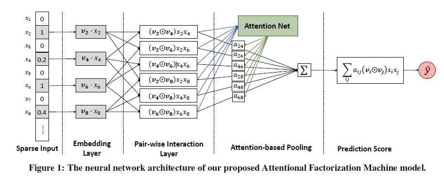

::: tip 提示
根据遗忘曲线：如果没有记录和回顾，6天后便会忘记75%的内容

阅读笔记正是帮助你记录和回顾的工具，不必拘泥于形式，其核心是：记录、翻看、思考
:::

## Attentional Factorization Machines: Learning the Weight of Feature Interactions via Attention Networks

### 1、前言

本文要介绍的是由浙江大学联合新加坡国立大学提出的AFM模型。AFM 模型是一种基于注意力机制的推荐模型，它通过结合特征交叉和用户兴趣的权重学习，能够更准确地捕捉用户的兴趣和行为之间的复杂关系。该模型在推荐系统领域取得了显著的成果，并被广泛应用于电子商务、社交媒体和在线广告等领域。本文将逐步介绍 AFM 模型的核心思想和关键组件，解释其如何从海量的用户行为数据中挖掘出有用的信息，并利用注意力机制来加强特征交叉的影响力。

### 2、动机

AFM（Attentional Factorization Machines），从名称上来看，该模型就是在 FM 的基础上添加了注意力机制。FM 通过特征向量的内积来对交叉特征进行建模，但是却没有考虑不同交叉特征的重要性。本文的主要目的就是对不同的交叉特征进行注意力权重分配，以衡量不同的交叉特征的重要程度。
$$
y_{fm}=w_{0}+\sum_{i=1}^{n}w_{i}x_{i}+\sum_{i=1}^{n}\sum_{j=i+1}^{n}<v_{i}, v_{j}>x_{i}x_{j}.
$$
如何让不同的交叉特征具有不同的重要性就是 AFM 核心的贡献。

### 3、模型原理



因子分解机（FM）是一种监督学习方法，通过结合二阶特征交互来增强线性回归模型，通过学习每个特征的嵌入向量（embedding vector），FM可以估计任何交叉特征的权重。但是FM缺乏区分特征交互重要性的能力（并非所有特征都包含用于估计目标的有用的）。注意力因子分解机 AFM 是对 FM 的改进，解决了FM对于所有的特征权重都是一样的，不能区分特征交互重要性的问题。注意因子分解机（AFM）通过神经注意网络（Neural Attention Network）**从数据中自动地学习每个特征交互的重要性**，从而实现特征交互对预测的贡献不同。

AFM 最核心的两个点分别是 Pair-wise Interaction Layer 和 Attention-based Pooling Layer。前者将输入的非零特征的隐向量两两计算 element-wise product （哈达玛积，两个向量对应元素相乘，得到的还是一个向量），再将前面得到的交叉特征向量组输入到Attention-based Pooling，该pooling层会先计算出每个特征组合的自适应权重(通过Attention Net进行计算)，通过加权求和的方式将向量组压缩成一个向量，由于最终需要输出的是一个数值，所以还需要将前一步得到的向量通过另外一个向量将其映射成一个值，得到最终的基于注意力加权的二阶交叉特征的输出。

#### 3.1 Pair-wise Interaction Layer

类似于 FM，Pair-wise 交互层将 $m$ 个向量扩展到 $m(m-1)/2$ 个交叉向量。不同的是，FM 二阶交叉项将所有非零特征对应的隐向量两两点积再求和，Pair-wise 二阶交叉项则是将所有非零特征对应的隐向量两两对应元素乘积，然后再向量求和。按照论文的意思，特征的 embedding 可以表示为：$\varepsilon=v_{i}x_{i}$， 经过 Pair-wise Interaction Layer 输出可得：
$$
f_{(PI)}(\varepsilon)=\{(v_{i}\odot v_{j})x_{i}x_{j}\}_{i,j\in R_{x}}
$$
其中 $R_{x}$ 表示的是有效的特征集合。此时的 $f_{(PI)}(\varepsilon)$ 表示的是一个向量集合，所以需要先将这些向量集合聚合成一个向量，然后再转换成一个数值：
$$
\hat{y}=p^{T}\sum_{(i,j)\in R_{x}}(v_{i}\odot v_{j})x_{i}x_{j}+b
$$

上式中的求和部分就是将向量集合聚合成一个维度与隐向量维度相同的向量，通过向量 $p$ 再将其转换成一个数值，$b$ 表示的是偏置。

#### 3.2 Attention-based Pooling Layer

这是本文的一个核心创新。思想是不同的特征交互向量在将它们压缩为单个表示时根据对预测结果的影响程度对其加上不同权重，然后进行加权求和。前面已经介绍了 Pair-wise Interaction Layer，其主要是将使用哈达玛积得到的交叉特征转换成一个最终输出需要的数值。由于 FM 的缺陷，忽略了不同交叉特征的重要程度。为了解决这一问题，作者对特征交互采用注意力机制，对交互作用的向量进行加权和：
$$
f_{Att}(f_{(PI)}(\varepsilon))=\sum_{(i,j)\in R_{x}}a_{ij}(v_{i}\odot v_{j})x_{i}x_{j},
$$
其中 $a_{ij}$ 是交叉特征的注意力得分，可以理解为交叉特征在预测目标中的重要性。为了获得注意力得分 $a_{ij}$，作者使用了 MLP，称之为注意力网络，其可以形式化为：
$$
a_{ij}^{'}=h^{T}ReLU(W(v_{i}\odot v_{j})x_{i}x_{j}+b), \\
a_{ij}=\frac{exp(a_{ij}^{'})}{\sum_{(i,j)\in R_{x}}exp(a_{ij}^{'})},
$$
其中 $W,b,h$ 为模型参数，注意力分数则是通过 softmax 函数进行标准化。这样，就得到了 AFM 二阶交叉部分的注意力权重。再将一阶项写在一起，就得到了 AFM 模型的公式：
$$
\hat{y}_{afm}(x)=w_{0}+\sum_{i=1}^{n}w_{i}x_{i}+p^{T}\sum_{i=1}^{n}\sum_{j=i+1}^{n}a_{ij}(v_{i}\odot v_{j})x_{i}x_{j}+b.
$$

#### 3.3 模型训练

从最终的公式来看，AFM 模型与 FM 模型非常相似，所以 AFM 也可以通过调整损失函数来适应不同的任务（如分类、回归及排序）。另外，AFM 也有对防止过拟合进行处理：

- Pair-wise Interaction Layer 的输出结果使用了 dropout 来防止过拟合。因为并不是所有的特征的组合都对预测结果有用，所以随机的去除一些交叉特征，让剩余的特征去自适应的学习可以更好的防止过拟合。
- Attention-based Pooling Layer 的权重矩阵 $W$ 使用 $l2$ 正则，作者没有在这一层使用 dropout 的原因是发现同时在特征交叉层和注意力层加 dropout 会使得模型训练不稳定，并且性能还会下降。

加上正则项之后的回归任务的损失函数表示为：
$$
L=\sum_{x\in \mathcal{T}}(\hat{y}_{afm}(x)-y(x))^{2}+\lambda\|W\|^{2}
$$


### 4、代码实现

```python
import tensorflow as tf
import tensorflow.keras.backend as K
from tensorflow.keras.layers import Layer
from tensorflow.keras.layers import Dense, Embedding
from tensorflow.keras.models import Model
from tensorflow.keras.regularizers import l2

class Interaction(Layer):
    """
    Interaction layer
    input shape: [None, field, k]
    output shape: [None, field*(field-1)/2, k]
    """

    def __init__(self):
        super(Interaction, self).__init__()

    def call(self, inputs, **kwargs):
        
        if K.ndim(inputs) != 3:
            raise ValueError("Unexpected inputs dimensions %d, expect to be 3 dimensions" % (K.ndim(inputs)))
        element_wise_products = []
        for i in range(inputs.shape[1]):
            for j in range(i + 1, inputs.shape[1]):
                element_wise_products.append(tf.multiply(inputs[:, i], inputs[:, j]))  # [t, None, k]
        element_wise_products = tf.transpose(tf.convert_to_tensor(element_wise_products),
                                             perm=[1, 0, 2])  # [None, t, k]

        return element_wise_products
class Attention(Layer):
    """
    Attention layer
    input shape: [None, n, k]
    output shape: [None, k]
    """

    def __init__(self, activation='relu'):
        super(Attention, self).__init__()
        self.activation = activation

    def build(self, input_shape):
        """
        :param input_shape: [None, field, k]
        :return:
        """
        self.att_w = Dense(input_shape[1], activation=self.activation)
        self.att_h = Dense(1, activation=None)

    def call(self, inputs, *args, **kwargs):
        if K.ndim(inputs) != 3:
            raise ValueError("Unexpected inputs dimensions %d, expect to be 3 dimensions" % (K.ndim(inputs)))

        x = self.att_w(inputs)  # [None, field, field]
        x = self.att_h(x)  # [None, field, 1]
        att_score = tf.nn.softmax(x)
        att_score = tf.transpose(att_score, perm=[0, 2, 1])  # [None, 1, field]
        output = tf.reshape(tf.matmul(att_score, inputs), shape=(-1, inputs.shape[2]))  # [None, k]

        return output 

class AFM(Model):
    def __init__(self, feature_columns, mode='att', embed_reg=1e-6):
        super(AFM, self).__init__()
        self.dense_feature_columns, self.sparse_feature_columns = feature_columns
        self.mode = mode

        self.embed_layers = {
            'embed_' + feat['feat_name']: Embedding(input_dim=feat['feat_num'],
                                                    input_length=1,
                                                    output_dim=feat['embed_dim'],
                                                    mask_zero=True,
                                                    embeddings_initializer='random_uniform',
                                                    embeddings_regularizer=l2(embed_reg))
            for feat in self.sparse_feature_columns
        }
        self.interaction_layer = Interaction()
        if self.mode == 'att':
            self.attention_layer = Attention()

        self.output_layer = Dense(1)

    def call(self, inputs, **kwargs):

        sparse_embed = tf.concat(
            [self.embed_layers['embed_{}'.format(feat["feat_name"])](inputs[feat['feat_name']])
             for feat in self.sparse_feature_columns], axis=1)
        dense_inputs = tf.concat([inputs[feat["feat_name"]] for feat in self.dense_feature_columns], axis=-1)

        # Pair-wise Interaction
        sparse_embed = self.interaction_layer(sparse_embed)
        if self.mode == 'avg':
            x = tf.reduce_mean(sparse_embed, axis=1)  # (None, k)
        elif self.mode == 'max':
            x = tf.reduce_max(sparse_embed, axis=1)
        else:
            x = self.attention_layer(sparse_embed, axis=1)
        dense_inputs = tf.concat([dense_inputs, x], axis=-1)
        output = tf.nn.sigmoid(self.output_layer(dense_inputs))
        return output
```

