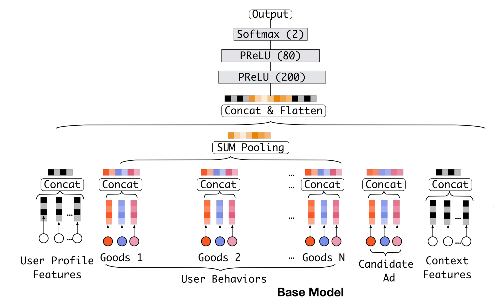
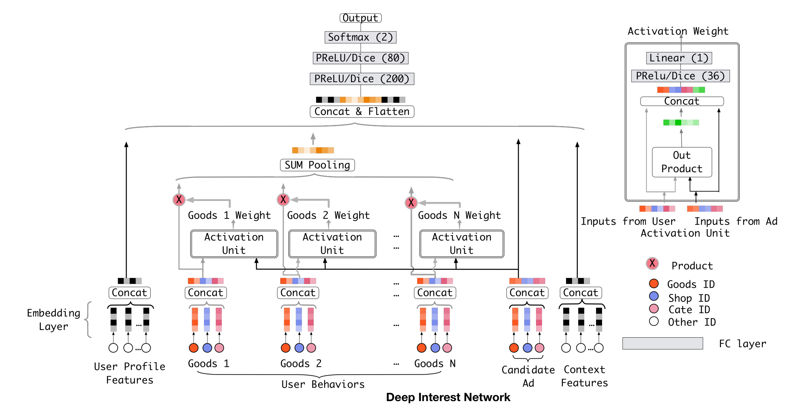
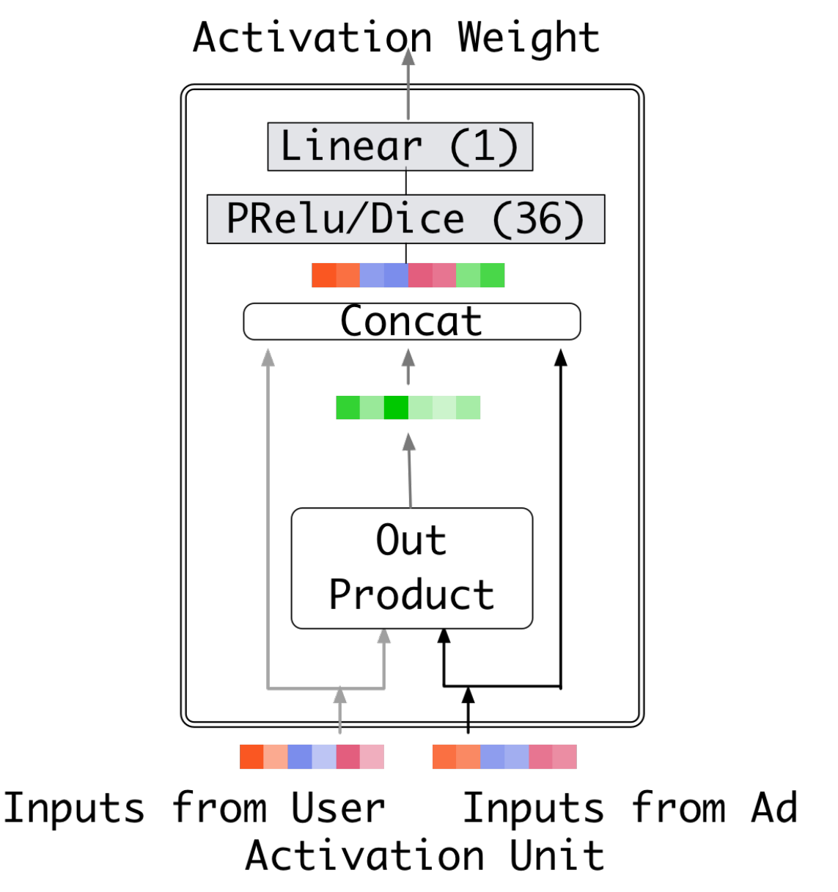

::: tip 提示
根据遗忘曲线：如果没有记录和回顾，6天后便会忘记75%的内容

阅读笔记正是帮助你记录和回顾的工具，不必拘泥于形式，其核心是：记录、翻看、思考
:::

::: info 信息
论文 [Deep Interest Network for Click-Through Rate Prediction](https://arxiv.org/pdf/1706.06978)     

代码 [https://github.com/zhougr1993/DeepInterestNetwork](https://github.com/zhougr1993/DeepInterestNetwork)

摘要: 本文提出了一个新的模型：深度兴趣网络（DIN），通过设计一个局部激活单元，根据特定广告的历史行为自适应地学习用户兴趣的表示。该表示向量针对不同的广告进行变化，极大地提升了模型的表达能力。此外，开发了两项技术：小批量感知正则化和数据自适应激活函数，可用于训练拥有数亿参数的工业级深度网络。

:::

## 1 前言

Deep Interest Network（DIN）是2018年阿里巴巴提出来的模型， 该模型基于业务的观察，从实际应用的角度进行改进，相比于之前很多“学术风”的深度模型， 该模型更加具有业务气息。该模型的应用场景是阿里巴巴的电商广告推荐业务， 这样的场景下一般**会有大量的用户历史行为信息**， 这个其实是很关键的，因为DIN模型的创新点或者解决的问题就是使用了注意力机制来对用户的兴趣动态模拟， 而这个模拟过程存在的前提就是用户之前有大量的历史行为了，这样我们在预测某个商品广告用户是否点击的时候，就可以参考他之前购买过或者查看过的商品，这样就能猜测出用户的大致兴趣来，这样我们的推荐才能做的更加到位，所以这个模型的使用场景是**非常注重用户的历史行为特征（历史购买过的商品或者类别信息）**。

## 2 动机

在个性化的电商广告推荐业务场景中，也正是由于用户留下了大量的历史交互行为，才更加看出了之前的深度学习模型（统称 Embeding&MLP 模型）的不足之处。如果学习了前面的各种深度学习模型，就会发现 Embeding&MLP 模型对于这种推荐任务一般有着差不多的固定处理套路，就是大量稀疏特征先经过 embedding 层， 转成低维稠密的，然后进行拼接，最后喂入到多层神经网络中去。

这些模型在这种个性化广告点击预测任务中存在的问题就是**无法表达用户广泛的兴趣**，因为这些模型在得到各个特征的 embedding 之后，就蛮力拼接了，然后就各种交叉等。这时候根本没有考虑之前用户历史行为商品具体是什么，究竟用户历史行为中的哪个会对当前的点击预测带来积极的作用。 而实际上，对于用户点不点击当前的商品广告，很大程度上是依赖于他的历史行为的。

如果是之前的那些深度学习模型，是没法很好的去表达出用户这广泛多样的兴趣的，如果想表达的准确些， 那么就得加大隐向量的维度，让每个特征的信息更加丰富， 那这样带来的问题就是计算量上去了，毕竟真实情景尤其是电商广告推荐的场景，特征维度的规模是非常大的。 并且根据上面的例子， 也**并不是用户所有的历史行为特征都会对某个商品广告点击预测起到作用**。所以对于当前某个商品广告的点击预测任务，没必要考虑之前所有的用户历史行为。

这样， DIN的动机就出来了，在业务的角度，我们应该自适应的去捕捉用户的兴趣变化，这样才能较为准确的实施广告推荐；而放到模型的角度， 我们应该**考虑到用户的历史行为商品与当前商品广告的一个关联性**，如果用户历史商品中很多与当前商品关联，那么说明该商品可能符合用户的品味，就把该广告推荐给他。而一谈到关联性的话， 我们就容易想到“注意力”的思想了， 所以为了更好的从用户的历史行为中学习到与当前商品广告的关联性，学习到用户的兴趣变化， 作者把注意力引入到了模型，设计了一个"local activation unit"结构，利用候选商品和历史问题商品之间的相关性计算出权重，这个就代表了对于当前商品广告的预测，用户历史行为的各个商品的重要程度大小， 而加入了注意力权重的深度学习网络。

## 3 模型原理
### Base 模型
Base 模型就是现在比较常见的多层神经网络，即先对特征进行 Embedding 操作，得到一系列 Embedding 向量之后，将不同 group 的特征 concate 起来之后得到一个固定长度的向量，然后将此向量喂给后续的全连接网络，最后输出 pCTR 值具体网络结构如下

### DIN 模型
#### 模型架构
其实对比 DIN 模型和 Base 模型就可以发现在模型结构上的差别主要就在如何聚合多个用户行为 Embedding 向量，Base 模型中直接对多个 Embedding 向量进行等权的 sum-pooling，这种方法肯定会带来信息的丢失，而且相对重要的 Embedding 向量也无法完全突出自己所包含的信息。所以 DIN 采取了一个比较直观的方式，就是 weighted-sum pooling，而且 Attention 的本质也可以认为是 weighted-sum，让模型更加关注有用的信息（有用信息的权重会更大一些）。

##### Activation Unit
对于用户的每个行为 Embedding 向量，都需要计算出一个权重，这个权重代表了对于当前商品广告的预测，用户历史行为的各个商品的重要程度大小。

在本文当中计算 Attention 权重的方式是利用用户行为的 Embedding 向量和广告的 Embedding 向量来进行计算，具体文章中采用的是用一个神经网络（activation unit）来得到 weight，其网络结构如下

其中 Activation Unit 的输入包括两个部分，一个是原始的用户行为 Embedding 向量、广告 Embedding 向量；另外一个是两者 Embedding 向量经过外积计算后得到的向量，文章指出这种方式有利于 relevance modeling。

除此之外文章用到的 Attention 机制不是原始 NLP 任务中采用的 Attention，文章中放宽了对于权重加和等于一的限制，这样更有利于体现不同用户行为特征之间的差异化程度。

##### Mini-batch Aware Regularization(MBAR)

mini-batch aware regularization 主要解决的就是在大规模稀疏场景下，采用 SGD 对引入 $l_2$ 正则的 loss 进行更新时计算开销过大的问题。该方法只对每一个 mini-batch 中参数不为 0 的进行梯度更新，经过一系列推到之后得到近似的梯度计算公式如下所示
$$
w_j \leftarrow w_j - \eta \left[ \frac{1}{|\mathcal{B}_m|} \sum_{(x, y) \in \mathcal{B}_m} \frac{\partial L(p(x), y)}{\partial w_j} + \lambda \frac{\alpha_{mj}}{n_j} w_j \right]
$$

##### 自适应激活函数(Dice)
文章认为采用 PRelu 激活函数时，他的 rectified point 固定为 0，这在每一层的输入分布发生变化时是不适用的，所以文章对该激活函数机型了改进，平滑了 rectified point 附近曲线的同时，激活函数会根据每层输入数据的分布来自适应调整 rectified point 的位置，具体形式如下:
$$
f(s) = p(s) \cdot s + (1 - p(s)) \cdot \alpha s, \quad p(s) = \frac{1}{1 + e^{-\frac{s - E[s]}{\sqrt{Var[s] + \epsilon}}}}
$$

## 总结
DIN模型的确给 CTR 预估领域带来了新的研究思路。同时算法与工程架构是相辅相成的，在模型越来越复杂的今天，如何有效的提升线上服务的工程架构也是每一个推荐、搜索、广告领域算法工程师需要考虑的。

