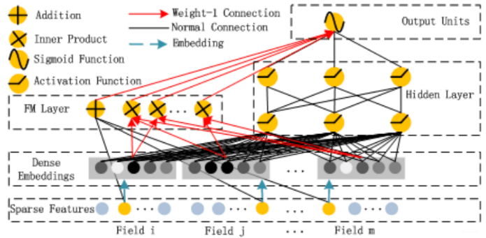
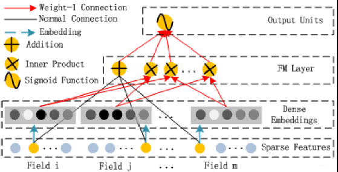
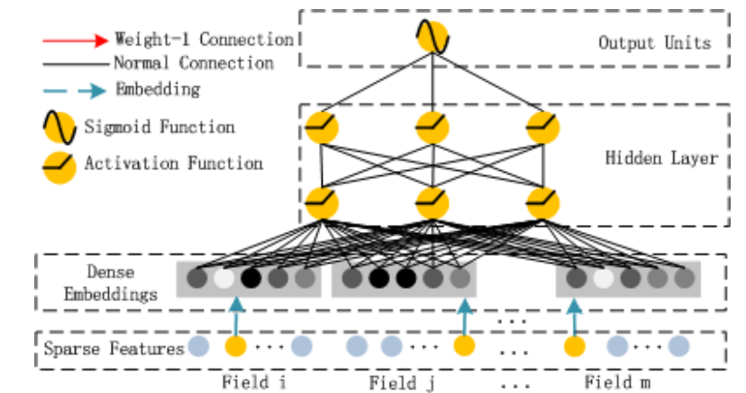
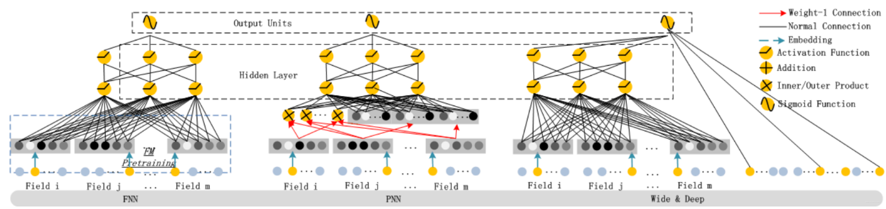

::: tip 提示
根据遗忘曲线：如果没有记录和回顾，6天后便会忘记75%的内容

阅读笔记正是帮助你记录和回顾的工具，不必拘泥于形式，其核心是：记录、翻看、思考
:::

## DeepFM: A Factorization-Machine based Neural Network for CTR Prediction（DeepFM，IJCAI2017，Huawei）

### 1 前言

学习用户行为背后复杂的特征交互对于最大化推荐系统的点击率至关重要。 尽管取得了巨大进步，但现有方法似乎对低阶或高阶交互存在强烈偏见，或者需要专业知识特征工程。 在本文中，我们表明可以推导出强调低阶和高阶特征交互的端到端学习模型。 所提出的模型 DeepFM 结合了用于推荐的分解机的功能和用于在新的神经网络架构中进行特征学习的深度学习的功能。 与谷歌最新的 Wide & Deep 模型相比，DeepFM 的“宽”和“深”部分共享输入，除了原始特征之外不需要特征工程。 我们进行了全面的实验，以证明 DeepFM 在基准数据和商业数据上相对于现有 CTR 预测模型的有效性和效率。

### 2 动机

在在线广告推荐系统中，CTR 预测是一个重要的任务，它用于估计用户对广告的点击概率。准确地预测 CTR 可以帮助广告平台更好地为用户提供个性化的广告推荐，从而提高广告投放的效果和收入。对于 CTR 问题，被证明的最有效的提升任务表现的策略是特征组合（Feature Interaction），组合特征大牛们研究过组合二阶特征，三阶甚至更高阶，但是面临一个问题就是随着阶数的提升，复杂度就成几何倍的升高。这样即使模型的表现更好了，但是推荐系统在实时性的要求也不能满足了。如何更高效的学习特征组合是当前研究面临的一个更加深入的问题。

### 3 模型原理

用一句话概括 DeepFM 模型，那就是将 Wide&Deep 中的 Wide 部分由 LR 换成了 FM 。该模型也是由两部分组成，如图所示。



左边是 FM，右边是 DNN。 DNN 部分没有改变，Wide 部分则是换成了 FM。主要是针对 Wide&Deep 的 Wide部分 不具备自动特征组合能力的缺陷进行改进的。

#### 3.1 FM 部分



如图所示，浅层部分采用的是标准的 FM 模型，主要负责特征之间的低阶交互过程，该部分的输出是 Addition 单元和 Inner Product 单元 Concatenate 到一起在经过一个Sigmoid得到logits。Addition 单元反应的是一阶特征的影响，而 Inner Product 单元则是代表了二阶特征交互的影响。具体公式如下： 
$$
y_{FM}=<w,x>+\sum_{j_1=1}^{d}\sum_{j_2=j_1+1}^{d}<V_i,V_j>x_{j_1}\cdot x_{j_2}
$$

#### 3.2 Deep 部分



如图所示， Deep 部分主要是为了学习高阶的特征组合。具体而言，使用全连接的方式将Dense Embeddings 输入到 Hidden Layer，这里面 Dense Embeddings 就是为了解决 DNN 中的参数爆炸问题，这也是推荐模型中常用的处理方法。Embedding 层的输出是将所有 id 类特征对应的 Embedding 向量 Concatenate 到一起输入到 DNN 中。其中 $e_i$ 表示第 $i$ 个 field 的 Embedding， $m$ 是 field 的数量：
$$
a^{(0)}=[e_{1}, e_{2}, \cdots, e_{m}],
$$

上一层的输出作为下一层的输入，于是可以得到：
$$
a^{(l+1)}=\sigma(W^{(l)}a^{(l)}+b^{(l)}),
$$

其中$\sigma(\cdot)$表示激活函数，$a、W、b$分别表示该层的输入、权重和偏置。最后进入 DNN 部分输出使用$sigmoid$函数进行激活：
$$
y_{DNN}=\sigma(W^{|H|+1}\cdot a^{H}+b^{|H|+1}).
$$

### 4 模型对比



**FNN：**FNN 也是 FM 和 DNN 结合的模型，不同于 DeepFM，FNN 采用串行拼接的结合方式，将 DNN 接在 FM 层之后，以减轻全连接层构造隐式特征的工作。该模型采用了两阶段的训练方式。第一阶段训练一个 FM模型，从而得到每个特征对用的隐向量矩阵 $W$。第二阶段利用隐向量矩阵 $W$ 初始化 DNN 的嵌入层，然后再监督训练 DNN 即可。这样做的好处就是一方面利用 FM 学习到的先验知识，减轻 DNN 的学习压力，另一方面 FM 只考虑了二阶交叉特征，忽略了高阶特征，后面拼接 DNN 以弥补该缺陷，提升模型的表达能力。

**PNN：**不同于 FNN，PNN是在 Embedding 层和 DNN 之间增加了一个 Product 层。该层是特征交互层，共有两种方式，一种是 Inner Product，$m$ 个特征两两进行内积，每两个 $k$  维特征的内积可得到一个一维变量，总共可得到 $m * (m-1) / 2$ 个变量，拼接在一起即为特征交互的结果 $p$。另外一种则是 Outer Product，与 Inner Product 不同的是，每两个 $k$ 维特征的外积不再是一个一维变量，而是形状为 $(k, k)$ 的二维张量。所以又引入等形状的权重矩阵 W，与二维张量进行对应元素乘积，然后求和得到一维变量。文中引入 $m * (m-1) / 2$ 个可训练的权重矩阵，与每个二维张量计算元素积，得到 $m * (m-1) / 2$ 个变量，然后拼接得到特征交互的结果$p$。得到交互特征之后，再与 Embedding 层的输出结果进行拼接作为 DNN 的输入。该方法显式的进行特征交互，提高模型表达能力，同时保留了低维与高维特征。

**Wide&Deep：**FNN 和 PNN 模型仍然有一个比较明显的缺点，即对于低阶组合特征学习到的比较少，这一点主要是由于 FM 和 DNN 的串行方式导致的，也就是虽然 FM 学到了低阶特征组合，但是 DNN 的全连接结构导致低阶特征并不能在 DNN 的输出端较好的表现。于是Google提出了 Wide&Deep 模型，通过采用并行结构解决串行结构存在的问题。其中，Wide部分采用逻辑回归（LR）来保留原始特征并学习低阶交叉特征，主要作用是让模型具有较强的“记忆能力”；Deep部分则是采用 DNN 学习高阶特征，从而让模型具有“泛化能力”。这样的结构，使得模型具有了逻辑回归（LR）和深度神经网络（Deep Neural Network）的优点，能够快速处理并记忆大量历史行为特征，并且具有强大的表达能力。然而，在 output Units 阶段直接将低阶和高阶特征进行组合很容易让模型最终偏向学习到低阶或者高阶的特征，而不能做到很好的结合。

### 5 代码实现

```python
import tensorflow as tf
from tensorflow.keras.layers import Layer
from tensorflow.keras.layers import Dense, Dropout, BatchNormalization
from tensorflow.keras.regularizers import l2


class FM(Layer):
    """
    FM part
    """
    def __init__(self, k, w_reg, v_reg):
        super(FM, self).__init__()
        self.k = k
        self.w_reg = w_reg
        self.v_reg = v_reg

    def build(self, input_shape):
        self.w0 = self.add_weight(name='w0',
                                  shape=(1,),
                                  initializer=tf.zeros_initializer(),
                                  trainable=True
                                  )
        self.w = self.add_weight(name='w',
                                 shape=(input_shape[-1], 1),
                                 initializer=tf.random_normal_initializer(),
                                 trainable=True,
                                 regularizer=l2(self.w_reg)
                                 )
        self.v = self.add_weight(name='v',
                                 shape=(input_shape[-1], self.k,),
                                 initializer=tf.random_normal_initializer(),
                                 trainable=True,
                                 regularizer=l2(self.v_reg))


    def call(self, inputs, *args, **kwargs):
        linear_part = tf.matmul(inputs, self.w) + self.w0    # (None, 1)

        square_of_sum = tf.pow(tf.matmul(inputs, self.v), 2)    # (None, self.k)
        sum_of_square = tf.matmul(tf.pow(inputs, 2), tf.pow(self.v, 2))    # (None, self.k)
        cross_term = square_of_sum - sum_of_square
        cross_term = 0.5 * tf.reduce_sum(cross_term, axis=-1, keepdims=True)    # (None, 1)

        output = linear_part + cross_term
        return output

class DNN(Layer):
    """
    DNN part
    """
    def __init__(self, hidden_units, output_dim, dropout=0.3, activation='relu'):
        super(DNN, self).__init__()
        self.hidden_units = hidden_units
        self.output_dim = output_dim
        self.activation = activation
        self.normlization = normlization

        self.dnn_layers = [Dense(units=units, activation=self.activation) for units in hidden_units]
        if self.normlization:
            self.batch_norm = BatchNormalization()
        self.dropout = Dropout(dropout)
        self.out_layer = Dense(self.output_dim, activation=None)

    def call(self, inputs, *args, **kwargs):
        x = inputs
        for layer in self.dnn_layers:
            x = layer(x)

        x = self.dropout(x)
        output = self.out_layer(x)
        return output
```

