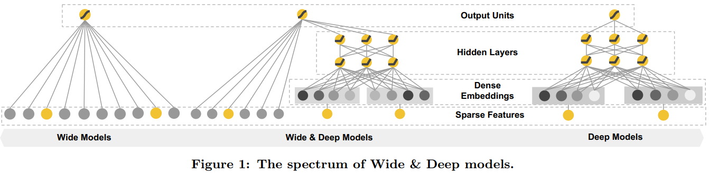

::: tip 提示
根据遗忘曲线：如果没有记录和回顾，6天后便会忘记75%的内容

阅读笔记正是帮助你记录和回顾的工具，不必拘泥于形式，其核心是：记录、翻看、思考
:::

## Wide & Deep Learning for Recommender Systems（Wide&Deep，DLRS2016， google）

### 1 、前言

本次记录的是自提出以来就在业界发挥着巨大影响力的模型——Wide&Deep模型。其思想正如其名，是由单层的Wide部分和多层的Deep部分组成的混合模型。其中，Wide部分的主要作用是让模型具有较强的“记忆能力”；Deep部分的主要作用是让模型具有“泛化能力”。这样的结构，使得模型具有了逻辑回归（LR）和深度神经网络（Deep Neural Network）的优点，能够快速处理并记忆大量历史行为特征，并且具有强大的表达能力，不仅在当时迅速成为业界争相应用的主流模型，而且衍生出了大量的以Wide&Deep模型为基础的混合模型。

### 2、动机

在CTR预估任务中利用手工构造的交叉组合特征来使得线性模型具有“记忆力”，来记住共现频率及较高的特征组合，往往也能达到一个不错的baseline，且可解释性强。但是这样的方式有着比较明显的缺点：

- 特征工程需要耗费太多精力。
- 模型无法进行泛化，仅仅记住这些组合特征，而对于未出现过的特征组合，权重系数为0。

为了加强模型的泛化能力，研究者引入了DNN结构，将高维稀疏特征编码为低维稠密的Embedding向量，这种基于Embedding的方式能够有效提高模型的泛化能力。但是，基于Embedding的方式可能因为数据具有长尾分布，导致长尾的一些特征值无法被充分学习，其对应的Embedding是不准确的，便会造成模型泛化过度。

Wide&Deep模型围绕**记忆性（Memorization）**和**泛化性（Generalization）**进行讨论。**“记忆能力”可以被理解为模型直接学习并利用历史数据中物品或者特征的“共现频率”的能力。“泛化能力”可以被理解为模型传递特征的相关性，以及发掘稀疏甚至从未出现过的稀有特征与最终标签相关性的能力。**

### 3、Wide&Deep模型框架



如图所示，Wide&Deep模型本身的结构是非常简单的，分为Wide部分和Deep部分。其中Wide部分有利于增强模型的“记忆能力”，Deep部分则有利于增强模型的“泛化能力”。

#### 3.1 Wide部分

Wide部分是一个广义的线性模型，输入的特征主要由两部分组成，一部分是原始的部分特征，另一部分是原始特征的交叉特征（cross-product transformation），对于交互特征可以定义为：
$$
\phi_{k}(x)=\prod_{i=1}^{d}x_{i}^{c_{ki}}, \quad c_{ki}\in\{0, 1\}
$$
$c_{ki}$是一个是一个布尔变量，当第$i$个特征属于第$k$个特征组合时，$c_{ki}$的值为1，否则为0，$x_i$是第$i$个特征的值，大体意思就是两个特征都同时为1这个新的特征才能为1，否则就是0，说白了就是一个特征组合。用原论文的例子举例：

> AND(user_installed_app=QQ, impression_app=WeChat)，当特征user_installed_app=QQ,和特征impression_app=WeChat取值都为1的时候，组合特征AND(user_installed_app=QQ, impression_app=WeChat)的取值才为1，否则为0。

对于Wide部分训练时候使用的优化器是带$L_1$正则的FTRL算法（Follow-the-regularized-leader），该优化器非常注重模型稀疏性质，也就是说Wide&Deep模型采用该优化器是想让Wide部分变得更加的稀疏，即Wide部分的大部分参数都为0，这就大大压缩了模型权重及特征向量的维度。**Wide部分模型训练完之后留下来的特征都是非常重要的，那么模型的“记忆能力”就可以理解为发现"直接的"，“暴力的”，“显然的”关联规则的能力。**举个简单的例子，Google 期望Wide部分发现这样的规则：**用户安装了应用A，此时曝光应用B，用户安装应用B的概率大。**

#### 3.2 Deep部分

Deep部分是一个DNN模型，输入的特征主要分为两大类，一类是数值特征(可直接输入DNN)，一类是类别特征（需要经过Embedding之后才能输入到DNN中），Deep部分的数学形式如下：
$$
a^{(l+1)}=f(W^{(l)}a^{(l)}+b^{(l)})
$$
其中$l$是层数，$f$是激活函数，通常使用RELU函数。 $a^{(l)}$，$b^{(l)}$和$W^{(l)}$是第$l$层的激活、偏置和模型权重。**随着DNN模型层数的加深，中间的特征就越抽象，也就提高了模型的泛化能力。**对于Deep部分的DNN模型作者使用了深度学习常用的优化器AdaGrad，这也是为了使得模型可以得到更精确的解。

#### 3.3 Wide & Deep

Wide&Deep模型是将两部分输出的结果结合起来联合训练，通过使用小批量随机优化同时将输出的梯度反向传播到模型的Wide和Deep部分来完成。将Wide和Deep部分的输出重新使用一个逻辑回归模型做最终的预测，输出概率值。联合训练的数学形式如下：需要注意的是，因为Wide侧的数据是高维稀疏的，所以作者使用了FTRL算法优化，而Deep侧使用的是 Adagrad。
$$
P(Y=1|x)=\delta(w_{wide}^{T}[x,\phi(x)]+w_{deep}^{T}a^{lf}+b)
$$

### 4 代码实现

```python
import tensorflow as tf
from tensorflow.keras.layers import Layer
from tensorflow.keras.layers import Dense, Dropout, Embedding
from tensorflow.keras.models import Model
from tensorflow.keras.regularizers import l2

class WideLayer(Layer):
    """
    wide part
    """
    def __init__(self, w_reg=1e-4):
        super(WideLayer, self).__init__()
        self.w_reg = w_reg

    def build(self, input_shape):
        self.w0 = self.add_weight(name='w0',
                                  shape=(1,),
                                  initializer=tf.zeros_initializer(),
                                  trainable=True,
                                  )

        self.w = self.add_weight(name='w',
                                 shape=(input_shape[-1], 1),
                                 initializer=tf.random_normal_initializer(),
                                 trainable=True,
                                 regularizer=l2(self.w_reg))

    def call(self, inputs, *args, **kwargs):
        # dense feature
        output = tf.matmul(inputs, self.w) + self.w0  # (None, 1)
        return output

class DeepLayer(Layer):
    """
    deep part
    """
    def __init__(self, hidden_units, output_dim, dropout=0.3, activation='relu'):
        super(DeepLayer, self).__init__()
        self.hidden_layer = [Dense(units=unit, activation=activation) for unit in hidden_units]
        self.dropout = Dropout(dropout)
        self.output_layer = Dense(output_dim, activation=None)

    def call(self, inputs, *args, **kwargs):
        x = inputs
        for layer in self.hidden_layer:
            x = layer(x)
        x = self.dropout(x)
        output = self.output_layer(x)

        return output
    
class WideDeep(Model):
    def __init__(self, feature_columns, hidden_units, output_dim, dnn_dropout=0.3, embed_reg=1e-6, w_reg=1e-4,
                 activation='relu'):
        super(WideDeep, self).__init__()
        self.dense_feature_columns, self.sparse_feature_columns = feature_columns
        self.embed_layers = {
            'embed_' + feat['feat_name']: Embedding(input_dim=feat['feat_num'],
                                                    output_dim=feat['embed_dim'],
                                                    mask_zero=True,
                                                    embeddings_initializer='random_uniform',
                                                    embeddings_regularizer=l2(embed_reg))
            for feat in self.sparse_feature_columns
        }

        self.wide_layer = WideLayer(w_reg)
        self.deep_layer = DeepLayer(hidden_units, output_dim, dnn_dropout, activation)

    def call(self, inputs, *args, **kwargs):
        sparse_input = tf.concat(
            [self.embed_layers['embed_{}'.format(feat["feat_name"])](inputs[feat['feat_name']])
             for feat in self.sparse_feature_columns], axis=-1)
        sparse_input = tf.squeeze(tf.convert_to_tensor(sparse_input), axis=1)
        dense_input = tf.concat([inputs[feat["feat_name"]] for feat in self.dense_feature_columns], axis=-1)

        # wide part
        wide_output = self.wide_layer(dense_input)

        # deep part
        deep_output = self.deep_layer(sparse_input)

        output = 0.5 * (wide_output + deep_output)
        output = tf.nn.sigmoid(output)

        return output
```

