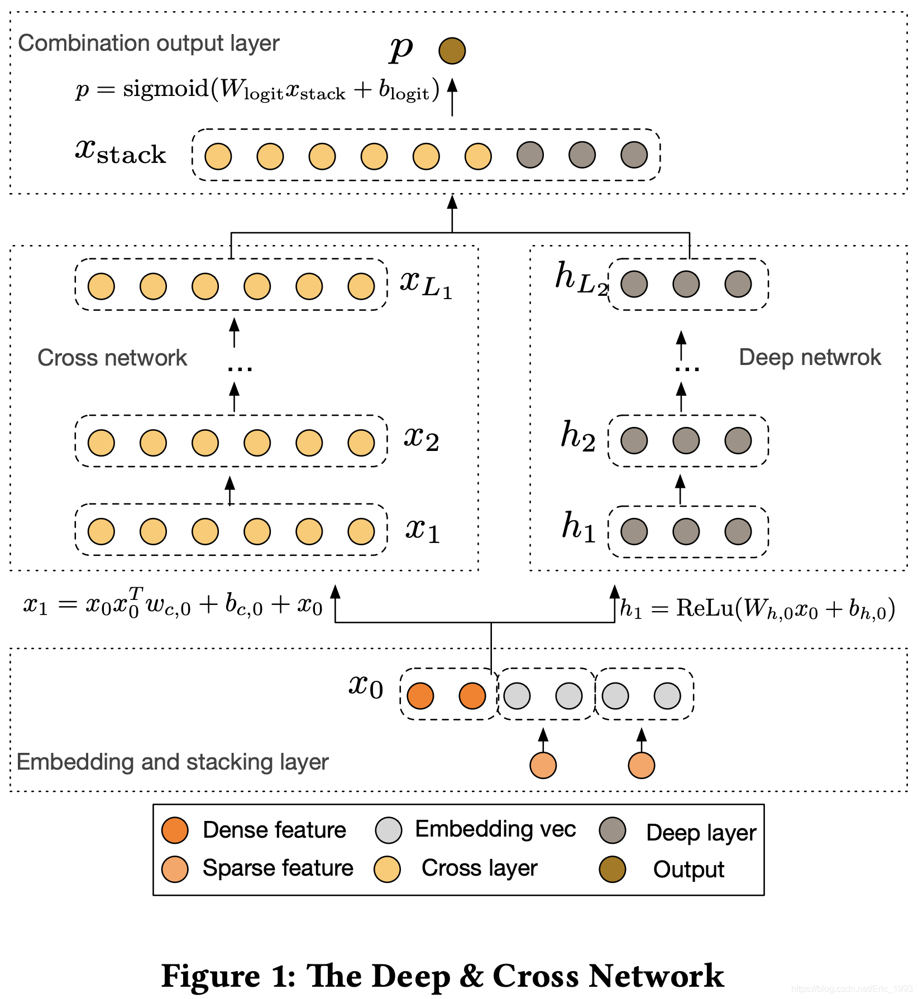
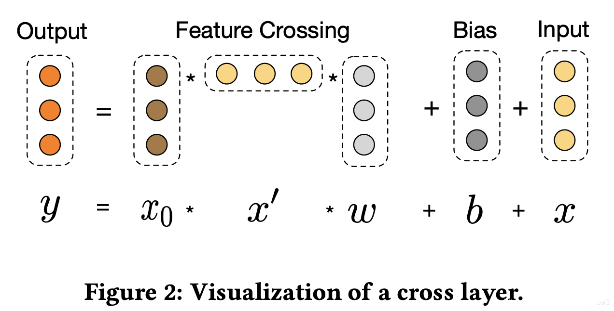

::: tip 提示
根据遗忘曲线：如果没有记录和回顾，6天后便会忘记75%的内容

阅读笔记正是帮助你记录和回顾的工具，不必拘泥于形式，其核心是：记录、翻看、思考
:::

::: info 信息
论文 [Deep & Cross Network for Ad Click Prediction](https://arxiv.org/pdf/1708.05123)     

代码 [https://github.com/shenweichen/DeepCTR/blob/master/deepctr/models/dcn.py](https://github.com/shenweichen/DeepCTR/blob/master/deepctr/models/dcn.py)

摘要: 本文提出了一种能够保持深度神经网络良好收益的深度交叉网络（DCN），除此之外，它还引入了一个新的交叉网络，更有效地学习在一定限度下的特征相互作用，更有甚，DCN 在每一层确切地应用交叉特征而不需要人工特征工程，这相比于 DNN 模型增加地额外地复杂度可以忽略不计。实验证明它在 CTR 预测数据机和稠密分类数据机上具有优越性能。

:::

## 论文贡献
> 提出了一种新的交叉网络，在每个层上明确地应用特征交叉，有效地学习有界度的预测交叉特征，并且不需要手工特征工程或穷举搜索。

> 跨网络简单而有效。通过设计，各层的多项式级数最高，并由层深度决定。网络由所有的交叉项组成，它们的系数各不相同。

> 交叉网络（DCN）在 LogLoss 上与 DNN 相比少了近一个量级的参数量。

## 网络架构
一个DCN模型从嵌入和堆积层开始，接着是一个交叉网络和一个与之平行的深度网络，之后是最后的组合层，它结合了两个网络的输出。完整的网络模型如下所示：

### 嵌入与堆叠层
考虑具有稀疏和密集特征的输入数据。在网络规模推荐系统中，如 CTR 预测，输入主要是分类特征，如`country=usa`。这些特征通常是编码为独热向量如`[ 0,1,0 ]`；然而，这往往导致过度的高维特征空间大的词汇。为了减少维数，我们采用嵌入过程将这些二进制特征转换成实数值的稠密向量（通常称为嵌入向量）：
$$
x_{\text{embed}, i} = W_{\text{embed}, i} x_i
$$

其中，$x_{embed,i}$ 是嵌入向量，x_i$ 是第 $i$ 层的二元输入，$W_{embed,i}\in R^{n_e \times n_v}$ 是与网络中的其他参数一起优化的相应的嵌入矩阵，$n_e, n_v$ 分别是嵌入大小和词汇大小，最后，将嵌入向量与归一化稠密特征 $x_{dense}$ 叠加起来形成一个向量：
$$
x_0 = [x_{\text{embed},1}^T, \cdots, x_{\text{embed},k}^T, x_{\text{dense}}^T]
$$
$x_0$ 就是网络的输入。

### 交叉网络
交叉网络的核心思想是以有效的方式应用显式特征交叉。交叉网络由交叉层组成，每个层具有以下公式：
$$
x_{l+1} = x_0 \cdot x_l^T w_l + b_l + x_l = f(x_l, w_l, b_l) + x_l
$$
其中，$x_l，x_{l+1} \in R^{d} $ 表示第 $l$ 和第 $l+1$ 层输出的列向量。每个交叉层在特征越过 $f$ 之后添加其输入，而映射函数$f: R^d \rightarrow R^d$ 拟合 $x_{l+1}-x_{l}$ 的残差，一个交叉层的可视化如下所示：

- **高阶交叉特征**：交叉网络的特殊结构使得交叉特征的阶数随层深度而增加。对于 $l$ 层的交叉网络，其最高多项式阶数（就输入 $x_0$ 而言）为 $l+1$。事实上，交叉网络包含了从 $1$ 到 $l+1$ 的所有交叉项。
- **复杂度分析**：$L_c$表示交叉层数，$d$表示输入维度。则交叉网络涉及的参数数量为：
$$
d \times L_c \times 2
$$
交叉网络的时间和空间复杂度与输入维度呈线性关系。因此，与深度网络相比，交叉网络引入的复杂度可忽略不计，使 DCN 的整体复杂度与传统 DNN 保持在同一水平。这种效率得益于 $x_0 x_{l}^{T}$ 的秩一特性，这使得无需计算或存储整个矩阵即可生成所有交叉项。

交叉网络的参数数量较少，限制了模型的容量。为了捕捉高度非线性的相互作用，还引入了一个并行的深度网络。

### 深度网络
深度网络就是一个全连接的前馈神经网络，每个深度层具有如下公式：
$$
h_{l+1}=f(W_{l}h_{l}+b_{l})
$$
其中，$h_{l}\in R_{l}^{n},h_{l+1}\in R_{l+1}^{n}$ 分别是第 $l$ 和第 $l+1$ 个隐藏层；$W_{l}\in R_{l+1}^{n}\times n_{l},b_{l}\in R_{l+1}^{n}$ 是第 $l$ 个深度层的参数；$f(\cdot)$ 是 ReLU 函数。

- **复杂度分析**：假设所有深层层级大小相同。设 $L$ 表示深层层级数，$m$ 表示深层层级大小。则深度网络中的参数数量为:
$$
d \times m + m + (m^2 +m) \times (L_d - 1)
$$

### 融合层
组合层将两个网络的输出连接起来，并将连接后的向量输入到标准 logits 层。以下是二分类问题的公式：
$$
p=\sigma([x_{L_1}^{T},h_{L_2}^{T}]w_{logits})
$$
其中，$x_{L_1}\in R^{d},h_{L_2}\in R^{m}$ 为 cross 网络和 deep 网络的输出，$w\in R^{d+m}$ 是融合层的权重，并且 $\sigma(x)=1/(1+exp(-x))$。

## 总结
识别有效的特征交叉一直是许多预测模型成功的关键。遗憾的是，该过程通常需要手动进行特征挖掘和穷举搜索。深度神经网络 (DNN) 在自动特征学习方面非常流行；然而，学习到的特征是隐式的且高度非线性的，网络在学习某些特征时可能会过大且效率低下。本文提出的深度交叉网络 (Deep & Cross Network) 可以处理大量的稀疏和密集特征，并与传统的深度表示联合学习有界度的显式交叉特征。交叉特征的度数在每个交叉层增加一级。
