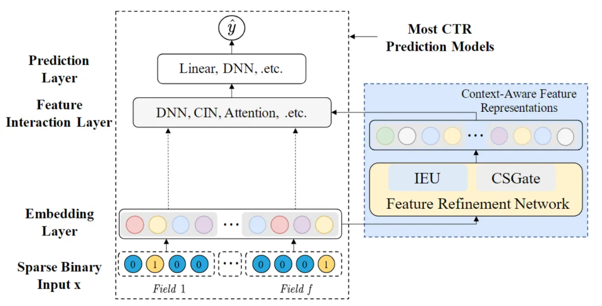
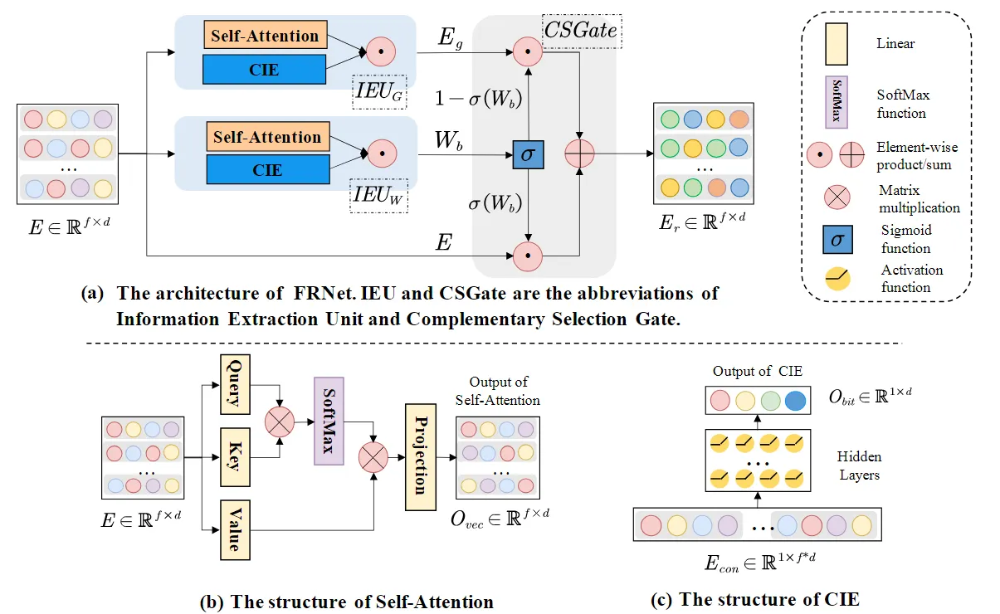

::: tip 提示
根据遗忘曲线：如果没有记录和回顾，6天后便会忘记75%的内容

阅读笔记正是帮助你记录和回顾的工具，不必拘泥于形式，其核心是：记录、翻看、思考
:::

## 贡献
> 1）提出了一种新的模块FRNet，这是第一个通过将原始特征和互补特征表示与位级权重相结合来学习上下文感知特征表示的工作；

> 2）FRNet 可以看作一个基本构建块应用到许多 CTR 预测方法以提高其性能，与现有的许多 CTR 预测方法有良好的兼容性。

## 动机
> 1）现有大多数方法只学习每个特征的固定表示，忽略了每个特征在不同上下文的重要性。例如：考虑两个实例 { female, white, computer, workday } 和{ female, red, lipstick, workday }，当对用户进行预测时，特征“female”应该根据其对不同实例的不同影响有不同的表示，本文称为上下文感知特征表示。一些 CTR 预测方法尝试学习特征表示的权重，已解决固定特征表示问题，但是只产生线性变换仍然不够灵活，无法捕获每个特征在不同上下文中的不同重要性。

> 2）自注意力机制已被用于 CTR 预测方法，主要学习所有相关特征对之间的交叉特征关系。然而，Self-attention 使用归一化权重来捕获同一实例中特征的相对重要性，从而忽略多个实例之间的特征重要性差异。考虑以下两个实例：{ female, red, lipstick, workday } 和 { female, red, lipstick, week }，其中自注意力只能学习特征“female”的非常相似的表示，因为与“red”和“lipstick”相比，特征“weekend”和“workday”可能具有非常小的注意力分数。然而，“female”用户的行为/兴趣可能仍然在两个实例中从“workday”到“weekend”发生显着变化。因此，理想的特征细化模块应该识别重要的跨实例上下文信息，并在不同的上下文下学习显着不同的表示。




## 模型架构



如图所示，FRNet 主要包含两个关键组件：1）信息提取单元（IEU），它捕获上下文信息和交叉特征关系，以指导上下文感知的特征细化；2）互补选择门（CSGate），它自适应地将在 IEU 中学习的原始和互补特征表征与位级权重相结合。

### 信息提取单元（Information Extraction Unit，IEU）
IEU 由三个基本组件组成： 1) Self-Attention 单元，用于捕获同时出现的特征之间的显式交叉特征关系； 2）上下文信息提取器（CIE），对不同的上下文信息进行编码； 3）集成单元，集成来自 Self-Attention 单元和 CIE 的信息。两个 IEU 分别用于学习位级权重， 产生互补的特征表征。

#### 自注意单元（Self-Attention unit）
其中自注意力单元为常规的自注意力计算，结构如图 2(b) 所示，这里不赘述，总体可以表示为：
$$Q,K,V=EW^{Q},EW^{K},EW^{V},$$
$$Attention(Q,K,V)=SoftMax(QK^{T}V)\in \mathbb{R}^{f\times d_{k}},$$
$$O_{vec}=Attention(Q,K,V)W^{P}\in\mathbb{R}^{f\times d}.$$
自注意力机制可以通过捕获所有特征对之间的交叉特征关系来细化不同上下文下的特征表征，从而实现部分上下文感知的特征表征学习。然而，自注意力仅利用了由成对特征交互表征的部分上下文信息，因此无法利用完整的上下文信息来指导特征细化。

#### 上下文信息提取器（Contextual Information Extractor）
每个实例中的上下文信息都隐含在所有特征中。因此，需要确保所有特征都对每个实例中的上下文信息有贡献。由于上下文信息通常不是很复杂，因此采用MLP提取。首先将原始特征表征拼接为$E_{con}$作为输入，每层的MLP表示如下，$h_{0}=E_{con}$，
$$h_{l+1}=PReLU(W_{l}h_{l}+b_{l}),$$
最后一层隐藏层将维度映射到$d$维（即拼接前各个向量的维度），得到下式，由于$O_{bit}$压缩了来自$E_{con}$的所有信息，因此它可以表示特定实例中的上下文信息。上下文信息$O_{bit}$对于每个实例都是唯一的，因为不同的实例包含不同的特征。
$$O_{bit}=PReLU(W_{L}h_{L}+b_{L}).$$

#### 集成单元（Integration unit）
经过上述两个部分得到$O_{vec}$和$O_{bit}$后，进行逐元素加权，公式如下，确保每个特征在不同的实例中可以有显著不同的表征：
$$O_{IEU}=O_{vec}\odot O_{bit}$$
如图 2(a) 所示，使用两个独立的 IEU 分别学习权重 $W_{b}$和补充特征$E_{g}$，表示图下：
$$E_{g}=IEU_{G}(E),W_{b}=IEU_{W}(E).$$

### 互补选择门（Complementary Selection Gate，CSGate）
在 CSGate 中，设计了一种新颖的门机制来控制信息流，并从具有位级权重的原始和互补特征中选择重要信息。如图 2 (a) 所示，CSGate 有三个不同输入： 1) 互补特征表征$E_{g}$； 2) 权重矩阵$W_{b}$； 3) 原始特征表示$E$。CSGate 的输出是上下文感知特征表示，公式如下，$\sigma$为 sigmoid 函数：
$$E_{r}=E\odot \sigma(W_{b})+E_{g}\odot (1-\sigma(W_{b})).$$

## 总结
本文介绍了由浙江大学联合新加坡国立大学提出的AFM模型。AFM 模型是一种基于注意力机制的推荐模型，它通过结合特征交叉和用户兴趣的权重学习，能够更准确地捕捉用户的兴趣和行为之间的复杂关系。

## 代码实现
```python
import tensorflow as tf
from tensorflow.keras.layers import Layer, Dense, PReLU, BatchNormalization, Dropout
from tensorflow.keras import Sequential

class FRNet(Layer):
    def __init__(self, field_length, embed_dim, weight_type="bit", num_layers=1, att_size=10, mlp_layer=256):
        super(FRNet, self).__init__()

        # IEU_G computes complementary features.
        self.IEU_G = IEU(field_length, embed_dim, weight_type="bit", bit_layers=num_layers, att_size=att_size,
                         mlp_layer=mlp_layer)

        # IEU_W computes bit-level or vector-level weights.
        self.IEU_W = IEU(field_length, embed_dim, weight_type=weight_type, bit_layers=num_layers, att_size=att_size,
                         mlp_layer=mlp_layer)

    def call(self, x_embed, **kwargs):

        com_feature = self.IEU_G(x_embed)
        weight_matrix = tf.sigmoid(self.IEU_W(x_embed))

        # CSGate
        x_out = x_embed * weight_matrix + com_feature * (tf.constant(1.0) - weight_matrix)

        return x_out


class IEU(Layer):
    def __init__(self, field_length, embed_dim, weight_type="bit", bit_layers=1, att_size=10, mlp_layer=256):
        super(IEU, self).__init__()

        self.input_dim = field_length * embed_dim
        self.weight_type = weight_type

        # Self-attention unit
        self.vector_info = SelfAttention(embed_dim=embed_dim, att_size=att_size)

        mlp_layers = [mlp_layer for _ in range(bit_layers)]

        self.mlps = MLP(embed_dims=mlp_layers, output_layer=False)
        self.bit_projection = Dense(units=embed_dim, activation='relu')

    def call(self, inputs, **kwargs):
        # self-attention unit
        x_vector = self.vector_info(inputs)
        # CIE unit
        mlp_input = tf.reshape(inputs, [-1, self.input_dim])
        x_bit = self.mlps(mlp_input)
        x_bit = self.bit_projection(x_bit)
        x_bit = tf.expand_dims(x_bit, axis=1)
        # integration unit
        x_out = x_bit * x_vector

        if self.weight_type == "vector":
            x_out = tf.reduce_sum(x_out, axis=2, keepdims=True)
        return x_out


class SelfAttention(Layer):
    def __init__(self, embed_dim, att_size=20):
        super(SelfAttention, self).__init__()
        self.embed_dim = embed_dim
        self.trans_Q = Dense(units=att_size)
        self.trans_K = Dense(units=att_size)
        self.trans_V = Dense(units=att_size)
        self.projection = Dense(units=embed_dim)

    def call(self, inputs, **kwargs):
        Q = self.trans_Q(inputs)
        K = self.trans_K(inputs)
        V = self.trans_V(inputs)

        attention = tf.matmul(Q, tf.transpose(K, perm=[0, 2, 1]))  # B,F,F
        attention_score = tf.nn.softmax(attention, axis=-1)
        context = tf.matmul(attention_score, V)
        context = self.projection(context)
        return context


class MLP(Layer):
    def __init__(self, embed_dims, dropout=0.5, output_layer=True):
        super(MLP, self).__init__()
        layers = []
        for embed_dim in embed_dims:
            layers.append(Dense(embed_dim, kernel_initializer='glorot_uniform'))
            layers.append(BatchNormalization())
            layers.append(PReLU())
            layers.append(Dropout(dropout))

        if output_layer:
            layers.append(Dense(1))
        self.mlp = Sequential(layers)

    def call(self, inputs, **kwargs):
        """
        :param x: [B,F*E]
        """
        return self.mlp(inputs)

```