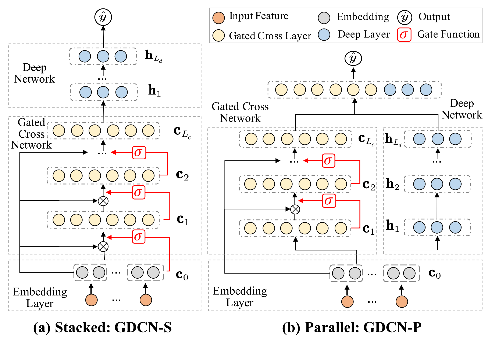
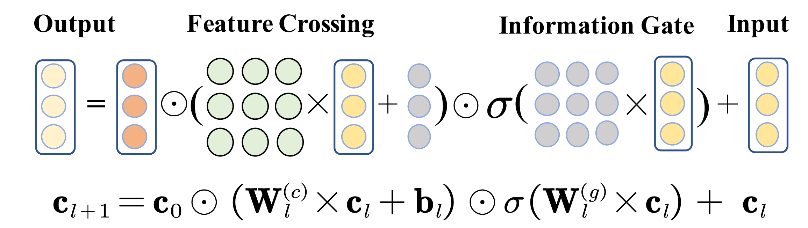

::: tip 提示
根据遗忘曲线：如果没有记录和回顾，6天后便会忘记75%的内容

阅读笔记正是帮助你记录和回顾的工具，不必拘泥于形式，其核心是：记录、翻看、思考
:::

::: info 信息
论文 [Towards Deeper, Lighter and Interpretable Cross Network for CTR Prediction](https://arxiv.org/pdf/2311.04635)     

代码 [https://github.com/anonctr/GDCN](https://github.com/anonctr/GDCN)

摘要: 本文提出了一种门控深度交叉网络（GDCN）的和一种场级（field-level）维度优化（FDO）方法来应对这些问题。其中门控交叉网络（GCN）捕获显式的高阶特征交互，并按每个阶层（这里的阶是指特征交互的层次深度，就是通常说的高阶交互，低阶交互等）动态过滤重要交互。FDO 根据每个 field 中包含的信息来学习压缩维度。

:::

## 论文贡献
> 1）提出了一种新的方法-GDCN，通过GCN和DNN学习显式和隐式特征交叉。GCN设计了一个信息门来动态过滤下一阶交叉特征，并有效地控制信息流。在捕捉更深层次的高阶交叉特征方面表现出了更高的性能和稳定性。

> 2）开发了 FDO 方法，根据每个字段的内在重要性为其分配精简维度。通过采用 FDO，GCN 仅用原始模型参数的 23% 就实现了相当的性能。

## 模型架构

GDCN 由嵌入层、门控交叉网络（GCN）和深度网络（DNN）组成。GCN 用于捕捉显式特征交互，有一个信息门控来识别重要的交叉特征。然后，将 DNN 集成到隐式特征交叉模型中。GDCN 通过引入信息门自适应地过滤交叉特征，而不是直接聚合所有特征。这使 GDCN 能够真正利用更深层次的高阶交叉信息，而不会出现性能下降，并使 GDCN 具有可解释性。

DCNv2 主要有两部分组成，交叉网络和 DNN 部分，本文是在该基础上改进型的，所以结构也是类似的，结合交叉网络和 DNN 有两种方式堆叠和平行，如上图所示。

### 门控交叉网络（GCN）

作为GDCN的核心结构，GCN对带有信息门的显式特征交叉进行建模。 GCN的第 $l+1$ 层门控交叉层表示为下式，其中 $c_0$ 为经过 embedding 层后进入交叉网络的基础输入，$c_l$ 表示经过第 $l$ 层的特征交互后的输出。计算过程如上图所示。

$$
\mathbf{c}_{l+1} = \underbrace{\mathbf{c}_0 \odot \left( \mathbf{W}_l^{(c)} \times \mathbf{c}_l + \mathbf{b}_l \right)}_{\text{Feature Crossing}} \odot \underbrace{\sigma \left( \mathbf{W}_l^{(g)} \times \mathbf{c}_l \right)}_{\text{Information Gate}} + \mathbf{c}_l,
$$
在每个门控交叉层中，有两个核心组件：特征交叉和信息门。
#### 特征交叉
特征交叉组件计算一阶特征 $c_0$ 和第 $l+1$ 阶特征 $c_l$ 之间的特征交互，从而得到第 $l+2$ 阶的特征。矩阵 $W$ 为交叉矩阵，表示不同 field 在特征交互时的重要性。然而，并非所有 $l+2$ 阶特征对预测都有正向作用。随着交叉深度的增加，交叉特征表现出指数增长，引入了可能导致次优性能的交叉噪声。

为了解决上述问题，本节引入了信息门控组件，自适应地学习第 $l+2$ 阶特征的重要性。通过 sigmoid 函数得到门控权重也就是上式中的 $W_{l}^{(g)}$。该过程可以放大重要特征，减轻不重要特征的影响。随着交叉层数量的增加，每个交叉层的信息门过滤下一阶交叉特征，并有效地控制信息流。

### Field level的维度优化
嵌入维度通常决定对信息进行编码的能力。但为所有 field 分配相同的维度会忽略不同字段中的信息容量。如，性别的值的数量远小于 itemid。本文使用后验场级维度优化（FDO）方法，该方法基于每个场（field）在特定数据集中的内在重要性来学习其维度。

- 首先，训练一个固定场维度为16的完整模型，为每个字段生成一个信息嵌入表。
- 使用 PCA 为每个字段的嵌入表计算一组奇异值，按大小降序排列。通过评估信息利用率（即信息比率），可以通过识别对总体信息贡献最大的k个奇异值。为每个字段选择合适的压缩维度。
- 最后，用上一步中学习到的场维度来训练一个新的模型。

## 总结
本文提出了一种新颖的方法——GDCN，用于对显式和隐式特征交叉进行建模。作为核心结构，GCN 利用信息门来识别重要的交叉特征，避免了模型性能在更深的高阶层中下降。重要的是，GCN 在模型和实例层面都表现出良好的可解释性，有助于理解模型预测。所提出的 FDO 方法根据不同领域的内在重要性，学习特定领域且精简的维度，从而帮助 GCN 和 GDCN 在更轻的模型规模下实现相当的性能。

