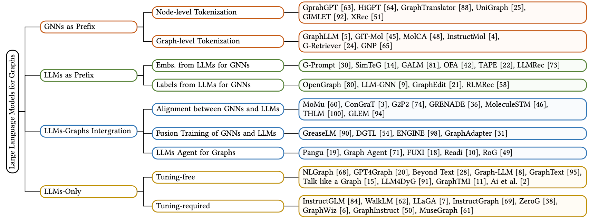
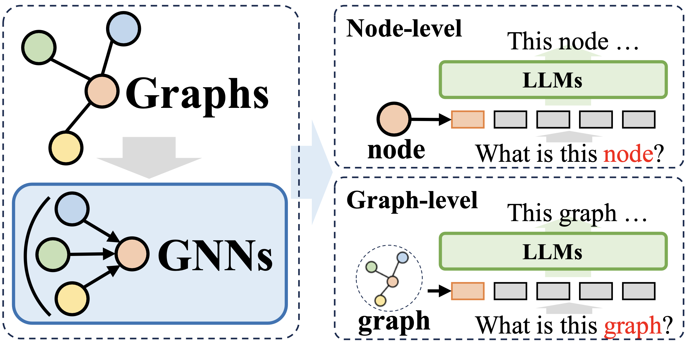
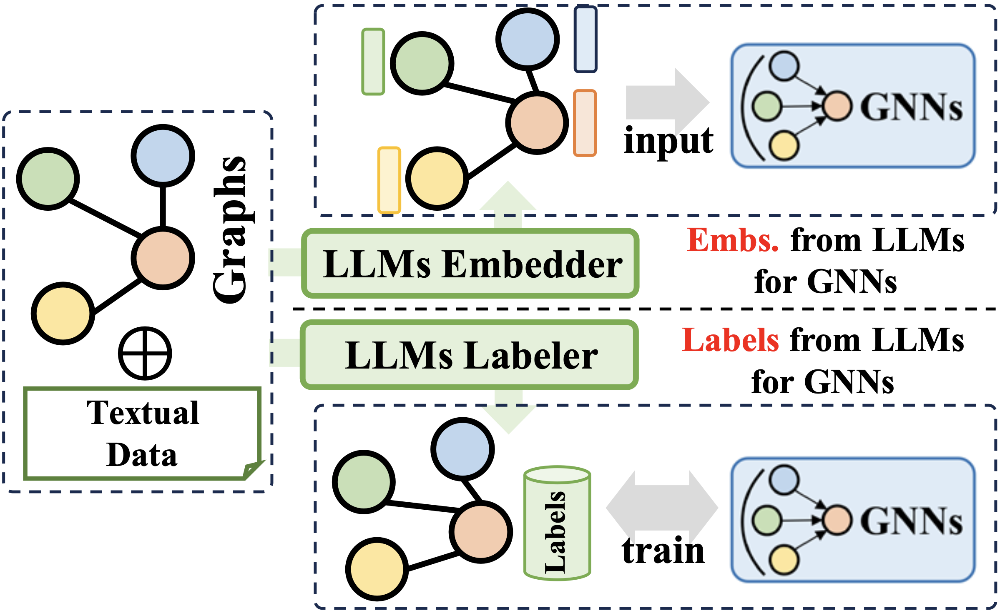
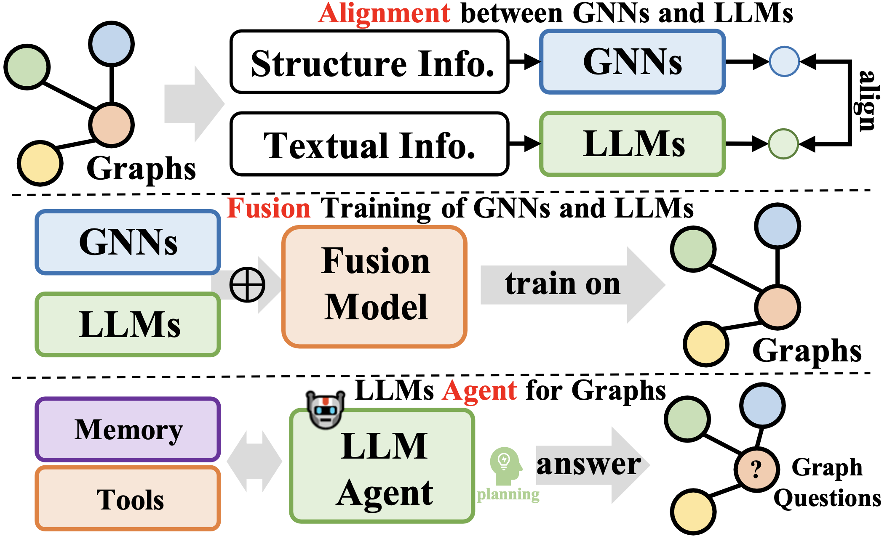
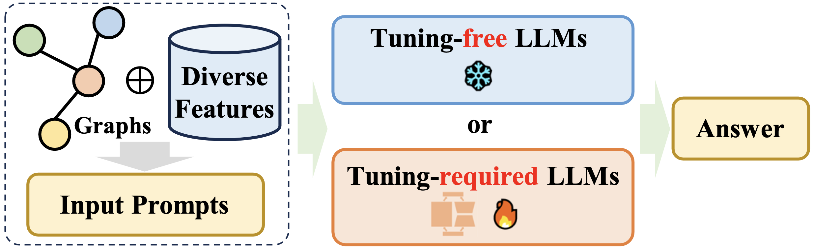

::: tip 提示
根据遗忘曲线：如果没有记录和回顾，6天后便会忘记75%的内容

阅读笔记正是帮助你记录和回顾的工具，不必拘泥于形式，其核心是：记录、翻看、思考
:::

::: info 信息
论文 [A Survey of Large Language Models for Graphs](https://arxiv.org/pdf/2405.08011v1)     

相关 [https://github.com/HKUDS/Awesome-LLM4Graph-Papers](https://github.com/HKUDS/Awesome-LLM4Graph-Papers)

摘要: 
:::

### GNNs as Prefix
GNN 作为处理图数据的第一个组件，并为 LLM 提供结构感知 tokens (节点级，边级以及图级)进行推理。
在这种方式下， GNN 作为结构编码器，以增强 LLM 对图结构的理解，从而有利于下游任务。这种情况下，GNN 通常扮演 tokenizer 的角色，将图数据编码为具有丰富结构信息的图 token 序列，然后输入到 LLM 中与自然语言对齐。

- Node-level Tokenization
图结构的每个节点都输入到 LLM 中，旨在使 LLM 理解细粒度的节点级结构信息并区分关系。
- Graph-level Tokenzation
使用特定的池化方法将图压缩为固定长度的 token 序列，旨在捕获图结构的高级全局语义信息。

### LLMs as Prefix
LLM 首先使用文本信息处理图数据，然后提供节点嵌入或生成标签来改进图神经网络的训练。
利用大型语言模型产生的信息来改进图神经网络的训练。此信息包括从大型语言模型派生的文本内容、标签或嵌入。

- Embeddings from LLMs for GNNs
使用大型语言模型为图神经网络生成的嵌入。
- Labels from LLMs for GNNs
集成大型语言模型为图神经网络生成的标签。此上下文中的监督标签不限于分类任务中的分类标签，而是可以采用嵌入、图等多种形式。从LLM 生成的信息不被用作 GNN 的输入，而是形成监督信号进行更好的优化，这使得gnn能够在各种与图相关的任务上实现更高的性能。

### LLMs-Graphs Integration
LLM 实现与图数据的更高层次的集成，如与 GNN 的融合训练或对齐，并构建基于 LLM 的代理与图信息交互。

- Alignment between GNNs and LLMs
GNN 和 LLM 旨在处理不同形式的数据，GNN 专注于结构化数据，LLM 专注于文本数据。这导致两个模型的特征空间不同。为了解决这个问题并使两种模式的数据更有利于 GNN 和 LLM 的学习，通常使用对比学习或期望最大化 (EM) 迭代训练等技术来对齐两个模型的特征空间。使得能够更好地对图和文本信息进行建模，从而提高各种任务的性能。
- Fusion Training of GNNs and LLMs
尽管 GNN 和 LLM 的表示之间的对齐实现了两个模型的协同优化和嵌入级对齐，但它们在推理过程中保持不变。为了实现 LLM 和 GNN 之间的更高层次的集成，一些工作专注于设计模块的体系结构的更深层次的融合，如llm中的变压器层和 GNN 中的图神经网络。协同训练 GNN 和 LLM 可以为图任务中的两个模块带来双赢的双向好处。
- LLMs Agent for Graphs
一个新兴的研究方向是基于 LLM 构建自主代理，以解决人类给定的或与研究相关的任务。通常，代理由内存模块、感知模块和动作模块组成，以实现观察、记忆召回和动作循环以解决给定任务。在图域中，基于llm的代理可以直接与图数据交互，以执行节点分类和链接预测等任务。

### LLMs-Only
设计实用的提示方法，将图结构数据接到 LLM 单词序列中进行推断，有些方法也包含多模态 tokens。
允许 LLM 直接接受图结构信息，理解它，并与这些信息一起对各种下游任务进行推理。

- Tuning-free
旨在设计 LLM 可以理解表达图的提示，直接提示预先训练的 LLM 来执行面向图的任务。
- Tuning-required
侧重于以特定方式将图转换为序列，并使用微调方法将图 token 序列和自然语言 token 序列对齐。

 