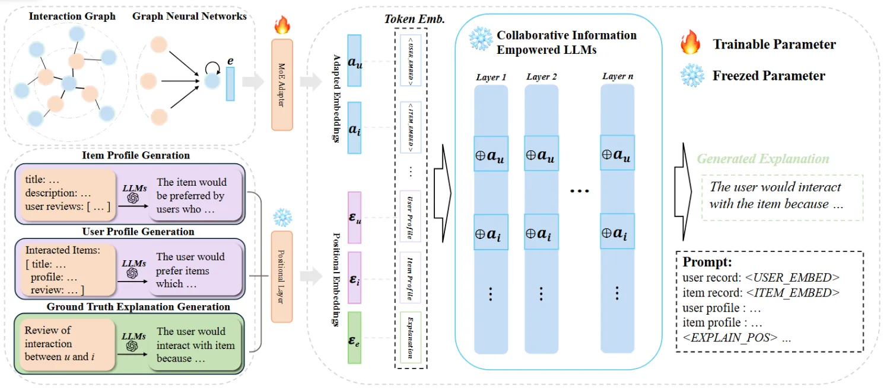
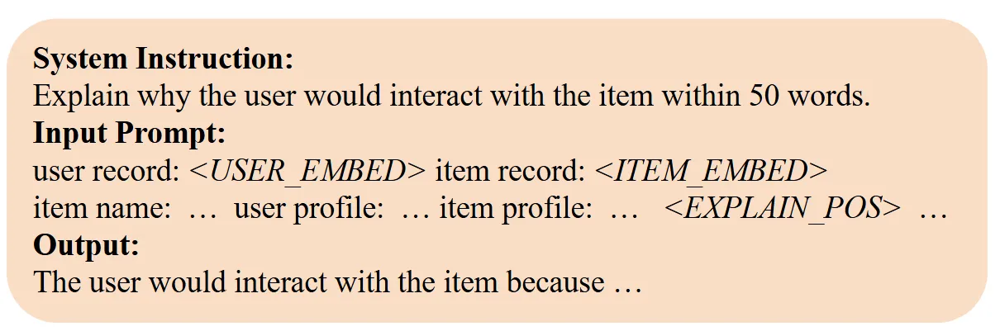

::: tip 提示
根据遗忘曲线：如果没有记录和回顾，6天后便会忘记75%的内容

阅读笔记正是帮助你记录和回顾的工具，不必拘泥于形式，其核心是：记录、翻看、思考
:::

::: info 信息
论文 [XRec: Large Language Models for Explainable Recommendation](https://arxiv.org/pdf/2406.02377)     

代码 [https://github.com/HKUDS/XRec](https://github.com/HKUDS/XRec)

摘要: 
本文主要介绍一个名为 XRec 的模型不可知框架，该框架使 LLM 能够为推荐系统中的用户行为提供全面的解释。该框架通过整合协作信号和设计一个轻量级的协作适配器，使 LLM 能够理解用户-物品交互中的复杂模式，并更深入地了解用户偏好。
:::

## 论文贡献
> 1）提出了与模型无关的 XRec，这是一个开创性的协作指令调优框架，它使大型语言模型能够为推荐系统中的用户行为提供全面的解释。

> 2）为 LLM 配备了独特的能力，通过协作指令调整范式集成协作信号来理解用户物品交互的复杂模式。

> 3）为了弥合协作关系和语言语义空间的表示空间，设计了一个轻量级的协作适配器，将行为感知的协作信号合并到LLM中，从而更深入地了解用户偏好。

## 模型架构
XRec 模型的目标是揭示用户-物品交互背后的潜在原因，并阐明影响用户行为的因素。通过统一图协同过滤和大语言模型，XRec 旨在提供洞察力的解释，帮助用户理解某些交互发生的原因，并增强推荐过程的透明度。

### 协同关系 Tokenizer
为了有效地捕捉大量用户和物品之间的协同关系，并反映它们的交互模式，自然语言有其局限性，但表示提供了一种强大的替代方案。XRec 利用图神经网络的强大能力作为 tokenizer，将高阶协同关系信息编码成潜在嵌入空间，从而有效建模复杂的用户偏好。

#### 基于图的消息传递
协同图 tokenizer 利用消息传递机制在用户-物品交互图中传播和聚合信息，促进用户和物品节点表示的学习。在 XRec 中，采用 LightGCN 作为有效的协同信息聚合的主干。
$$e_{u}^{(l+1)}=\sum_{i\in \mathcal{N}_{u}}\frac{1}{\sqrt{|\mathcal{N}_{u}|}\sqrt{|\mathcal{N}_{i}|}}e_{i}^{(l)}, \\

e_{i}^{(l+1)}=\sum_{u\in \mathcal{N}_{u}}\frac{1}{\sqrt{|\mathcal{N}_{i}|}\sqrt{|\mathcal{N}_{u}|}}e_{u}^{(l)},$$
用户和物品最终嵌入是通过对所有层嵌入进行平均来计算：
$$e_{u}=\sum_{k=0}^{K}\frac{1}{K+1}e_{u}^{(k)}, \quad e_{i}=\sum_{k=0}^{K}\frac{1}{K+1}e_{i}^{(k)},$$

#### 利用 CF 信号进行 Tokenizer 优化
为了使用来自用户交互的隐式反馈信号来优化协作图 Tokenizer，作者利用贝叶斯个性化排名 (BPR) 损失作为监督信号来指导用户和物品嵌入的生成，其定义为：
$$L_{BPR}=-\sum_{u=1}^{m}\sum_{i\in \mathcal{N}_{u}}\sum_{j \notin \mathcal{N}_{u}}ln\sigma(\hat{y}_{u,i}-\hat{y}_{u,j}),$$
$\hat{y}_{u,i}$表示用户$u$和物品$i$之间的预测分数（内积），$\sigma$表示$sigmoid$函数。此外，还包括一个正则化损失来维护嵌入的范数：
$$L_{reg}=\lambda(\|e_{u}^{(0)}\|^{2}+\|e_{i}^{(0)}\|^{2}),$$

### LLM 的协同指令调优
为了使 LLM 能够理解用户和物品之间的协作信息，引入了一种协同指令调优范式。这种方法将行为级信息与语言级语义对齐，从而将用户偏好纳入 LLM 中的知识。

#### 协同信息适配器
鉴于行为级协作信息与与用户和物品相关的文本语义之间可能存在的分歧性表示空间，XRec 配备了轻量级但有效的适配器。这个适配器旨在对这些不同的模态进行对齐。从而使模型能够有效利用协作信号和文本语义。

为了弥合大型语言模型 (LLM) 的输入与行为感知协作关系 tokens 之间的语义差距，并增强模型的泛化能力，应用了混合专家 (MoE) 方法进行嵌入空间适应。在这个专家混合架构中，每个专家都由一个线性层表示，该层捕获不同的语义维度，然后使用可学习的门控路由器机制集成这些专家。这允许模型自适应地组合由各种专家编码的不同语义表示，有效地弥合行为感知协作关系 tokens 和文本语言 tokens 之间的差距。

#### 用 LLM 统一 CF
有了新调整的嵌入，就准备将协作信息注入 LLM 中。引入特殊 tokens 来预留输入提示的空间，在将提示转换为 tokens 嵌入之后，将调整后的嵌入注入这些预留位置。

然而，随着输入提示中嵌入 tokens 的每个节点仅由单个 token 表示，一个挑战出现了。随着输入长度的增加，分配给每个嵌入 token 的注意力权重不可避免地会减少，这可能导致协作信息的潜在损失。为了应对这种影响力的稀释，我们借鉴了(齐等人，2023)的方法，并将适应的嵌入-tokens注入扩展到初始输入提示之外。具体来说，
我们将它们纳入LLM的每一层预留位置。为了促进这一点，我们对LLM中的每一层的键、查询和值投影函数进行了如下修改：
$$f_{\{q,k,v\}}(x_{i}) += W_{\{q,k,v\}}\cdot a_{i},$$
用$W_{q,k,v}$表示查询、键和值的投影矩阵，用$a_{i}$表示适应的嵌入。XRec 确保大型语言模型（LLMs）在其整个结构中不断访问并整合协作信息，而不仅仅是输入阶段。通过将基于图的知识注入 LLMs 的所有层，不仅保持了协作上下文的稳健表示，而且还能直接将梯度流有效地引导混合专家（MoE）模块。这种创新的语言建模与图表示学习集成使得能够利用 LLMs 提供的深度上下文洞察力，同时受益于图神经网络所识别的结构模式。

#### 结构化提示嵌入
采用结构化提示，如图 2 所示，它集成了各种数据元素。这个过程涉及对提示进行 token 化并将其转换为嵌入空间表示。为了确保提示中的特殊 tokens 被识别为唯一的实体，将它们合并到 LLM 的 tokenizer 中。然后，这些专门的 tokens 被它们在转换后的 token 嵌入中的相应适应嵌入所取代。

具体来说，将输入提示定义为$\mathcal{P}=[p_{1},\cdots,p_{u},\cdots,p_{i},\cdots,p_{e},\cdots,p_{l}],$其中每个元素$p$表示一个输入 token。$p_{u},p_{i},p_{e}$分别表示$<USER\_EMBED>,<ITEM\_EMBED>,<EXPLAIN\_POS>$。在通过位置嵌入层处理后，将其输出表示为$\mathcal{E}=[\epsilon_{1},\cdots，\epsilon_{u},\cdots，\epsilon_{i},\cdots，\epsilon_{e},\cdots，\epsilon_{l}],$其中$\epsilon$是其对应 token 的嵌入表示，随后，$\epsilon_{u}$和$\epsilon_{i}$被改造的嵌入$a_{u}$和$a_{i}$替换，形成最终的嵌入层$\mathcal{E}=[\epsilon_{1},\cdots，a_{u},\cdots，a_{i},\cdots，\epsilon_{e},\cdots，\epsilon_{l}],$进一步用作 LMM 的输入。
为了提高大型语言模型 (LLM) 生成上下文和句法连贯的解释的能力，目标是最小化下一个 token 的预测概率与序列中实际下一个 token 之间的损失。利用负对数似然 (NLL) 作为训练损失，计算如下：
$$\mathcal{L}=-\frac{1}{N}\sum_{i=1}^{N}\sum_{c=1}^{C_{i}}y_{ic}\cdot log(\hat{y}_{ic}),$$
这里，$N$是解释的数量，$C_{i}$是每个解释中的字符计数，$y_{i,c}$和$\hat{y}_{i,c}$分别表示实际 tokens 和预测tokens。为了最小化训练复杂度，冻结 LLM 中的所有参数，不包括与 GNN 训练过程的任何交互。唯一的可训练参数是专家混合 (MoE) 模型中的参数。

#### 真实解释生成
直接使用用户主观评论作为推荐系统的基本事实解释，可能只隐含地传达用户的意图或情绪。为了解决这个限制并提高基本事实解释的质量，采用大型语言模型 (LLM) 来从原始评论中提取明确的用户意图。
$$explanation(u,i)=LLMs(\mathcal{P},r_{u,i}),$$
其中，$r_{u,i}$是用户$u$对物品$i$的评论。

## 总结
本文提出了一个新的框架 XRec，它将基于图的协同过滤范式与大型语言模型 (LLM) 的能力无缝集成，以生成对推荐输出的全面解释。通过利用用户-物品交互图中编码的固有协作关系，XRec 能够有效地捕获用户偏好和物品关联背后的高阶依赖关系。XRec 引入了专门的协作信息适配器，作为建立协作信号与 LLM 中编码的丰富文本语义之间的强联系的关键桥梁。