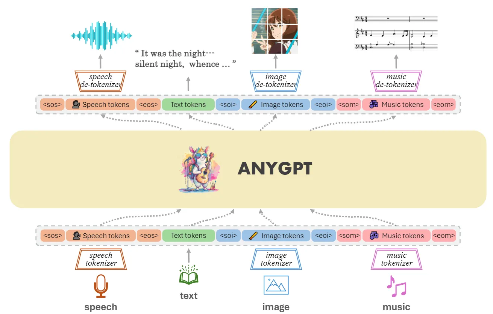
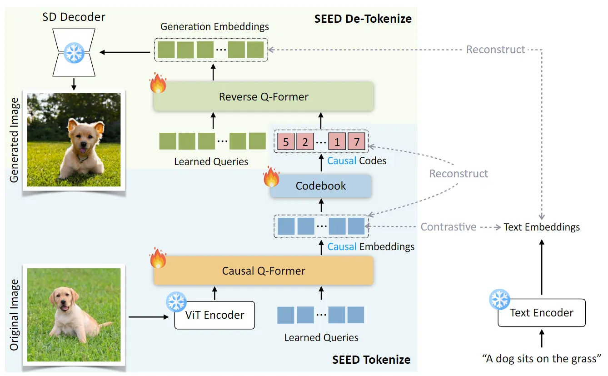
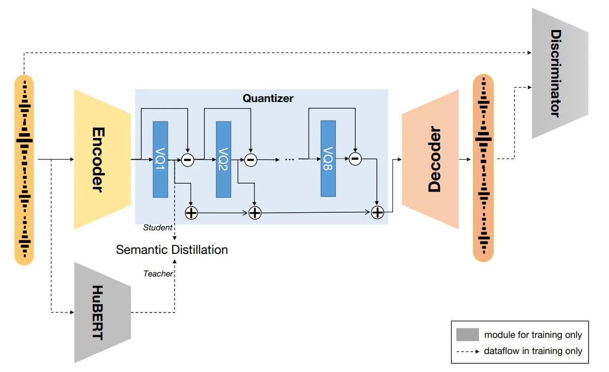
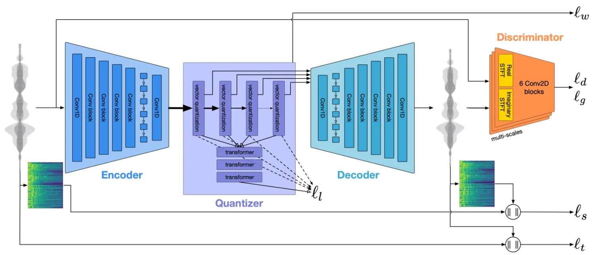

::: tip 提示
根据遗忘曲线：如果没有记录和回顾，6天后便会忘记75%的内容

阅读笔记正是帮助你记录和回顾的工具，不必拘泥于形式，其核心是：记录、翻看、思考
:::

::: info 信息
论文 [AnyGPT: Unified Multimodal LLM with Discrete Sequence Modeling](https://arxiv.org/pdf/2402.12226)     

主页 [https://junzhan2000.github.io/AnyGPT.github.io/](https://junzhan2000.github.io/AnyGPT.github.io/)

代码 [https://github.com/OpenMOSS/AnyGPT](https://github.com/OpenMOSS/AnyGPT)

摘要: 本文主要介绍了一种名为AnyGPT的多模态语言模型，一种任意到任意模态的语言模型。它利用离散表示来统一处理各种模态，包括语音、文本、图像和音乐。 AnyGPT 可以稳定地训练，无需对当前的大语言模型（LLM）架构或训练范式进行任何改变。

:::

## 论文贡献
> 1）提出了一种基于 token 的任意到任意模型的多模态语言模型AnyGPT，可以理解和生成各种模态，包括语音、文本、图像和音乐。

> 2）使用生成模型开发了一个管道来构建了一个包含108k个具有交错多模态元素的多轮对话的数据集AnyInstruct-108k。

> 3）证明了离散表示可以有效地统一语言模型中的多种模态。

## 模型架构
AnyGPT主要包含三个组成部分：多模态 tokenizer、作为骨干网络的多模态语言模型 和多模态 de-tokenzier。tokenizer 将连续的非文本模态转换为离散 tokens，随后排列成多模态交错序列。然后语言模型使用下一个 token 预测目标进行训练。在推理阶段通过 de-tokenizer 将多模态 tokens 解码回其原始表征。

### Tokenization

#### 图像tokenizer

图像 tokenizer 使用的是SEED tokenizer（Tencent，2023），主要包含几个组件：Vit encoder、Causal Q-Former、VQ Codebook、MLP以及UNet decoder。以$224\times 224$RGB 的图像作为输入，ViT encoder 将其编码为$16\times 16$的 patches，然后 Causal Q-Former 将这些 patches 特征转换成 32 维的 causal embeddings，接着用具有 8192 项的 codebook 将 causal embeddings 离散化为一系列的矢量 codes，MLP用于将视觉 codes 解码为生成嵌入，该嵌入与预先训练的 unCLIPSD 的潜在空间对齐。最后，UNet 解码器用于将生成嵌入恢复为原始图像。

#### 语音tokenizer

语音 tokenizer 使用的是 SpeechTokenizer（Fudan，2023）。采用具有残差矢量量化 (RVQ) 的 encoder-decoder 架构。SpeechTokenizer 使用八个分层量化器将单通道音频序列压缩为离散矩阵，每个量化器有 1024 个条目，并实现了 50 Hz 的帧速率。第一个量化器层捕获语义内容，而第 2 层到第 8 层编码副语言细节。因此，将 10 秒的音频转换为$500\times 8$矩阵，分为语义和声学 tokens。

#### 音乐tokenizer

音乐 tokenizer 使用的是 Encodec（Meta，2022）。使用残差矢量量化（RVQ）量化的潜在空间的卷积auto-encoder 作为音乐 tokenizer。使用了在 20k 条音乐轨道上预训练的 Encodec1 的可用现成变体。该变体处理 32 kHz 单音音频，并实现了 50 Hz 的帧速率。生成的嵌入使用具有四个量化器的 RVQ 进行量化，每个量化器的 codebook 大小为 2048，得到组合音乐词汇量为 8192。

### 语言模型 Backbone

#### 扩展词汇表
为了将多模态离散表示合并到预训练的 LLM 中，使用新的模态特定 tokens 扩展词汇表，从而扩展相应的嵌入和预测层，新合并的参数是随机初始化的。来自所有模态的 tokens 组合起来形成一个新的词汇表，其中每个模态都在语言模型中进行训练，以在共享表示空间中对齐。这个增量词汇表的大小用$V$表示，是所有模态的词汇量的总和，即$V=\sum_{i=1}^{n}V_{i}$，其中$V_i$表示第$i$个模态的词汇量。

#### 统一多模态语言模型
配备特定于模态的 tokenizer，将多模态数据压缩为离散 token 序列，可以使用下一个 token 预测损失由语言模型训练。这自然使核心LLM能够以自回归的方式统一感知、理解、推理和生成等任务。这里使用了LLaMA-2 7B 作为主干。

#### 多模态生成
高质量多模态数据的生成，包括高清图像和高保真音频，提出了一个重大挑战。这些数据通常需要大量位才能进行准确的表示，导致长序列对语言模型特别苛刻，因为计算复杂度随着序列长度呈指数增长。
为了解决这个问题，本文采用两阶段框架进行高保真生成，包括语义信息建模和感知信息建模。首先，语言模型的任务是在语义级别生成经过融合和对齐的内容。然后，非自回归模型将多模态语义标记转换为感知级别的高保真多模态内容，在性能和效率之间取得平衡。
具体来说，使用与扩散潜在空间对齐的 SEED tokens 进行视觉语言建模。语义级 SEED tokens 通过扩散模型解码为高质量图像，以其优越的生成能力而闻名。对于语音，利用 SoundStorm (google，2023)，这是一种非自回归掩码语言模型，经过训练可以从语义标记中生成 SpeechTokenizer 的声学标记。本文训练了一个 Soundstorm 变体，它是在多语言 LibriSpeech（MLS）数据集上使用 SpeechTokenizer 训练的。随后，SpeechTokenizer 的解码器将所有语音 tokens 转换为原始音频数据。这种方法使 AnyGPT 使用 3 秒的语音提示复制任何说话者的语音，同时显着减少 LLM 的语音序列的长度。对于音乐，使用 Encodec 标记过滤掉人类感知之外的高频细节，然后使用 Encodec 解码器将这些标记重建为高保真音频数据。

## 总结
在这项工作中，提出了 AnyGPT，这是一种任意到任意多模态语言模型，它利用离散表示来统一处理各种模态，包括语音、文本、图像和音乐。离散多模态表示促进了新模态的无缝集成，不需要改变现有的LLM架构或训练范式。为了使模型能够处理多模态输入和输出的任意组合，合成了第一个大规模任意到任意多模态指令数据集 AnyInstruct-108k，该数据集由复杂交织各种模态的多轮对话组成。实验结果表明，AnyGPT在各种跨模态任务中取得了很好的结果，并证明了离散表示可以有效地方便地统一一个统一的大型语言模型中的多个模态。
### 限制和未来工作：
1）Benchmark：任意到任意多模态大型语言模型 (LLM) 的领域都是新兴的研究领域。然而，缺乏专门的基准来评估模型跨多个维度的能力，以及减轻潜在风险，提出了一个相当大的挑战。因此，综合基准的开发势必行。
2）增强 LLMs：虽然具有离散表示的多模态 LLM 可以稳定地训练，但与单模态训练相比，可以观察到更高的损失，阻碍了每个模态的最佳性能。改进多模态融合的潜在策略可能涉及缩放 LLM 和 tokenizers 或采用混合专家 (MOE) 架构来更好地管理不同的数据并优化性能。
3）更好的 tokenizer：在采用离散表示的多模态 LLM 中，tokenizer 的质量为模型的理解和生成潜力设置了上限。增强 tokenizer 可以从各种角度进行处理，包括采用优越的 codebook 训练方法、开发更有凝聚力的多模态表示在各种模态中的应用。
4）更长的上下文：多模态内容，如图像和音频，通常跨越广泛的序列。例如，AnyGPT 将音乐建模限制为 5 秒，极大地限制了其音频输出的实际有用性。此外，对于任意到任意多模态对话，扩展上下文允许更多的会话交换，从而丰富交互的深度和复杂性。
