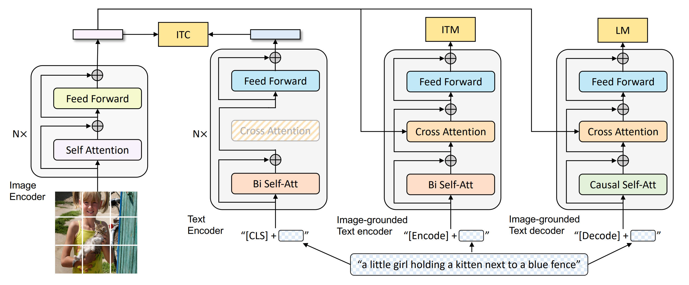
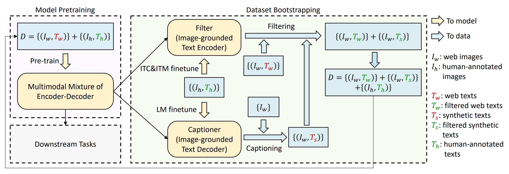

::: tip 提示
根据遗忘曲线：如果没有记录和回顾，6天后便会忘记75%的内容

阅读笔记正是帮助你记录和回顾的工具，不必拘泥于形式，其核心是：记录、翻看、思考
:::

::: info 信息
论文 [BLIP: Bootstrapping Language-Image Pre-training for Unified Vision-Language Understanding and Generation](https://arxiv.org/pdf/2201.12086)     

代码 [https://github.com/salesforce/BLIP](https://github.com/salesforce/BLIP)

摘要: 本文提出了 BLIP，这是一种新的 VLP 框架，可灵活地转移到视觉语言理解和生成任务。BLIP 通过引导字幕有效地利用了嘈杂的网络数据，其中字幕制作者生成合成字幕，过滤器删除嘈杂的字幕。
:::

## 论文贡献
> 1) 编码器-解码器的多模态混合 (MED)：一种用于有效多任务预训练和灵活迁移学习的新模型架构。MED 可以作为单模态编码器、基于图像的文本编码器或基于图像的文本解码器运行。该模型与三个视觉语言目标联合进行预训练：图像文本对比学习、图像文本匹配和图像条件语言建模。

> 2) 字幕和过滤 (CapFilt)：一种用于从嘈杂的图像文本对中学习的新数据集引导方法。将预训练的 MED 微调为两个模块：一个字幕生成器，用于根据网络图像生成合成字幕，以及一个过滤器，用于从原始网络文本和合成文本中删除嘈杂的字幕。

## 方法
### 模型架构

为了预先训练一个具有理解和生成能力的统一模型，本文提出了多模态编码器-解码器混合模型 (MED)，这是一种可以在以下三种功能之一中运行的多任务模型：

#### 单模态编码器
单模态编码器，分别对图像和文本进行编码。文本编码器与 BERT 相同，其中 [CLS] 标记附加到文本输入的开头以总结句子。

#### 基于图像的文本编码器
基于图像的文本编码器，通过在文本编码器的每个转换器块的自注意（SA）层和前馈网络（FFN）之间插入一个额外的交叉注意（CA）层来注入视觉信息。特定于任务的 [Encode] 标记附加到文本，并使用 [Encode] 的输出嵌入作为图像-文本对的多模态表示。

#### 基于图像的文本解码器
基于图像的文本解码器，用因果自注意层替换基于图像的文本编码器中的双向自注意层。 [Decode] 标记用于表示序列的开始，而 wend-of-sequence 标记用于表示其结束。

### 预训练目标
在预训期间，联合优化了三个目标，包括两个基于理解的目标和一个基于生成的目标。每个图像-文本对只需要通过计算量更大的视觉转换器进行一次前向传递，并通过文本转换器进行三次前向传递，其中激活不同的功能来计算如下所示的三个损失。

#### 图像-文本对比损失（ITC）
图像 encoder 分支采用 ViT 结构，文本 encoder 部分采用 BERT 结构，[CLS] token用来代表整个句子的特征。图像特征和文本特征进行对比损失，从而进行对齐操作。

ITC 图文对比任务，采用的标准的 InfoNCE loss。和 ALBEF 类似，BLIP 在 ITC 中，同样构建了队列，同样采用了 momentum 机制。相当于有两个 image encoder 和两个 text encoder，其中一个采用动量更新参数，并构建图像特征和文本特征，并存入队列中，从而增大对比损失时的负样本数量。

```python
sim_i2t = image_feat @ text_feat_all / self.temp
sim_t2i = text_feat @ image_feat_all / self.temp

loss_i2t = -torch.sum(F.log_softmax(sim_i2t, dim=1) * sim_i2t_targets, dim=1).mean()
loss_t2i = -torch.sum(F.log_softmax(sim_t2i, dim=1) * sim_t2i_targets, dim=1).mean()

loss_itc = (loss_i2t + loss_t2i) / 2

self._dequeue_and_enqueue(image_feat_m, text_feat_m)
```

#### 图像-文本匹配损失（ITM）
采用 image-grounded text encoder，具体结构也是 BERT，采用 cross-attention 来融合图像特征和文本特征，相当于一个多模态的 encoder，[Encode] token 用来代表多模态融合后的特征，最后在该特征后面增加一个 mlp 分类 head，区分图文是否匹配。

ITM 图文匹配任务，是一个二分类任务。和 ALBEF 类似，正样本对就是同时输入的图像和文本，而负样本是利用上面的图文对比相似任务中的相似度进行采样挖掘而来。正样本对和负样本对分别经过多模态 encoder，再经过一个线性分类 head，最终获得分类得分。采用交叉熵损失函数进行训练。

```python
vl_embeddings = torch.cat([
                output_pos.last_hidden_state[:, 0, :],
                output_neg.last_hidden_state[:, 0, :], ], dim=0)
itm_logits = self.itm_head(vl_embeddings)

itm_labels = torch.cat([torch.ones(bs, dtype=torch.long), torch.zeros(2 * bs, dtype=torch.long)],dim=0).to(image.device)
loss_itm = F.cross_entropy(itm_logits, itm_labels)
```

#### 语言模型损失（LM）
采用 image-grounded text decoder，用 causal self-attention 来编码图像特征和文本特征。与 BERT 的 mask 机制不同，这里 causal self-attention 是一种序列注意力机制，相当于预测接下来的语句。[Decode] token 被用来表示句子的开头。因此该语言模型任务能够为图像生成一段话 caption，为后续的 captioner、filter 机制奠定基础。

LM语言模型任务，是一个序列生成任务。输入图像特征和语句开始token，然后序列化生成语句。该语句可以认为是图像的caption。
```python
decoder_output = self.text_decoder(
            decoder_input_ids,
            attention_mask=text.attention_mask,
            encoder_hidden_states=image_embeds,
            encoder_attention_mask=image_atts,
            labels=decoder_targets,
            return_dict=True )

loss_lm = decoder_output.loss
```

### CapFilt
进一步，为了提升对数据噪声的鲁棒性，BLIP 采用了一种 Captioning and Filtering (CapFilt) 的机制，和ALBEF 的蒸馏方法不同。该机制充分利用两点：一是 BLIP 中的 image-grounded text encoder 和image-grounded text decoder，两个结构可以过滤图文对和生成图像的描述文本，而文本又可以和图像组成一个图文匹配对；二是利用高质量的人类标注的图文对数据集来进行模型训练监督，从而获得更加可靠的 BLIP 预训练模型，为图像生成更加可靠的文本。有了这两点，似乎可以循环利用这两步，从而不断提高模型效果。


### 训练流程

- 利用网络上获取的图文对和人工标注好的图文对，对 BLIP 网络进行预训练，获得一个基础版本的多模态混合encoder-decoder 模型。
- 利用ITC和ITM任务，在人工标注的高质量图文对上，对 BLIP 的 image-grounded text encoder 进行finetune，获得一个高置信度的 Filter。
- 然后利用 LM 任务，在人工标注的高质量图文对上，对 BLIP 的 image-grounded text decoder 进行finetune，获得一个高质量的 Captioner。
- 然后针对网络获取的图文对中的图片进行 captioning 操作，获取描述文本，与图片组成一个图文对。将该图文对和网络获取的图文对一起送进 filter 中，获取过滤成功的图文对。
- 最后将过滤成功的图文对，和人工标注的高质量图文对组成一个全新的数据集，利用该数据集对 BLIP 进行预训练，获得更加高质量的图文预训练模型。


## 总结

本文提出了 BLIP，一种新的 VLP 框架，在包括基于理解和基于生成的任务在内的各种下游视觉语言任务上具有最先进的性能。BLIP 使用从大规模嘈杂图像文本对引导的数据集，通过注入不同的合成字幕并删除嘈杂字幕，对多模态编码器-解码器模型进行预训练。我们发布了引导数据集，以促进未来的视觉语言研究。

另外，有几个潜在的方向可以进一步提高 BLIP 的性能：
- （1）多轮数据集引导；
- （2）为每个图像生成多个合成字幕，以进一步扩大预训练语料库；
- （3）通过训练多个不同的字幕制作者和过滤器并在 CapFilt 中结合它们的力量来模型集成。