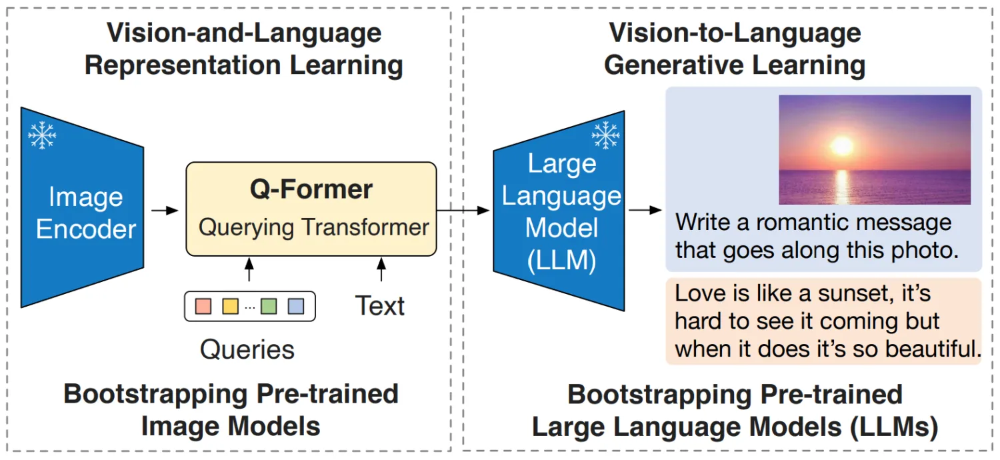

::: tip 提示
根据遗忘曲线：如果没有记录和回顾，6天后便会忘记75%的内容

阅读笔记正是帮助你记录和回顾的工具，不必拘泥于形式，其核心是：记录、翻看、思考
:::

::: info 信息
论文 [BLIP-2: Bootstrapping Language-Image Pre-training with Frozen Image Encoders and Large Language Models](https://arxiv.org/pdf/2301.12597)     

代码 [https://github.com/salesforce/LAVIS/tree/main/projects/blip2](https://github.com/salesforce/LAVIS/tree/main/projects/blip2)

摘要: 本文提出了 BLIP-2，这是一种通用且高效的预训练策略，可以从现成的冻结的预训练图像编码器和冻结的大型语言模型引导视觉语言预训练。BLIP-2 将模态差距与轻量级 Querying Transformer 连接起来，该 Transformer 分两个阶段进行预训练。第一阶段从冻结的图像编码器引导视觉语言表示学习。第二阶段从冻结的语言模型引导视觉语言生成学习。

:::

## 论文贡献
> 1）本文提出了BLIP-2，这是一种通用而有效的预训练策略，它从现成的冻结预训练图像编码器和冻结的大型语言模型中引导视觉语言预训练，有效地利用了冻结的预训练图像模型和语言模型，并使用两阶段预训练的 Q-Former 弥合模态差距。

> 2）可以提示 BLIP-2 执行遵循自然语言指令的零样本图像到文本生成，从而实现视觉知识推理、视觉对话等新兴能力。

> 3）BLIP-2 使用了冻结的单峰模型和轻量级的 Q-Former，具有更高效的计算效率。

## 模型架构
本文提出了BLIP-2，一种新的视觉语言预训练方法，可以从冻结的预训练单峰模型中引导。为了弥合模态差距，提出了一个分两个阶段预训练的Querying Transformer （Q-Former）：
- 1）具有冻结图像编码器的视觉语言表示学习阶段;
- 2）具有冻结 LLM 的视觉语言生成学习阶段。

### Q-Former
Q-Former 包含两个共享 self-attention 层的 transformer 模块：
- 一种与冻结图像编码器交互的图像 transformer，用于视觉特征提取。
- 一种既可以充当文本编码器又可以充当文本解码器的文 transformer。

### 表征学习预训练阶段：三个预训练目标

- Image-Text Contrastive Learning (ITC) 
  - 学习对齐图像表示和文本表示，以使它们的相互信息最大化。通过对比正负对的图像-文本相似性来实现这一点。
  - 为了避免信息泄漏，采用了 unimodal self-attention 掩码，不允许 query 和文本相互查看。
- Image-grounded Text Generation (ITG) 
  - 训练 Q-Former 生成文本，将输入图像作为条件。
  - 由于 Q-Former 的架构不允许冻结图像编码器和文本 tokens 之间的直接交互，因此生成文本所需的信息必须首先由 query 提取，然后通过 self-attention 传递给文本 tokens。因此，query 被迫提取包含文本所有信息的视觉特征。
  - 使用 multimodal causal self-attention 掩码来控制 query 与文本交互。query 可以相互关注，但不能关注文本 tokens。每个文本 tokens 都可以处理所有 query 及其以前的文本标记。
- Image-Text Matching (ITM) 
  - 旨在学习图像和文本表示之间的细粒度对齐。
  - 这是一个二进制分类任务，要求模型预测图像文本对是正（匹配）还是负（不匹配）。
  - 使用 bi-directional self-attention 掩码，所有查询和文本都可以相互关注。因此，输出的 query embedding 捕获多模态信息。

### 生成学习预训练阶段

- 将 Q-Former（附带冻结图像编码器）连接到冻结 LLM，以获取LLM 的生成语言能力 。
- 使用 FC 层将QFormer 输出的 query embedding 线性投影到与 LLM 的文本 embedding 相同的维度。将投影的 query embedding 附加到输入文本 embedding 。
  - 它们用作 soft visual prompts，以 Q-Former 提取的视觉表示为 LLM 提供条件。
  - 由于 Q-Former 已经有预训练以提取富含语言信息性的视觉表示，因此它有效地充当了一个信息 bottleneck，将最有用的信息提供给 LLM，同时去除不相关的视觉信息，减轻了 LLM 学习视觉语言对齐的负担，从而减轻了灾难性遗忘问题。
- 实验尝试了两种类型的 LLMs：
  - 基于解码的 LLM：对语言建模损失进行预训练，其中冻结的LLM的任务是生成基于 Q-Former 视觉表示的文本。
  - 基于编码器-解码器的LLM：使用前缀语言建模损失进行预训练，将文本分成两部分。前缀文本与视觉表示连接，作为LLM编码器的输入。后缀文本用作LLM解码器编码器的生成目标。

## 总结
本文提出了 BLIP-2，这是一种通用且计算效率高的视觉语言预训练方法，它利用了冻结的预训练图像编码器和 LLM。BLIP-2 在各种视觉语言任务中实现了最先进的性能并且在预训练阶段只有少量的可训练参数。BLIP-2 还展示了零样本指示图像到文本生成的新兴能力。

限制：

- 1）缺乏高质量的数据集，导致缺乏上下文学习能力。
- 2）由于冻结模型的使用，BLIP-2 继承了 LLM 的风险，例如输出攻击性语言、传播社会偏见或泄露私人信息。