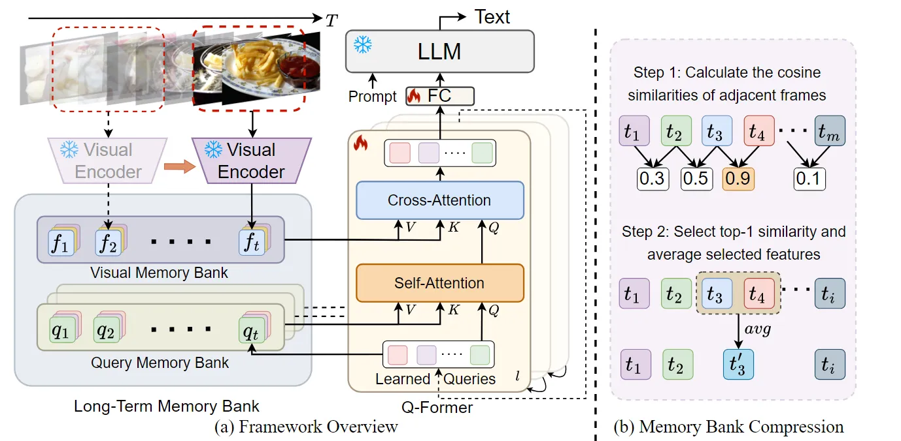

::: tip 提示
根据遗忘曲线：如果没有记录和回顾，6天后便会忘记75%的内容

阅读笔记正是帮助你记录和回顾的工具，不必拘泥于形式，其核心是：记录、翻看、思考
:::

::: info 信息
论文 [MA-LMM: Memory-Augmented Large Multimodal Model for Long-Term Video Understanding](https://arxiv.org/pdf/2404.05726)     

主页 [https://boheumd.github.io/MA-LMM/](https://boheumd.github.io/MA-LMM/)

代码 [https://github.com/boheumd/MA-LMM](https://github.com/boheumd/MA-LMM)

摘要: 本文针对长视频理解提出了 MA-LMM 模型，通过在线方式处理视频，并将过去的视频信息存储在内存库中，这允许模型参考历史视频内容进行长期分析，而不会超过 LLM 的上下文长度约束或 GPU 内存限制。其中视频库可以无缝集成到当前的 MLLM 中。

:::

## 论文贡献

> 1）引入了一种新的长短期记忆体设计来增强现有的 MLLM，配备长视频建模能力。

> 2）所提出的模型显著减少了 GPU 内存使用量，并通过在线方式处理视频序列来解决 LLM 的上下文长度限制。

## 模型架构
MA-LMM主要包含三个组成部分：
- 1）冻结的视觉编码器提取视觉特征；
- 2）可训练的 Q-Former 在时序上对齐视觉和文本嵌入空间；
- 3）冻结 LLM 的文本解码。

### 视觉特征提取
类似于人类的顺序方式以及关联过去的记忆进行理解，MA-LMM 按顺序处理视频帧，将新帧输入与存储在长短期记忆库中的历史数据动态关联，确保仅保存判别信息以供后续使用，这种选择性保留有助于更可持续和更有效的视频理解方法，这进一步允许模型自动支持在线视频推理任务。
形式上，给定$T$个视频帧序列，将每个视频帧传递给预训练的视觉编码器获得视觉特征$V=\{v_{1},v_{2},\cdots v_{T}\}, v_{t}\in \mathbb{R}^{P\times C}$，其中$P$是每帧视频$patch$的数量，$C$是帧特征的通道维度，然后，通过位置嵌入层$(PE)$将时间顺序信息注入到帧级特征：
$f_{t}=v_{t}+PE(t),f_{t}\in \mathbb{R}^{P\times C}$

### 长期时序建模
为了将视觉嵌入与文本嵌入空间对齐，使用了 Q-Former 架构。Q-Former 采用学习到的 query $z\in \mathbb{R}^{N\times C}$来捕获视频时间信息。其中$N$是学习的 query 的数量，$C$是通道维度。Q-Former 为每张图片输出 32 $tokens$。每个 Q-Former 块由两个注意力子模块组成：（1）交叉注意力层，它与从冻结的视觉编码器中提取的原始视觉嵌入交互，以及（2）自注意力层，它对输入查询之间的交互进行建模。与仅关注当前帧嵌入的 BLIP-2 中的原始 Q-Former 不同，这里设计了一个由视觉记忆库和查询记忆库组成的长短期记忆库，它积累过去的视频信息并增强输入到交叉注意力层和自注意力层，以实现有效的长期视频理解。

#### 视觉记忆库（Visual Memory Bank）
视觉记忆库存储从冻结的视觉编码器中提取的每一帧的原始视觉特征。具体来说，对于当前时间步$t$，视觉记忆库包含了过去视觉特征的串联列表$F_{t}=Concat[f_{1},f_{2},\cdots,f_{t}],F_{t}\in \mathbb{R}^{tP\times C}$。给定输入 query $z_{t}$,视觉记忆库作为 key 和 value：
$$Q=z_{t}W_{Q},K=F_{t}W_{K},V=F_{t}W_{V},$$
然后，使用交叉注意操作：
$$O=Attn(Q,K,V)=Softmax(\frac{QK^{T}}{\sqrt{C}})V.$$
通过这种方式，它可以通过具有长期上下文的缓存视觉记忆库明确地关注过去的视觉信息。由于 Q-Former 中的所有交叉注意力层都关注相同的视觉特征，因此只有一个视觉记忆库在所有 Q-Former 块中共享。

#### 查询记忆库（Query Memory Bank）
与存储原始和静态视觉特征的固定视觉记忆库不同，查询记忆库累积每个时间步的输入查询，表示为$Z_{t}=Concat[z_{1},z_{2},\cdots,z_{t}],Z_{t}\in\mathbb{R}^{tN\times C}$。通过存储这些查询，使用 Q-Former 维护模型对每一帧的理解和处理的动态内存。查询记忆库也充当 key 和 value：
$$Q=z_{t}W_{Q},K=Z_{t}W_{K},V=Z_{t}W_{V},$$
然后使用交叉注意力（操作与视觉记忆库相同）。在每个时间步，$z_{t}$包含专门针对每个视频的学习重要信息，直到当前时间步$t$，与静态视觉记忆库不同，输入查询$z_{t}$在模型训练期间通过级联 Q-Former 块演变，在抽象级别捕获不同的视频概念和模式。因此，每个自注意力层都有一个唯一的查询记忆库，其中包含的输入查询在训练时更新。

#### 记忆库压缩（Memory Bank Compression）
鉴于模型直接将过去的视频信息存储在内存库中，GPU 内存成本和计算复杂度随着过去视频帧的数量线性增加。这对于长视频来说尤其具有挑战性，因此必须将记忆库进一步压缩成更小的大小。一个简单的解决方案是使用第一出队列来管理时间序列。在这种情况下，如果记忆库的当前长度超过预定义的限制，则删除最早的时间步长的特征。然而，这种方法不可避免地会导致早期历史信息的损失，因为添加新帧时会弹出旧特征。为了解决这个问题，作者利用长视频中的时间冗余，并引入了一种新的内存库压缩 (MBC) 技术。该方法根据相邻特征的相似性随时间聚合和压缩视频信息，同时保留早期历史信息。通过这种方式，重复信息被合并到内存库中，而判别特征保持不变。
如果当前记忆库长度大于预定义的阈值$M$，在每个自回归迭代中应用压缩算法。形式上，给定包含列表$[f_{1},f_{2},\cdots,f_{M}],f_{t}\in\mathbb{R}^{P\times C}$的视觉记忆库，当一个新的帧特征$f_{M+1}$出现时，需要通过将长度减少 1 来压缩内存库。在每个空间位置$i$，首先计算所有时间相邻标记之间的余弦相似度：
$$s_{t}^{i}=cos(f_{t}^{i},f_{t+1}^{i}),t\in[1,M],i\in[1,P].$$
然后跨时间选择最高的相似度，可以解释为时间上冗余最多的特征：
$$k=argmax_{t}(s_{t}^{i}).$$
接下来，所有空间位置的选定标记特征进行平均，以将内存库长度减少 1：
$$\hat{f}_{k}^{i}=(f_{k}^{i}+f_{k+1}^{i})/2.$$
通过这种方式，仍然可以保留最具辨别力的特征，同时保持时间顺序不变，如框架图中（b）所示，查询记忆库采用同样的方式进行压缩。

### 文本解码
当以自回归方式处理视频帧时，最终时间步的 Q-Former 输出包含所有历史信息，然后将其馈送到 LLM。因此，可以将输入文本标记的数量从 $N*T$显着减少到$N$，解决当前 LLM 的上下文长度限制，并大大减轻了 GPU 内存需求。在训练期间，给定一个包含视频-文本对的标注数据，模型以标准的交叉熵损失进行监督训练：
$$\mathcal{L}=-\frac{1}{S}\sum_{i=1}^{S}logP(w_{i}|w_{<i},V).$$
其中$V$表示输入视频，$w_{i}$是第$i$个真实文本标记。在训练期间，更新 Q-Former 的参数，同时保持视觉编码器和语言模型的权重被冻结。

## 总结
在本文中，引入了一个长短期记忆库，旨在增强当前的大型多模态模型，为它们配备有效且高效地建模长期视频序列的能力。所提出的方法按顺序处理视频帧并将历史数据存储在内存库中，解决了长视频输入带来的 LLM 的上下文长度限制和 GPU 内存限制。所提出的长期记忆库是一个即插即用模块，可以很容易地以现成的方式集成到现有的大型多模态模型中。