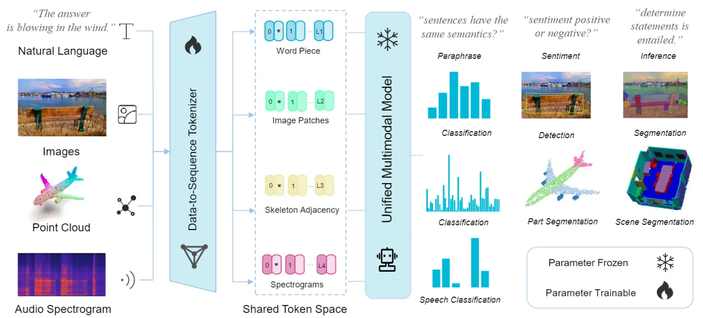
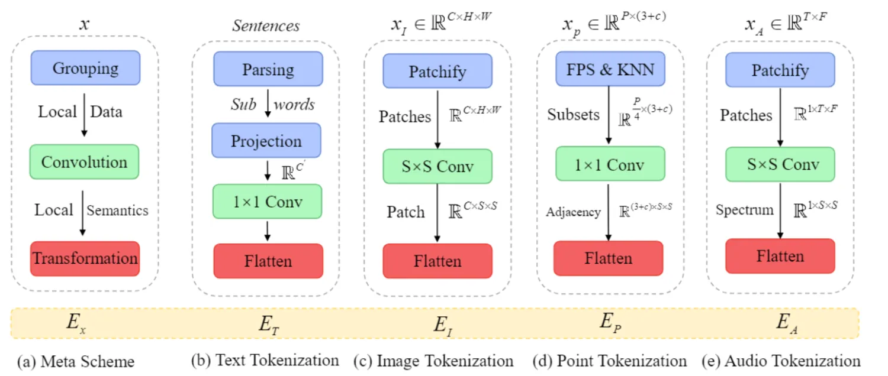

::: tip 提示
根据遗忘曲线：如果没有记录和回顾，6天后便会忘记75%的内容

阅读笔记正是帮助你记录和回顾的工具，不必拘泥于形式，其核心是：记录、翻看、思考
:::

::: info 信息
论文 [Meta-Transformer: A Unified Framework for Multimodal Learning](https://arxiv.org/pdf/2307.10802)     

主页 [https://kxgong.github.io/meta_transformer/](https://kxgong.github.io/meta_transformer/)

代码 [https://github.com/invictus717/MetaTransformer](https://github.com/invictus717/MetaTransformer)

摘要: 本文主要介绍了一个名为Meta-Transformer的统一框架，该框架可以处理12种不同的数据模态，包括文本、图像、点云、音频、视频等，并能够在没有成对多模态训练数据的情况下进行多模态感知。Meta-Transformer包含三个主要组成部分：一个统一的数据标记器、一个共享编码器和针对下游任务的任务特定头部。

:::

## 论文贡献
> 1）提出了一个新的框架 Meta-Transformer，它用一个统一的编码器能够同时从具有相同参数集的多个模态中提取表示。

> 2）对于多模态网络设计，全面检查了 Transformer 成分的功能，例如embeddings、tokenization和encoders在处理各种模态时的功能。 Meta-Transformer 提供了宝贵的见解，并在开发能够统一所有模态的模态不可知框架方面激发了有希望的新方向；

> 3）验证了 Meta-Transformer 在统一多模态学习方面的进一步潜力。

## 模型架构

整个模型分为三大部分：1. 模态信息标准化器（data-to-sequence tokenizer），将数据投影到共享嵌入空间；2. 与模态无关的标准化特征编码器（unified multimodal model），用于编码不同模态的嵌入； 3. 下游子任务头（task-specific heads），执行下游预测。

### 模态数据标准化器 （Data-to-Sequence Tokenization）

该模块旨在将各种模态的数据转换为 token embeddings，共享流行空间。考虑到模态的实际特点，将该方法应用于 tokenization。如图所示，以文本、图像、点云和音频为例。

文本：常规做法，使用带有30000词汇表的 WordPiece Embedding。每个输入文本被转换为一组token embeddings $x\in R^{n\times D}$，其中$n$是 token 的数量，$D$是嵌入维度。
图像：将二维图像$x\in R^{H\times W\times C}$展平为一个 2D 的 patches $x_p\in R^{N_s\times(S^{2}\cdot C)}$，其中$(H,W)$表示原始图像分辨率，$C$表示通道数，$S$是 patch size，$N_s=(HW/S^{2})$是生成的 patch 数量。然后使用一个投影层将维度映射为$D$：
$$x_{I}\in R^{C\times H\times W}\rightarrow x_{I}^{'}\in R^{N_s\times (S^2\cdot C)}\rightarrow x_{I}^{''}\in R^{N_s\times D}$$
点云：$\mathcal{X}=\{x_i\}_{i=1}^{P}$表示$P$个点的点云，其中$x_i=(p_i,f_i),p_i\in R^{3}$表示 3D 坐标，$f_i\in R^{c}$是第$i$个点的特征。使用最远点采样（FPS）操作对具有固定采样率（1/4）的原始点云进行采样。然后使用 K-最近邻 (KNN) 对相邻点进行分组。基于包含局部几何先验的分组集构造了具有分组子集中心点的邻接矩阵，以进一步覆盖 3D 对象和 3D 场景的综合结构信息。最后从$K$个子集中聚合结构表示，得到点嵌入为：
$$x_{P}\in R^{P\times (3+c)}\rightarrow x_{P}^{'}\in R^{\frac{P}{4}\times \frac{D}{2}}\rightarrow x_{P}^{''}\in R^{\frac{P}{16}\times D}$$
最远点采样（FPS）思想：不断迭代地选择距离已有采样点集合的最远点。
音频：首先使用 log Mel 滤波器组对持续时间为$t$秒的音频波形进行预处理，然后使用步幅为$t_s$的汉明窗口以频率$f_s$将原始波拆分为$l=(t/t_s)$区间，并将原始波进一步转换为$l$维滤波器组。随后，将谱图按时间和频率维度分割为大小为$S$的 patch，不同于图像，音频的 patch 在谱图上重叠。参照 AST，选择通过$S\times S$卷积将整个谱图分割为$N_s=12[(100t-16)/10]$个 patches，然后展平为 token 序列。过程如下：
$$x_{A}\in R^{T\times F}\rightarrow x_{A}^{'}\in R^{N_s\times S\times S}\rightarrow x_{A}^{''}\in R^{(N_s\cdot D/S^{2})\times D}$$
其中 $T$和$F$表示时间和频率维度。
> log Mel：梅尔滤波器组系数，常用的语音信号特征处理方式

### 模态无关的统一编码器（Unified Encoder）
将输入数据转换为 token embedding 空间后，利用冻结参数的 transformer 编码器对不同模态的 token embedding 序列进行编码。

预训练：利用 ViT 作为主干网络，并通过对比学习在 LAION-2B 数据集上对其进行预训练，这增强了通用 token 编码的能力。 预训练后，冻结主干网络的参数。 此外，对于文本理解，利用 CLIP的预训练文本标记器将句子分割为子词并将子词转换为词嵌入。
模态未知学习 ： 按照常规做法，将可学习的 token $x_{CLS}$添加到 token embedding 序列中，$x_{CLS}$的最终隐藏状态$(z_{L}^{0})$作为输入序列的表示，用于执行识别。为了加强位置信息，将 position embedding 合并到 token embedding 中。选择标准的可学习 1D position embedding。此外，没有观察到在图像识别上使用更复杂的 2D 感知 position embedding 进行实质性的性能改进。简单地通过逐元素加法运算将位置嵌入和内容嵌入融合在一起，然后将得到的嵌入序列馈送到编码器中。
深度为$L$的 Transformer 编码器包含多个堆叠的多头自注意力（MSA）层和 MLP 块。输入的 token embedding 首先被送到 MSA 层，然后是 MLP 块。然后第$l-1$个MLP 层的输出作为第$l$个 MSA 层的输入。在每一层之前附加层归一化（LN），并在每层之后应用残差连接。MLP 包含两个线性 FC 层和一个 GELU 非线性激活层。Transformer 的公式为：
$$z_0=[x_{CLS};E_{x_1};E_{x_2};\cdots ;E_{x_n}]+E_{pos}, \qquad E\in R^{n\times D},E_{pos}\in R^{(n+1)\times D},\\
z_{l}^{'}=MSA(LN(z_{l-1}))+z_{l-1},   \qquad l=1\cdots L, \\
z_{l}=MLP(LN(z_{l}^{'}))+z_{l}^{'},  \qquad l=1\cdots L, \\
y=LN(z_{L}^{0}),$$

其中$E_x$表示所提出的 tokenizer 的 token embedding，$n$表示 token 的数量。使用位置嵌入$E_{pos}$来增强 patch embedding 和可学习的 embedding。

### 特定任务头（Task-Specific Heads）
在获得学习表示后，将表示提供给特定任务的头$h(\cdot;\theta_{h})$，主要由MLP组成，因模态和任务而异。Meta-Transformer 的学习目标可以概括为：
$$\hat{y}=\mathcal{F}(x;\theta^{*})=h\circ g\circ f(x), \quad \theta^{*}=\underset{\theta}{argmin}\mathcal{L}(\hat{y},y)$$
其中$f(\cdot),g(\cdot),h(\cdot)$分别定义了tokenizer, backbone, heads的函数。

## 总结
本文主要探索了 transformer 在统一多模态方面的潜力，提出了多模态统一框架 Meta-Transformer以处理不同的模态数据。展现了开发具有 transformer 主干的统一多模态只能的一个有前途的趋势。从复杂度、方法和应用的角度来看，Meta-Transformer 有以下缺陷：
复杂性：Meta-Transformer 需要 $O(n^{2}\times D)$ 的时间复杂度来处理token embedding $[E_1,\cdots ,E_n]$。高内存成本和沉重的计算负担使得难以扩大规模。
方法：与 TimeSformer 和 Graphormer 中的轴向注意机制相比，Meta-Transformer 缺乏时间和结构意识。这种限制可能会影响 Meta-Transformer 在时间和结构建模起着至关重要的作用的任务的整体性能，例如视频理解、视觉跟踪或社交网络预测。
应用：Meta-Transformer 主要在多模态感知方面具有优势，但是它对跨模态生成的能力仍然是未知的。