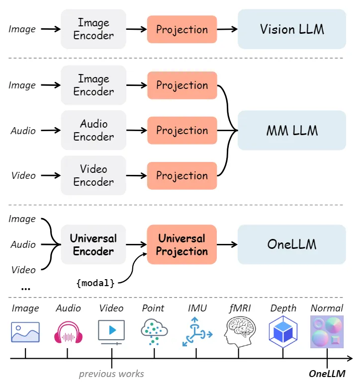
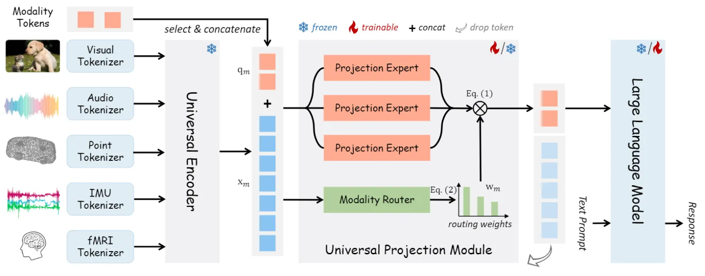

::: tip 提示
根据遗忘曲线：如果没有记录和回顾，6天后便会忘记75%的内容

阅读笔记正是帮助你记录和回顾的工具，不必拘泥于形式，其核心是：记录、翻看、思考
:::

::: info 信息
论文 [OneLLM: One Framework to Align All Modalities with Language](https://arxiv.org/pdf/2312.03700)     

主页 [https://onellm.csuhan.com/](https://onellm.csuhan.com/)

代码 [https://github.com/csuhan/OneLLM](https://github.com/csuhan/OneLLM)

摘要: 本文主要介绍了一种名为OneLLM的框架，该框架能够将各种不同的数据模态与自然语言进行对齐，包括图像、视频、音频、点云、深度/法线图、惯性测量单元（IMU）和功能性磁共振成像（fMRI）。

:::

## 论文贡献

> 1）提出了一个统一框架来将多模态输入与语言对齐。采用一个统一的多模态编码器，利用预训练的视觉语言模型和投影专家的混合，可以作为 MLLM 的通用且可扩展的组件。

> 2）OneLLM 是第一个在单个模型中集成八种不同模态的 MLLM。通过统一的框架和渐进式多模态对齐管道，可以很容易地扩展 OneLLM 以包含更多数据模态。

> 3）编制了一个大规模的多模态指令数据集。在本文中，OneLLM使用这个数据集进行微调，以充分发挥其多模态理解、推理和指令遵循能力。

之前都是各个模态编码器编码各自的模态，现在用一个统一的编码器编码各种模态，用一个统一投影层一块投影。

## 模型架构
OneLLM主要包含四个组成部分：特定模态分词器、通用编码器、通用投影模块（UPM）和LLM。

### 轻量级模态tokenizer
模态 tokenizer 是将输入信号转换为 token 序列，以便于基于 Transformer 的编码器可以处理这些 tokens。这里将输入表示为$x\in R^{L\times D}$，其中$L$是序列长度，$D$是 token 维度。考虑到不同数据模态固有的变化，作者为每个模态设计了一个单独的 tokenizer。对于图像和视频等二维位置信息的视觉输入，直接使用单个二维卷积层作为 tokenizer。对于其他模态，将输入转换为二维或者一维序列，然后使用二维/一维卷积层处理。例如，将音频信号转换为二维频谱图。

### 通用编码器
冻结的预训练 Transformer 表现出了较强的模态传输能力。因此，作者利用预训练的视觉语言模型作为所有模态的通用编码器。在OneLLM中，使用了 CLIPViT 作为通用计算引擎。

### 通用投影模块
与现有的基于模态投影的工作不同，本文提出了一个通用投影模块（UPM），将任何模态投影到 LLM 的嵌入空间中。如图所示，OPM 由$K$个投影专家$\{P_k\}$组成，其中每个专家都是在图像文本数据上预训练的一堆转换器层。作者通过实验证明，多个专家更有效和可扩展。当扩展到更多模态时，只需要添加几个并行专家。
为了将多个专家集成到同一个模块中，作者提出了一种动态模态路由器$R$来控制每个专家的贡献并增加模型容量。路由器$R$的结构是一种简答的多层感知机，它接收输入的 tokens 并计算每个专辑的路由权重。此外，还添加了可学习的模态 tokens$\{q_m\}_{m\in \mathcal{M}}$在模态之间进行切换，其中$\mathcal{M}$为模态集，$q_m\in R^{N\times D}$包含$N$个维数为$D$的 tokens。在模态$m$的前向传播中，将输入 tokens ${x_m}\in R^{L\times D}$和模态 tokens $q_m$拼接输入到 UPM 中：
$$[\bar{q}_{m},\bar{x}_{m}]=UPM([{q}_{m},{x}_{m}])=\sum_{k=1}^{K}w_{m}\cdot P_{k}([{q}_{m},{x}_{m}]), \quad w_m=\sigma\circ R_m([{q}_{m},{x}_{m}])$$
其中$w_m\in R^{N\times K}$是路由权值，SoftMax $\sigma$确保$\sum_{k=1}^{K}w_{m,k}=1$。对于任何模态，只提取投影模块 tokens $\bar{q}_m$作为输入信号，并将不同长度的$x_m$转换为均匀固定长度的 tokens。

### LLM
本文使用了开源的 LLaMA2 作为框架的 LLM。LLM 的输入包括投影 tokens $\bar{q}_m$和经过词嵌入的文本提示。为了简单起见，总是在输入序列的开头放置模态 tokens。然后要求 LLM 根据模态标记和文本提示生成适当的响应。

## 渐进式多模态对齐
多模态对齐的简单方法是在多模态文本数据上联合训练模型。然而，由于数据规模的不平衡，直接在多模态数据上训练会导致模态之间的偏差表示。这里，作者建议训练一个图像-文本模型作为初始化，并将其它模态逐步接入到 LLM 中。

### 图像-文本对齐
从一个基本的视觉LLM框架开始，包括一个图像标记器、一个预先训练的 CLIP-ViT、一个图像投影模块$P_I$和一个LLM。考虑到与其他模式相比，图像文本数据相对丰富，作者首先在图像-文本数据上训练模型，以很好地对齐 CLIP-ViT 和 LLM，即学习一个好的图像-文本投影模块。预训练的$P_I$不仅用作连接图像和语言的桥梁，而且还为多模态文本对齐提供了良好的初始化。然后通过混合多个预训练的$P_I$来构建 UPM：$UPM=\{P_k\}=\{Init(P_I)\}$，其中$Init$是权重初始化，有效地降低了其他模态与语言对齐的成本。

### 多模态-文本对齐
将多模态-文本对齐作为一个持续学习过程。在时间戳$t$，已经在一组模态上$\mathcal{M}_{1}\cup\mathcal{M}_{2}\cdots \mathcal{M}_{t-1}$，训练了模型。当前的训练数据来自$\mathcal{M}_{t}$。为了防止灾难性遗忘，将均匀地从先前地训练数据和当前数据中进行采样。在本文例子中，作者根据多模态数据规模将多模态-文本对齐划分为多个训练阶段：1）图像；2）视频、音频和点云；3）深度/法线贴图、IMU 和 fMRI。如果想要支持新的模态，可以重复训练数据集，并与当前模态联合训练模型。

## 统一的多模态指令调优
在多模态文本对齐之后，OneLLM 成为一个多模态字幕模型，可以为任何输入生成简短的描述。为了充分释放OneLLM 的多模态理解和推理能力，作者策划了一个大规模的多模态指令调优数据集来进一步微调 OneLLM。

### Prompt 设计
（a）在利用 GPT4 生成的 IT 数据集（例如 LLaMA-150K）时，采用数据集提供的原始提示；（b）对于描述任务，采用的提示为：`Provide a onesentence caption for the provided {modal}`。（c）对于开放式问答任务，采用`Answer the question using a single word or phrase`来增强问题。（d）对于带有选项的问答任务，提示为：`{Question} {Options} Answer with the option's letter from the given choices directly`。（e）对于 IMU 和 fMRI 数据集，采用的提示为：`Describe the motion and Describe this scene based on fMRI data`。
在指令调优阶段，输入序列组织为：$\{\bar{q}, Sys, [Ins_t,Ans_t]_{t=1}^{T}\}$，其中$\bar{q}$是模态 tokens，$Sys$是系统提示，$[Ins_t,Ans_t]$对应于对话中的第$t$条指令-答案对。对于涉及多种模式的多模态输入，例如视听任务 ，在输入序列的开头定位模态 tokens。

## 总结
本文提出了一种 MLLM，即 OneLLM，其使用一个统一的框架将八种模态与语言对齐。首先是训练了一个基本的视觉 LLM，在此基础上，设计了一个具有通用编码器、UPM 和 LLM 的多模态框架。通过渐进式对齐管道，OneLLM 可以使用单个模型处理多模态输入。此外，还生成了一个大规模多模态指令数据集来充分释放 OneLL, 的指令跟随能力。

### 限制和未来工作：
1）缺乏图像之外模态的大规模、高质量的数据集，这导致 OneLLM 和这些模式上的专业模型之间存在一定差距。
2）高分辨率图像、长序列视频和音频等的细粒度多模态理解。收集高质量的数据集，设计新的编码器来实现细粒度的多模态理解，例如支持不同长度的输入。
