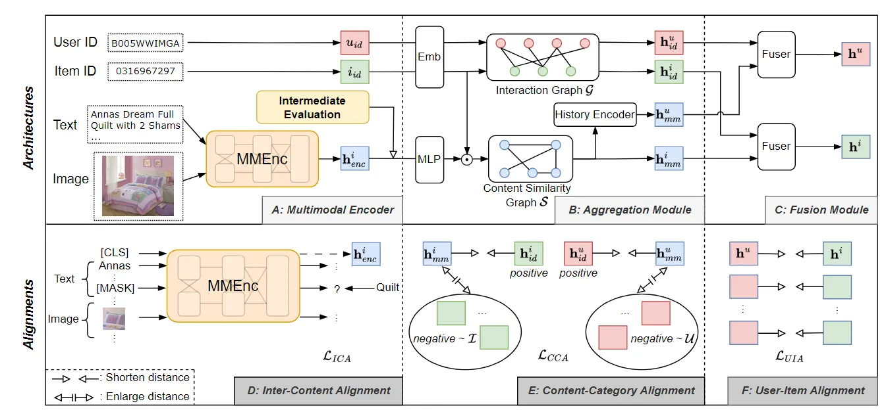

::: tip 提示
根据遗忘曲线：如果没有记录和回顾，6天后便会忘记75%的内容

阅读笔记正是帮助你记录和回顾的工具，不必拘泥于形式，其核心是：记录、翻看、思考
:::
::: info 信息
论文 [An Aligning and Training Framework for Multimodal Recommendations](https://arxiv.org/pdf/2403.12384)     

代码 [https://github.com/sjtulyf123/AlignRec_CIKM24](https://github.com/sjtulyf123/AlignRec_CIKM24)

摘要: 本文主要内容是针对多模态推荐问题提出了一种名为 AlignRec 的框架。该框架通过三个对齐任务来帮助推荐目标：内容间对齐、内容-类别对齐和用户-物品对齐。同时，还提出了一种高效实用的训练策略和新的评估协议，以验证多模态表示的有效性。

:::

## 论文贡献
> 1）分析了现有的多模态推荐方法存在错位问题，并提出了一种解决方案AlignRec，可以无缝集成到现有方法中。

> 2）设计通过在内容间对齐任务上进行预训练来训练 AlignRec，然后在推荐目标方面进一步训练对齐任务，以解决内容模态和分类模态之间的潜在学习速度不一致。

> 3）提供了三类新的中间协议来评估多模态特征是否有效。

## 模型架构
AlignRec主要包含三个模块：多模态编码器模块、聚合模块、和融合模块。

### 多模态编码器模块
多模态编码器模块旨在对齐同一物品的视觉和文本，并输出统一的多模态表示$h_{enc}^{i}$。采用基于Transformer 的多模态编码器，通过对齐视觉和文本信息来生成统一的多模态表示。形式上，假设$MMEnc$是一个多模式编码器，$h_{enc}^{i}$是物品$i$视觉和文本的统一表示，
$$h_{enc}^{i}=MMEnc(i_{v},i_{t}).$$
其中，MMEnc 的视觉-文本对齐通过基于交叉注意力的转换器进行优化。在实现中，利用最先进的BEiT3 作为骨干。该架构将通过跨模态专家和转换器对齐视觉和文本信息。通过掩码预测策略训练该模块，以确保模型更好地理解视觉和文本模式。

### 聚合模块
在获得$h_{enc}^{i}$后，我们使用图$\mathcal{G}$聚合物品和用户的多模态和基于 ID 的信息。通常，假设$Aggregator$是一个聚合模块。它将输出用户/物品多模态隐藏表示$(h_{mm}^{u},h_{mm}^{i})$和基于 ID 的表示$(h_{id}^{u},h_{id}^{i})$:
$$h_{mm}^{i},h_{mm}^{u},h_{id}^{i},h_{id}^{u}=Aggregator(h_{enc}^{i},i_{id},u_{id}|\mathcal{G}).$$
具体来说，使用 LightGCN 进行聚合。对用户和物品采用嵌入层得到$e_{id}^{i},e_{id}^{u}.$堆叠所有用户和物品的嵌入表示，得到矩阵$E_{id}$。假设$\hat{A}$是$A$的归一化邻接矩阵，其中$A=\begin{pmatrix}
0 & R \\
R^{T} & 0
 \end{pmatrix}$是由用户-物品交互矩阵$R$构造。然后，利用$L$层的 LightGCN 来聚合邻居基于 ID 的信息，获得$H_{id}$，其由$h_{id}^{u}$和$h_{id}^{i}$堆叠而成：
$$H_{id}^{l+1}=\hat{A}H_{id}^{l},\quad H_{id}^{0}=E_{id}, \quad l\in\{0, \cdots, L-1\};\\
H_{id}=\frac{1}{L+1}(H^{0}+H^{1}+\cdots +H^{L}).$$
其次，通过下式构造物品侧多模态隐藏表示$h_{mm}^{i}$，其中$\odot$是元素乘积，$\sigma$是 sigmoid 函数，$MLP$是多层感知机。在将 ID 和内容知识融合到$h_{con}^{i}$中之后，通过相似度矩阵$S$将邻居多模态信息聚合到$h_{mm}^{i}$。$S$是通过计算物品的多模态相似度来构建的，并且只保留$K^{'}$条最相似的边（KNN）。
$$h_{con}^{i}=e_{id}^{i}\odot(MLP(h_{enc}^{i})),\\
h_{mm}^{i}=\sum_{j\in \mathcal{I}}S_{ij}h_{con}^{i}.$$
最后，通过聚合用户$u$的历史行为来构建用户侧多模隐藏表示$h_{mm}^{u}$。$\hat{R}\in \mathbb{R}^{|\mathcal{U}|\times |\mathcal{I}|}$表示用户-物品交互矩阵，
$$h_{mm}^{u}=\sum_{j\in \mathcal{I}}\hat{R}_{uj}h_{mm}^{j}.$$

### 融合模块
基于多模态隐藏表示和基于 ID 的表示包含来自不同领域或方面的物品/用户信息。在 AlignRec 框架中，使用融合模块$Fuser$将这些信息融合到通用物品/用户表示$h^{i}$和$h^{u}$中。
$$h^{i}=Fuser(h_{mm}^{i},h_{id}^{i}),\quad h^{u}=Fuser(h_{mm}^{u},h_{id}^{u}).$$
具体来说，利用逐元素加法运算来融合基于多模态和基于 ID 的表示，最后得到用户和物品的通用表示。该模块也可以替换为更复杂的融合操作，例如当前方法中的注意力。
$$h^{i}=h_{mm}^{i}+h_{id}^{i}, \quad h^{u}=h_{mm}^{u}+h_{id}^{u}.$$
在 top-K 推荐阶段，计算给定用户$u$的所有用户-物品对的分数：$s(u,i)=h^{i}(h^{u})^{T}$，并进行排序。然后，选择排名靠前的物品作为用户的推荐物品。 

## 三个对齐目标

### 内容间对齐
在多模态推荐场景中，物品的视觉模态和文本模态通常从不同的角度表示相同的物品（例如，同一产品的图片和描述）。然而，从不同的编码器中提取视觉和文本特征将导致内容模态之间的分布和表示差异，这使得物品表示变得困难。
视觉-文本对齐是通过掩码数据建模技术学习的：在使用其他模态（文本）和掩码模态中的剩余标记（视觉）预测掩码标记时屏蔽一种模态（例如视觉）的一些标记。通过这种方式，$MMEnc$可以同时关注视觉和文本，以便多模态信息逐渐对齐和融合。训练损失是掩码-图像-建模（MIM）和掩码-语言-建模（MLM）的总和：
$$\mathcal{L}_{ICA}=\mathcal{L}_{MIN}+\mathcal{L}_{MLM}.$$

### 内容-类别对齐
简单的聚合获取的多模态和 ID 隐藏表示使得同一内容类别对之间远离，模型很难区分物品和用户的内容类别对，因此，在聚合后对齐同一用户或物品的多模态和 ID 隐藏表示。
根据聚合模块的输出，采用批内 InfoNCE 对内容-类别对齐进行建模，指导框架学习正负内容-类别对的差异。$i^{'}$和$u^{'}$分别表示批内物品和用户，$\tau$为温度超参数。然后内容类别对齐任务可以通过以下公式进行优化：
$$\mathcal{L}_{CCA}=-log\frac{exp(h_{mm}^{i}\cdot h_{id}^{i}/\tau)}{\sum_{i^{'}}exp(h_{mm}^{i}\cdot h_{id}^{i^{'}}/\tau)}-log\frac{exp(h_{mm}^{u}\cdot h_{id}^{u}/\tau)}{\sum_{i^{'}}exp(h_{mm}^{u}\cdot h_{id}^{u^{'}}/\tau)}.$$
除了对齐任务之外，多模态隐藏表示本身还包含丰富的信息：相似物品的多模态信息也应该是相似的。此外，在内容-类别对齐任务中，将盲目地优化多模态隐藏表示$h_{mm}^{i}$靠近物品的 ID 表示$h_{id}^{i}$，导致表示崩溃问题并丢失其语义信息。因此，为了保持相似度关系并避免表示崩溃，提出了一种批内正则化器来约束每两个多模态隐藏表示$h_{mm}^{i}$之间的相似度保持接近$h_{enc}^{i}$之间的相似度。$i$和$j$表示两个批内物品，$C(x,y)$是两个向量之间的余弦相似度，$\|\cdot\|$是 L2-范数，$sg(\cdot)$表示停止梯度算子；那么正则化可以定义为：
$$\mathcal{L}_{REG}=\|C(h_{mm}^{i},h_{mm}^{j})-sg(C(h_{enc}^{i},h_{enc}^{j}))\|_{2}.$$

### 用户-物品对齐
在得到$Fuser$中的通用用户和物品表示后，尝试对齐用户与其交互物品之间的表示空间进行用户-项目对齐，
$$\mathcal{L}_{UIA}=1-C(h^{i},h^{u}).$$

## 训练策略
为了训练推荐，我们使用 BPR 损失来优化推荐目标，内积作为评分函数，$i^{‘}$作为负采样项，如下所示。它可以很容易地推广到其他推荐目标:
$$\mathcal{L}_{BPR}=ln\sigma[h^{i}(h^{u})^{T}-h^{i^{'}}(h^{u})^{T}].$$
在 AlignRec 中，有三个对齐损失以及 BPR 损失和正则化损失，联合优化会存在一些问题。
在训练速度方面，内容间对齐学习一个统一的多模态表示，该表示集成了原始图像和文本中的信息，需要大量的图像-文本对数据和更多的训练时间。相反，与推荐相关的任务(内容-类别对齐和用户-物品对齐)通常快速收敛。因此，直接端到端训练它们将使推荐相关任务在 ICA 任务之前学习得很好，这表明与推荐相关的任务无法获得适当的多模态信息。鉴于架构复杂性，多模态编码器由复杂的转换器组成，而与推荐相关的任务由简单的全连接或图层组成。因此，联合训练它们很难优化整个网络结构。
考虑到上述困难，在 AlignRec 中，建议分离和解耦整个训练过程：首先，预训练内容间对齐任务（称为预训练）；然后，将剩余的两个对齐任务与具有权重超参数$\alpha、\beta$和$\lambda$的推荐目标（称为训练）一起训练，如下述公式。解耦的训练过程可以使 AlignRec 能够为具有大规模多模态数据的每个项目生成对齐且信息丰富的多模态特征，然后在内容类别对齐和用户-物品对齐的帮助下生成合适的用户/物品表示。
$$Pre-training:min\mathcal{L}_{ICA}, \\
Train:min\mathcal{L}_{BPR}+\alpha\mathcal{L}_{CCA}+\beta\mathcal{L}_{UIA}+\lambda{L}_{REG}.$$

## 总结
在本文中，专注于对齐视图中的多模态推荐，并提出了一个名为 AlignRec 的框架。在该框架中，建议利用三个对齐任务来帮助推荐目标：内容间对齐试图对齐和融合视觉和文本模态之间的信息；内容类别对齐设法消除基于多模态和基于 ID 的表示之间的差距；用户-项目对齐旨在使交互用户和项目彼此接近。我们还为该框架提出了一种高效且实用的训练策略，然后使用评估协议来验证多模态表示的有效性。综合实验证明了 AlignRec 的优越性能。