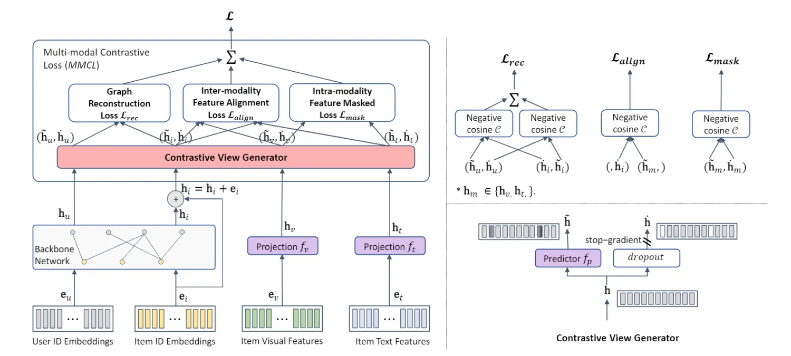

::: tip 提示
根据遗忘曲线：如果没有记录和回顾，6天后便会忘记75%的内容

阅读笔记正是帮助你记录和回顾的工具，不必拘泥于形式，其核心是：记录、翻看、思考
:::

::: info 信息
论文 [Bootstrap Latent Representations for Multi-modal Recommendation](https://arxiv.org/pdf/2207.05969)     

代码 [https://github.com/enoche/BM3](https://github.com/enoche/BM3)

摘要: 本文主要提出了一种新的自监督多模态推荐模型，称为 BM3，它既不需要从辅助图中增强，也不需要从负样本中增强。具体来说，BM3 首先通过简单的 dropout增强从用户和物品的表示中引导潜在的对比视图。然后联合优化三个多模态目标，通过重建用户-物品交互图和在模态间和模态内视角下对齐模态特征来学习用户和物品的表示。BM3 既减轻了与反例进行对比的需要，又减轻了从附加目标网络进行复杂图增强以生成对比视图的需要。

:::

## 论文贡献

> 1）提出了一种新的多模态自监督学习方法 BM3，使用简单的潜在表示 dropout 机制而不是图增强来生成用户的目标视图或没有负样本的对比学习项目。

> 2）设计了一个联合优化三个目标的多模态对比损失 (MMCL) 函数。除了最小化经典的用户-项目交互图重建损失外，MMCL 还进一步对齐不同模态之间的学习特征，并减少了来自特定模态的不同增强视图的表示之间的差异。

## 模型架构

### 多模态潜在空间转换器
构造用户-物品交互图，并根据用户物品 ID 嵌入表示在 LightGCN 上获得用户和物品（增加残差层）的最终嵌入表示。通过利用MLP将单模态特征投影到低维潜在空间获得对应的物品单模态嵌入表示 。

### 多模态对比损失

#### 对比视图生成器
之前的工作使用图增强来生成原始图的两个替代视图以进行自监督学习。通过两个增强图对输入特征进行编码，以生成对比视图。为了降低计算复杂度和内存成本，BM3通过类似于节点dropout的简单潜在嵌入dropout技术消除了对图增强的需求。在dropout比率$p$下的对比潜在嵌入计算如下:
$$\dot{h}=h\cdot Bernoulli(p).$$
然后在此基础上利用stop-gradient技术。对原始嵌入输入到基于多层感知机的预测器得到表示。

#### 图重构损失
BM3 以正的用户-物品对$(u,i)$作为输入，使用在线表示$(\tilde{h}_{u},\tilde{h}_{i})$生成的对比视图$(\dot{h}_{u},\dot{h}_{i})$,将对称损失函数定义为$(\tilde{h}_{u},\dot{h}_{i})$和$(\dot{h}_{u},\tilde{h}_{i})$之间的余弦相似度：
$$\mathcal{L}_{rec}=C(\tilde{h}_{u},\dot{h}_{i})+C(\dot{h}_{u},\tilde{h}_{i}),$$
最后，在目标网络上停止梯度，只强制在在线网络上的损失反向传播。
$$\mathcal{L}_{rec}=C(\tilde{h}_{u},sg(\dot{h}_{i}))+C(sg(\dot{h}_{u}),\tilde{h}_{i}).$$

#### 模态间特征对齐损失
进一步，将物品的多模态特征与目标 ID 嵌入对齐，对齐鼓励 ID 嵌入在具有相似多模态特征的物品上彼此接近。对于每个物品的单模态潜在嵌入$h_{m}$，对比视图生成器将其对比对输出为$(\tilde{h}_{m}^{i},\dot{h}_{m}^{i})$。使用负余弦相似度来执行$\dot{h}^{i}$和$\tilde{h}_{m}^{i}$之间的对齐：
$$\mathcal{L}_{align}=C(\tilde{h}_{m}^{i},\dot{h}_{i}),$$

#### 模态内特征掩码损失
最后，BM3 使用模态内特征掩码损失来进一步鼓励使用潜在嵌入的稀疏表示学习预测器。通过对比视图生成器的 dropout 随机屏蔽潜在嵌入 $h_{m}$的子集，并将稀疏嵌入表示为$\dot{h}_{m}^{i}$。模态内特征掩码损失定义为：
$$\mathcal{L}_{mask}=C(\tilde{h}_{m}^{i},\dot{h}_{m}^{i}),$$
此外，在在线嵌入上添加正则化惩罚，得到最终的损失函数为：
$$\mathcal{L}=\mathcal{L}_{rec}+\mathcal{L}_{align}+\mathcal{L}_{mask}+\lambda\cdot(\|h_{u}\|_{2}^{2}+\|h_{i}\|_{2}^{2}).$$

## 总结
本文提出了一种新的自监督学习框架BM3，用于多模态推荐。BM3 消除了在对用户和物品之间的交互进行建模时随机采样负样本的要求。为了在自监督学习中生成对比视图，BM3 利用一种简单而有效的潜在嵌入 dropout 机制来扰乱用户和物品的原始嵌入。此外，还设计了一种新的基于多模态对比损失的学习范式。具体来说，对比损失联合最小化：a) 用户-物品交互图的重建损失，b) 物品 ID 嵌入与其多模态特征之间的对齐损失，c) 模态特定特征内的掩码损失。