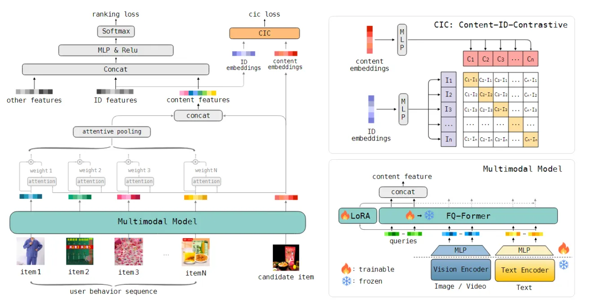
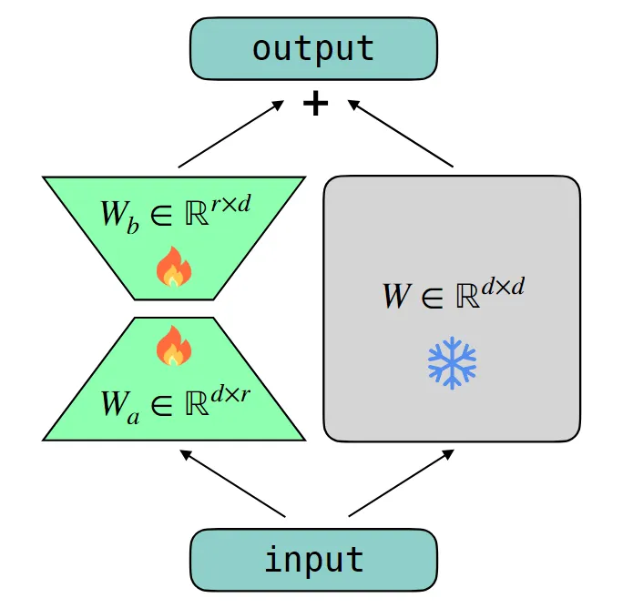
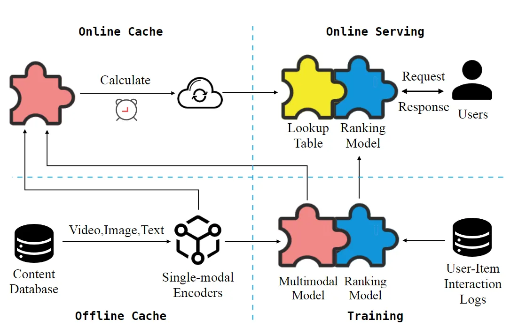

::: tip 提示
根据遗忘曲线：如果没有记录和回顾，6天后便会忘记75%的内容

阅读笔记正是帮助你记录和回顾的工具，不必拘泥于形式，其核心是：记录、翻看、思考
:::
::: info 信息
论文 [End-to-end training of Multimodal Model and ranking Model](https://arxiv.org/pdf/2404.06078v1)     

代码 [https://github.com/em3e2e-anonymous/em3/tree/master](https://github.com/em3e2e-anonymous/em3/tree/master)

摘要: 本文主要提出了一种新的自监督多模态推荐模型，称为 BM3，它既不需要从辅助图中增强，也不需要从负样本中增强。具体来说，BM3 首先通过简单的 dropout 增强从用户和物品的表示中引导潜在的对比视图。然后联合优化三个多模态目标，通过重建用户-物品交互图和在模态间和模态内视角下对齐模态特征来学习用户和物品的表示。BM3 既减轻了与反例进行对比的需要，又减轻了从附加目标网络进行复杂图增强以生成对比视图的需要。

:::

## 论文贡献
> 1）提出了 Fusion-Q-Former 来融合不同的模式，它由转换器和一组可训练的查询组成，生成固定长度的和鲁棒的多模态嵌入。

> 2）利用低秩适应技术来缓解序列建模中大量可训练参数和序列长度之间的冲突。

> 3）提出了一种新颖的 Content-ID-Contrastive 学习任务，通过相互对齐来补充内容和 ID 的优势，获得更多面向任务的内容嵌入和更通用的 ID 嵌入。

## 模型架构

### 排序模型
在排序模型中，有很多特征，例如 ID、上下文和会话特征。将它们连接起来并将它们馈送到 DNN 中，DNN 的 softmaxed 输出用于优化负对数似然函数：

$$L_{ranking}=-\frac{1}{B}\sum_{i=1}^{B}y_{i}log(\hat{y}_{i})+(1-y_{i})log(1-\hat{y}_{i})$$
### 多模态模型
#### 模态
从视觉编码器$f_{ve}$和文本编码器$f_{te}$中提取模态特征：
$$\bar{v}_{m}(A)=f_{ve}(img_{m}(A)),\quad m=1,2,\cdots,M,$$
$$\bar{t}_{k}(A)=f_{te}(txt_{k}(A)),\quad k=1,2,\cdots, K,$$
其中$M$表示视觉模态的数量，$K$表示文本模态的数量。然后通过几个 FC 层缩小它们的维度：
$$v_{m}(A)=f_{v}(\bar{v}_{m}(A)),$$
$$t_{k}(A)=f_{t}(\bar{t}_{k}(A)),$$

#### 模态融合
作者提出了 Fusion Q-Former (FQ-Former，由 Transformer 和一组可训练查询组成的) 来融合不同模态。给定模态集合$v_{A}=\{v_{1}(A),\cdots,v_{M}(A)\}$和$t_{A}=\{t_{1}(A),\cdots,t_{K}(A)\}$，将他们与全局共享的query ${\bf{q}}=\{q_{1},\cdots,q_{Q}\}$拼接，其中 $Q$ 是 query 的数量。然后输入到 Transformer 中，旨在使用自注意力 (SA) 学习不同模态之间的关系和重要性。最后，对第一个 $Q$ 输出标记进行切片以生成多模态内容特征：
$$c_{A}=f_{FQ-Former}(Qq,v_{A},t_{A})=TRM(concat([q,v_{A},t_{A}]))[:Q]$$
FQ-Former 比传统的融合方法具有优势：（i）固定长度：FQ-Former 的输出大小是固定的，不管模态的数量如何，这使得它更适合工业可变长度模态。(ii) 稳健：由于查询参与 SA，FQ-Former 可以通过为查询分配更多的注意力权重来减轻潜在的负面影响。
训练
通过冻结$f_{ve}$和$f_{te}$来选择这种混合训练范式；端到端训练 $f_{v}$、$f_{t}$和$f_{FQ-Former}$，以平衡效率和有效性之间的权衡。

### 序列建模
#### 用户内容兴趣
给定候选物品$A$和用户行为序列$\textbf{u}=\{u_{1},u_{2},\cdots,u_{N}\}$，首先利用多模态模型生成它们的内容嵌入$c_{A}$和$\{c_{u_1},c_{u_2},\cdots,c_{u_N}\}$，然后计算$c_{A}$和每个$c_{u_{i}}$之间的注意力分数，并利用分数对内容序列进行加权平均：
$$u_{A}=f(c_{A},c_{u_1},c_{u_2},\cdots,c_{u_N})=\sum_{i=1}^{N}a(c_{A},c_{u_{i}})c_{u_{i}}=\sum_{i=1}^{N}w_{i}c_{u_{i}},  \\
w_{i}=\frac{exp(a(c_{A},c_{u_{i}}))}{\sum_{j=1}^{N}exp(a(c_{A},c_{u_{j}}))},$$
其中$u_{A}$表示用户内容兴趣，$a(\cdot)$表示注意力分数函数，$N$是序列长度，$w_{i}$是 softmaxed attention 分数。

#### 基于LoRA的长期内容兴趣

增加序列长度会导致GPU OOM，这极大地限制序列长度。注意到多模态模型的参数在几天训练后会稳定，这一现象启发作者采用低秩适应（LoRA）技术。首先在短序列长度上需要优化的权重$W^{d\times d}$进行训练，经过一段时间的充分训练，冻结了$W$，并添加了一个可训练的LoRA模块，以持续遵循时变的在线分布。
如上图所示，LoRA包含两个FC层$W_{a}^{r\times d}$和$W_{b}^{d\times r}$，其中$d\ll r$。与$W^{d\times d}$相比，它们具有相同的输出大小，但可训练参数更少：
$$f_{LoRA}(x)=sg(Wx)+W_{b}(W_{a}x),$$
其中$sg(\cdot)$是停止梯度算子。通过这种方式，将可训练参数的数量从$O(d^{2})$减少到$O(rd)$，使得能够增加序列长度$N$，以便对用户的长期内容兴趣进行建模。

#### Content-ID-对比学习
ID 嵌入具有良好的内存，但存在冷启动问题，内容嵌入更具泛化性，但无法从交互中受益。基于此，作者提出了一个内容 ID-Contrastive (CIC) 学习任务来补充它们的优势。
给定物品$i$，首先选择几个重要的ID嵌入(例如ItemID、CategoryID)，并将它们连接为$id_{i}$。接下来，将内容嵌入$c_{i}$和 ID 嵌入$id_{i}$线性变换到相同的向量空间中：
$$C_{i}=f_{CIC}(c_{i}), \\
I_{i}=f^{'}_{CIC}(id_{i}),$$
它们是以下对比学习中彼此的正样本。
从训练批次中随机为每个$C_{i}$和$I_{i}$选取$H$个负样本。然后使用负对数似然函数来最大化每个正对的相似性并最小化负对的相似性：
$$L_{C2I}=-\frac{1}{B}\sum_{i=1}^{B}log\frac{exp(s(C_{i},I_{i})/\tau)}{exp(s(C_{i},I_{i})/\tau)+\sum_{j=1}^{H}exp(s(C_{i},I^{-}_{ij})/\tau)}, \\
L_{I2C}=-\frac{1}{B}\sum_{i=1}^{B}log\frac{exp(s(I_{i},C_{i})/\tau)}{exp(s(I_{i},C_{i})/\tau)+\sum_{j=1}^{H}exp(s(I_{i},C^{-}_{ij})/\tau)},$$
其中$s(\cdot)$表示余弦相似度，$\tau$是温度参数。最后，将它们的平均值添加到排名损失中：
$$L=L_{ranking}+\alpha\cdot L_{CIC}=L_{ranking}+0.5\cdot\alpha\cdot (L_{C2I}+L_{I2C}),$$
其中$\alpha$是超参数。
考虑到排名损失和 CIC 损失的约束，CIC 对不同物品有不同的影响：
- 在流行的物品上：ID 将主导对齐并将用户行为信息注入到内容嵌入中，生成更多面向任务的内容嵌入和更好地建模用户兴趣。
- 在冷启动物品上：内容将主导对齐并指导 ID 的更新。因此，具有相似材料的物品也将具有相似的 ID 嵌入，从而促进 RS 的泛化。

#### 特征系统
如图所示，从两个方面优化效率：
- 训练：由于$f_{ve}$和$f_{te}$被冻结，预先计算并缓存单模态特征$\bar{v}_{m}(A)$和$\bar{t}_{k}(A)$来加速离线训练。
- 服务：以常规间隔推断和缓存所有物品的多模式嵌入$c_{A}$。当 RS 接收到在线请求时，可以直接查找多模态嵌入，而无需前向传播。

## 总结
本文主要提出了一个名为 EM3 的工业多模态推荐框架，用于多模态模型和排名模型的端到端训练。EM3充分利用多模态，并允许个性化排序任务直接训练多模态模型中的核心模块，获得更多面向任务的内容表示。具体来说，我们提出了 FQ-Former 来融合不同的模式并生成固定长度的鲁棒内容嵌入。在用户顺序建模中，我们利用 LoRA 技术来减少可训练参数的消耗，以便我们可以增加行为序列的长度以更好地建模用户内容兴趣。此外，我们提出了一种新颖的 CIC 学习任务，通过对齐来补充内容和 ID 的优势，这使我们能够获得更多面向任务的内容嵌入和更通用的 ID 嵌入。