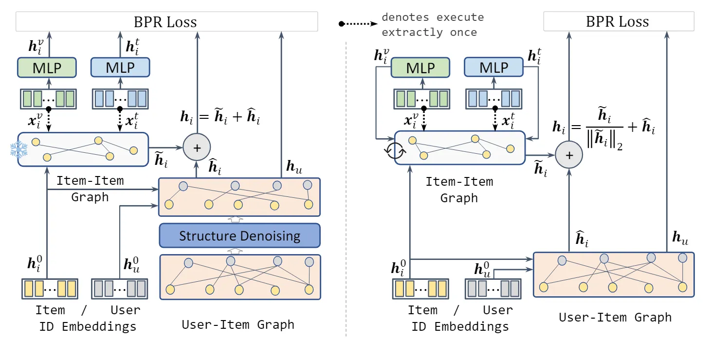

::: tip 提示
根据遗忘曲线：如果没有记录和回顾，6天后便会忘记75%的内容

阅读笔记正是帮助你记录和回顾的工具，不必拘泥于形式，其核心是：记录、翻看、思考
:::

::: info 信息
论文 [paperA Tale of Two Graphs: Freezing and Denoising Graph Structures for Multimodal Recommendation](https://arxiv.org/pdf/2211.06924) 

代码 [https://github.com/enoche/FREEDOM](https://github.com/enoche/FREEDOM)

摘要: 本文主要提出了一个简单而有效的模型，称为 FREEDOM，它冻结物品-物品图，对用户-物品交互图进行去噪，用于多模态推荐。理论上，通过图谱视角检查 FREEDOM 的设计，并证明它在图谱上具有更严格的上限。在对用户-物品交互图进行去噪时，设计了一种程度敏感的边缘剪枝方法，该方法在对图进行采样时以高概率拒绝可能有噪声的边缘。
:::

## 论文贡献

> 1）提出了一种图结构冻结和去噪多模态模型进行推荐，通过冻结物品-物品图来学习多模态信息。。

> 2）设计了一种程度敏感的边缘剪枝方法对用户-物品交互图进行去噪。

## 模型架构

### 构造冻结的物品-物品图

FREEDOM 使用来自每个模态$m$的原始特征通过 kNN 构建初始模态感知物品-物品图$S^{m}$。考虑$N$个物品，我们在原始特征($x_{i}^{m}$和$x_{j}^{m}$)上使用余弦相似度函数计算物品对$i$和$j$之间的相似度分数$S_{ij}^{m}$,即
$$
S_{ij}^{m}=\frac{(x_{i}^{m})^{T}x_{j}^{m}}{\|x_{i}^{m}\|\|x_{j}^{m}\|},
$$
其中$S_{ij}^{m}$是矩阵$S^{m}\in \mathbb{R}^{N\times N}$的第$i$行第$j$列元素。进一步利用 kNN 进行稀疏化并将权重$S^{m}$转换为非权重矩阵。即对于每个物品$i$，只保留 top-k 相似边的连接关系：
$$
\hat{S}_{ij}^{m}=\begin{cases}
1, \quad S_{ij}^{m}\in top-k(S_{i}^{m}), &\\
0, \quad otherwise.
\end{cases}
$$
LATTICE 是直接使用物品间的亲和值作为对应的元素，不同于 LATTICE，FREEDOM 将离散化的邻接矩阵$\hat{S}^{m}$归一化为$\tilde{S}^{m}=(D^{m})^{-\frac{1}{2}}\hat{S}^{m}(D^{m})^{-\frac{1}{2}}$，其中$D^{m}\in\mathbb{R}^{N\times N}$是$\hat{S}^{m}$的对角度矩阵，$D_{ii}^{m}=\sum_{j}\hat{S}_{ij}^{m}$。利用得到的模态感知邻接矩阵，通过聚合来自每个模态的结构来构建潜在的物品-物品图：
$$
S=\sum_{n\in \mathcal{M}}\alpha_{m}\tilde{S}^{m},
$$
其中$S\in \mathbb{R}^{N\times N},\alpha_{m}$表示模态$m$的重要性分数，$\mathcal{M}$是模态集合。重要性分数可以通过参数函数学习。在这里，考虑两种模态$\mathcal{M}=\{v,t\}$，引入一个超参数$\alpha_{v}$来减少模型参数，该超参数表示视觉模态在构建$S$中的重要性，则$\alpha_{t}=1-\alpha_{v}$。最后冻结潜在的物品-物品图。

### 去噪用户-物品二部图
这里采用了一种程度敏感的边缘修剪来对用户-物品二部图进行去噪。对于用户-物品交互矩阵$R\in\mathbb{R}^{M\times N}$，构造对称邻接矩阵$A$
$$
A=\begin{pmatrix}
0 & R \\
R^{T} & 0
 \end{pmatrix},
$$
给定一个连接结点$i$和$j$的特定边$e_{k}\in \mathcal{E},(0\le k\ < |\mathcal{E}|)$，计算它的概率为$p_{k}=\frac{1}{\sqrt{\omega_{i}}\sqrt{\omega_{j}}}$，其中$\omega_{i}$和$\omega_{j}$分别是图$\mathcal{G}$中结点$i$和结点$j$的度。也就是说，应该修剪的边数是$\lfloor \rho |\mathcal{E}| \rfloor$，其中$\lfloor\cdot\rfloor$是向下取整函数。因此，保留便的数量为$n=\lceil|\mathcal{E}(1-\rho)|\rceil$。因此，以索引$n$和参数向量$p=\langle p_{0}, p_{0}, \cdots,p_{|\mathcal{E}|-1}\rangle$从多项式分布中采样边。这样，连接高度结点的边在图中采样的概率很低。也就是说，这些边更有可能在$\mathcal{G}$中修剪。然后，根据采样边构造对称邻接矩阵$A_{\rho}$，归一化后得到$\hat{A}_{\rho}$。与 DropEdge 相似，FREEDOM 修剪用户-物品交互图并在每个训练时期迭代地对采样地邻接矩阵进行归一化。但是在推理阶段采用原始的归一化邻接矩阵$\hat{A}=D^{-1/2}AD^{-1/2}$。

### 集成两个图学习
对两个图及进行图卷积，具体来说，使用轻量级 GCN 在$S$和$\hat{A_{\rho}}$上进行信息传播和聚合。在物品-物品图上的图卷积可以定义为：
$$
\tilde{h}_{i}^{l}=\sum_{j\in \mathcal{N}(i)}S_{ij}\tilde{h}_{j}^{l-1},
$$
其中$\mathcal{N}(i)$是物品$i$的邻居物品，$\tilde{h}_{i}^{l}\in\mathbb{R}^{d}$是物品$i$在第$l$层的表示，$\tilde{h}_{i}^{0}$表示对应的 ID 嵌入向量，$d$是物品或用户 ID 嵌入的维度。通过堆叠卷积层，从多模态视图中获得最后一层表示$\tilde{h}_{i}^{L_{ii}}$作为物品$i$的表示$\tilde{h}_{i}$:
$$
\tilde{h}_{i}=\tilde{h}_{i}^{L_{ii}}.
$$
类似地，在用户-物品图中，执行卷积操作获得用户表示$\hat{h}_{u}\in \mathbb{R}^{d}$和物品表示$\hat{h}_{i}\in \mathbb{R}^{d}$:
$$
\hat{h}_{u}=READOUT(\hat{h}_{u}^{0},\hat{h}_{u}^{1},\cdots,\hat{h}_{u}^{L_{ui}}),\\
\hat{h}_{i}=READOUT(\hat{h}_{i}^{0},\hat{h}_{i}^{1},\cdots,\hat{h}_{i}^{L_{ui}}),
$$
其中$READOUT$函数可以是任何可微的函数，$\hat{h}_{u}^{0}$和$\hat{h}_{i}^{0}=\tilde{h}_{i}^{0}$分别表示用户和物品的 ID 嵌入。使用 LightGCN 的默认平均函数进行嵌入读出。
最后，使用用户-物品图输出的用户表示作为其最终表示。对于物品，从两个图中获得的表示相加作为其最终表示。
$$
h_{u}=\hat{h}_{u}, \\
h_{i}=\tilde{h}_{i}+\hat{h}_{i}.
$$
为了充分探索原始特征，通过 MLP 投影每个模态中物品$i$的多模态特征：
$$
h_{i}^{m}=x_{i}^{m}W_{m}+b_{m},
$$
其中$W_{m}\in\mathbb{R}^{d_{m}\times d},b_{m}\in \mathbb{R}^{d}$表示 MLP 中的线性变换矩阵和偏差。这样，每个单模态表示$h_{i}^{m}$与其 ID 嵌入共享相同的潜在空间。
对于模型优化，采用贝叶斯个性化排序（BPR）损失，它鼓励预测正用户-物品对得分高于负对：
$$
\mathcal{L}_{bpr}=\sum_{(u,i,j)\in\mathcal{D}}(-log\sigma(h_{u}^{T}h_{i}-h_{u}^{T}h_{j})+\lambda\sum_{m\in\mathcal{M}}-log\sigma(h_{u}^{T}h_{i}^{m}-h_{u}^{T}h_{j}^{m})),
$$
其中$\mathcal{D}$是训练集，每个三元组$(u,i,j)$满足$A_{ui}=1,A_{uj}=0$。$\sigma(\cdot)$是 sigmoid 函数，$\lambda$是权衡用户-物品 ID 嵌入与投影多模态特征之间的重建损失超参数。

## 总结
本文主要提出了一个冻物品-物品图，同时去噪用户-物品图的模型进行多模态推荐。通过理论和实证分析，证明了冻结 FREEDOM 中的项目-项目图可以产生各种好处。在去噪中，我们设计了一种程度敏感的边缘剪枝方法对用户-物品图进行采样，表现出比随机边缘丢弃推荐更好的性能。