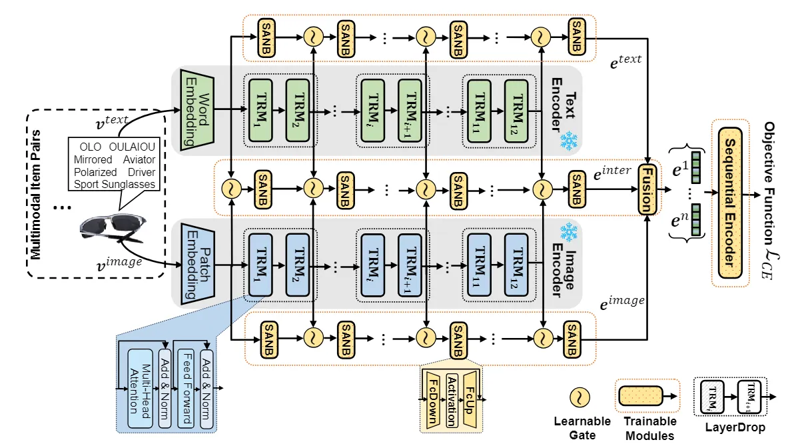
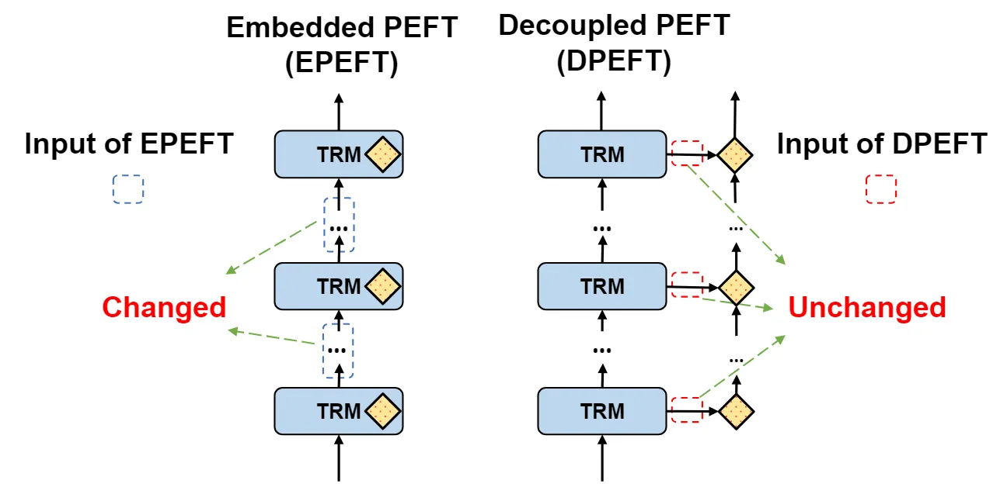

::: tip 提示
根据遗忘曲线：如果没有记录和回顾，6天后便会忘记75%的内容

阅读笔记正是帮助你记录和回顾的工具，不必拘泥于形式，其核心是：记录、翻看、思考
:::
::: info 信息
论文 [IISAN: Efficiently Adapting Multimodal Representation for Sequential Recommendation with Decoupled PEFT](https://arxiv.org/pdf/2404.02059)     

代码 [https://github.com/GAIR-Lab/IISAN](https://github.com/GAIR-Lab/IISAN)

摘要: 本文提出了 IISAN（用于多模态表示的模态内和模态间侧自适应网络），这是一种简单的即插即用架构，使用解耦 PEFT 结构并利用模态内和模态间适应。IISAN 匹配完全微调 (FFT) 和最先进的 PEFT 的性能，并且显著减少了 GPU 内存使用量，加速训练过程。

:::

## 论文贡献
> 1）引入了一种新的模态内和模态间侧适应网络 (IISAN)，遵循基于预训练的多模态基础模型的端到端顺序推荐任务的解耦 PEFT 范式。IISAN 允许采用缓存策略来进一步提高效率。

> 2）提出了一种新的实际效率指标（TPME），它衡量了训练时间、可训练参数和 GPU 内存的成本，这提供了模型效率的整体衡量标准。

> 3）提供了一个详细和可访问的分析来理解 PEFT 机制的高效率。与流行的 PEFT 相比，它在实际效率方面将 IISAN 定位为理论上优越的架构。

## 动机
> 1）大型基础模型的高成本：大型基础模型，如GPT-4、DALL-E、LLaMA和CLIP，虽然在自然语言处理、计算机视觉和多模态学习任务中非常有用，但它们在进行传统的全参数微调（Full Fine-tuning, FFT）时会产生巨大的成本。

> 2）GPU内存和训练时间的挑战：在多模态场景中，结合文本和视觉信息的模型大小和数据输入显著增加，导致GPU内存使用量和训练时间成为主要瓶颈。

> 3）现有PEFT方法的局限性：现有的PEFT方法，如Adapter和LoRA，虽然减少了可训练参数，但在反向传播期间的计算图仍然庞大，没有显著降低GPU内存和训练时间的成本。

> 4）对效率评价标准的重新思考：文章指出，仅仅关注参数效率并不能完全代表模型的实际效率，需要一个更全面的效率评价指标。

## 模型架构

IISAN的整体框架如图所示，提出了一种新的高效序列推荐个性化微调范式——解耦参数高效微调（DPEFT）。能够将预训练的大规模多模态模型有效地适应为物品编码器，这种解耦旨在优化反向传播计算图，有效的解决了在将大规模模型转换到下游任务时面临的训练时长和 GPU 内存挑战。利用 DPEFT 的独特特征，为 IISCAN 引入了缓存策略，以显著提高其实际效率。此外，利用多模态表示的内在性质，所提出的 IISAN 架构引入了两个独立的模态内 SAN（Side Adapted Network）用于视觉和文本模态适应，以及一个模态间 SAN 来处理两种模态之间的交互。解耦的模态内和模态间 SAN 擅长将预训练的大规模多模态基础模型（例如 BERT、ViT 和 CLIP）转移到下游多模态推荐任务，同时保持多方面的效率。

### 物品多模态表征学习
将物品的文本和图像分别输入到预训练的文本（如BERT）和视觉（如ViT）模型中，其中预训练模型包含一个嵌入层和多个 TRMs（Transformer Blocks）。通过预训练模型主干，可以从嵌入层获得文本和图像的嵌入表示，并从$(\{TRM_{i}\})$中获得多个隐藏状态$(\{h_{i}^{text}\})$和$(\{h_{i}^{image}\})$，其中$i$表示第$i$层主干网络。
IISAN 的创新在于提出了模态内和模态间侧适应网络（IISAN）旨在通过解耦的 PEFT 范式最大化从预训练模型派生的知识利用，以理解多模态物品序列表示。具体来说，将可训练参数解耦为三个独立的塔，分别是用于文本表示训练的文本模态侧适应网络、用于图像表示训练的视觉模态侧适应网络和用于图像-文本交互表示训练的模态间侧适应网络训练。每个侧适应网络（SAN）由多个 SAN 块组成，每个块包含基于全连接网络的上采样层和下采样层，由于骨干模型的一致性，文本 SAN、视觉 SAN 和 inter-SAN 的结构具有结构对称性。以文本 SAN 为例，采用可学习的门控机制将上一个 SANB 的融合信息$\{h_{i-1}^{B^{intra}}\}$和当前隐藏状态的信息$\{h_{i}^{text}\}$进行融合，如式：
$$h_{i}^{B^{intra}}=SANB^{intra}(\mu_{i}^{text}*h_{i-1}^{B^{intra}}+(1-\mu_{i}^{text})*h_{i}^{text})$$
其中$\mu_{i}^{text}\in[0,1].$需要注意第一个 SANB 的输入为文本嵌入，视觉 SAN 采用相同的操作。对于 inter-SAN，采用类似的门控方法，设计了一种融合机制来融合两种模态的隐藏状态，并将最后一个 SANB 的信息相加，如公式：
$$h_{i}^{B^{inter}}=SANB^{inter}(\beta_{i}*h_{i}^{image}+(1-\beta_{i})*h_{i}^{text}+h_{i-1}^{B^{inter}})$$
其中$\beta_{i}\in[0,1].$注意，第一个 SANB 仅输入文本嵌入和视觉嵌入。
此外，为了进一步提高网络效率和解决层冗余问题，我们引入了一种 LayerDrop 技术，以节省 SAN 块的数量。具体来说，将两个 TRMs 组合在一起，并将第一个隐藏状态从 SANs 中丢弃，可以节省一半的 SANB。此外，还探索了不同的 LayerDrop 方案，即丢弃不同的隐藏层状态，以实现效率和效果之间的最佳平衡，这反映了不同编码器层对最终模态表示的重要性。
最后，从模态内和模态间 SAN 中获得了一个有效的新的多模态表示，包括文本表示$\{e^{text}\}$，视觉表示$\{e^{image}\}$和文本-视觉交互表示$\{e^{inter}\}$。添加了一个基于线性的融合层（FL），以确保物品嵌入的输出维度和后面序列编码器的输入维度的一致性。如下：
$$e^{item}=FL([e^{image}:e^{inter}:e^{text}])$$
其中$[:]$表示特征拼接。

### 序列编码器
对于序列编码器，文中没有过多说明，通过源码可以看出序列编码器使用了标准的 Transformer 编码器结构。在获得物品多模态表示$e^{item}$后，将其输入到序列编码器来计算用户$u$对第$i$个物品最终的预测分数$\hat{y}_{ui}$，即序列编码器的输出与对应的物品的表示的乘积。

### 训练损失函数
就训练而言，采用了广泛使用的批内去偏交叉熵损失函数（in-batch debiased Cross-Entropy loss function）$\mathcal{L}_{CE}$：
$$D_{ui}=exp(\hat{y}_{ui}-log(p_{i}))+\sum_{j\in[B],j\notin I_{u}}exp(\hat{y}_{uj}-log(p_{j})),$$
$$\mathcal{L}_{CE}=-\sum_{u\in\mathcal{U}}\sum_{i\in[2,\cdots,n+1]}log\frac{exp(\hat{y}_{ui}-log(p_{i}))}{D_{ui}},$$
其中$p$是物品的流行度，$I_{u}$和$B$表示用户交互的物品集合和批次。$n+1$物品表示用户的$u$的预测物品。$D_{ui}$是简化公式的临时变量。

另外提出了一种缓存技术作为细化策略。如图所示，由于 DPEFT 机制的优势，即可分离预训练主干模型和新的可训练模型。该技术需要存储和重用从预训练的多模态主干中提取的物品隐藏状态，最大限度地减少训练期间基础模型重复前向传递的必要性。值得注意的是，重要的是要强调这种方法可能不适用于 EPEFT 方法。由于 EPEFT 中每个 PEFT 模块的输入将被前一个模块更改，这导致层的隐藏状态发生变化，不适合缓存。EPEFT 的这种限制突显了 DPEFT 的卓越效率。

## 总结
在本文中，提出了一种新的解耦 PEFT（DPEFT） 架构，名为 IISAN，用于预训练大规模多模态基础模型的推荐任务适应。IISAN 利用 DPEFT 中固有的优势将可训练的模态内和模态间适应网络与多模态主干分开，从而最小化计算图并允许缓存策略。这些允许 IISAN 在模型实际效率方面进行优化。此外，IISAN 中新的模态内和模态间 SAN 通过结合模态内和模态间信息自适应交互实现了与完整微调模型相当的性能。 