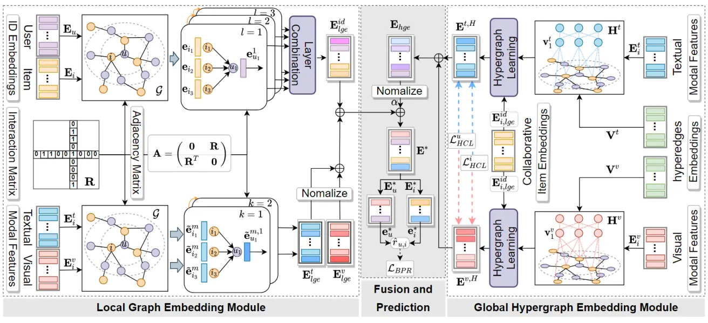

::: tip 提示
根据遗忘曲线：如果没有记录和回顾，6天后便会忘记75%的内容

阅读笔记正是帮助你记录和回顾的工具，不必拘泥于形式，其核心是：记录、翻看、思考
:::
::: info 信息
论文 [LGMRec: Local and Global Graph Learning for Multimodal Recommendation](https://ojs.aaai.org/index.php/AAAI/article/view/28688)     

代码 [https://github.com/georgeguo-cn/LGMRec](https://github.com/georgeguo-cn/LGMRec)

摘要: 本文提出了一种新颖的局部和全局图学习引导的多模态推荐器（LGMRec），它联合建模局部和全局用户兴趣。具体来说，提出了一个局部图嵌入模块，以独立学习具有局部拓扑关系的用户和物品的协同相关和模态相关嵌入。此外，全局超图嵌入模块旨在通过建模有洞察力的全局依赖关系来捕获全局用户和物品嵌入。然后可以将超图嵌入空间中获得的全局嵌入与两个解耦的局部嵌入相结合，以提高推荐的准确性和鲁棒性。

:::

## 论文贡献
> 提出了一种新颖的局部和全局图学习引导的多模态推荐器（LGMRec），它探索捕获和利用用户和项目的局部和全局表示以促进多模态推荐。

## 模型架构

LGMRec 的整体框架如图所示，主要由三个部分组成：（1）局部图嵌入（Local Graph Embedding，LGE）模块，该模块采用 GNN 分别捕获与 ID 嵌入和模态特征的用户-物品交互图上的协同相关和模态相关的用户局部兴趣；（2）全局超图嵌入（Global Hypergraph Embedding，GHE）模块，该模块通过捕获来自不同项目模态特征空间的全局超图结构依赖关系来学习全局用户和物品表示；（3）融合和预测模块，融合局部和全局嵌入，预测物品的最终用户偏好得分。

### 局部图嵌入模块
LGE（Local Graph Embedding） 模块旨在独立学习协同相关和模态相关的带有局部拓扑结构的用户和物品表示以避免用户嵌入的更新不稳定，促进解耦用户兴趣学习。

#### 协同图嵌入（Collaborative Graph Embedding，CGE）
首先通过具有 ID 嵌入的用户-物品交互图上的消息传播来捕获高阶连通性。特别地，第$(l+1)$层中地协同图传播函数$CGPROG(\cdot)$可以表示为：
$$E^{l+1}=CGPROG(E^{l})=(D^{-\frac{1}{2}}AD^{-\frac{1}{2}})E^{l},$$
其中，$CGPROG(\cdot)$继承了简化图卷积网络的轻量级形式，$A\in \mathbb{R}^{(|\mathcal{U}|+|\mathcal{I}|)\times (|\mathcal{U}|+|\mathcal{I}|)}$是交互矩阵构造的邻接矩阵$R$，$D$是$A$的对角矩阵。每个对角元素$D_{j,j}$表示矩阵$A$的第$j$行向量中的非零条目数。初始化的嵌入矩阵设置为$E^{0}=E^{id}$。然后采用层组合来整合来自隐藏层的所有嵌入。
$$E_{lge}^{id}=LAYERCOMB(E^{0},E^{1},E^{2},\cdots,E^{L}),$$
其中$E_{lge}^{id}\in \mathbb{R}^{(|\mathcal{U}|+|\mathcal{I}|)\times d}$是具有局部邻域信息的用户和物品的协同相关嵌入，使用平均函数来实现$LAYERCOMB(\cdot)$进行嵌入集成。

#### 模态图嵌入（Modality Graph Embedding，MGE）
考虑到模态之间的语义差异，进一步独立地推断交互图上用户和物品与模态特征的模态相关嵌入。原始的模态特征通常是从不同的预训练模型生成的，如 ResNet、BERT，它们在不同的空间中具有不同的维度。这里需要每个物品的高维模态特征$e_{i}^{m}$投影到一个统一的嵌入空间$\mathbb{R}^{d}$中，
$$\tilde{e}_{i}^{m}=TRANSFORM(e_{i}^{m})=e_{i}^{m}\cdot W_{m},$$
其中$e_{i}^{m}$是物品$i$的模态特征，$TRANSFORM(\cdot)$是一个由变换矩阵$W_{m}\in \mathbb{R}^{d_{m}\times d}$参数化的投影函数。由于获取用户模态信息的困难，现有方法经常重用用户 ID 嵌入作为模态特定图的输入，导致协作信号和模态信号的耦合。与它们不同的是，本文通过聚合物品模态特征来初始化用户模态特征，
$$\tilde{e_{u}^{m}}=\frac{1}{|\mathcal{N_{u}}|}\sum_{i\in N_{u}}\tilde{e_{i}^{m}},$$
其中$\mathcal{N}_{u}$表示用户$u\in\mathcal{U}$在用户物品交互图$\mathcal{G}$上的邻居集合。此操作确保了 ID 嵌入和模态特征的单独更新。因此可以构造模态特征矩阵$\tilde{E}^{m}=[\tilde{e_{u_{1}}^{m}},\cdot,\tilde{e_{u_{\mathcal{|U|}}}^{m}},\tilde{e_{i_{1}}^{m}},\cdot,\tilde{e_{i_{|\mathcal{I}|}}^{m}}]\in \mathbb{R}^{(|\mathcal{U}|+|\mathcal{i}|)\times d}$作为初始化输入$\tilde{E}^{m,0}$来通过光图传播函数$MGPROG(\cdot)$学习与模态相关的嵌入，
$$\tilde{E}^{m,k+1}=MGPROG(\tilde{E}^{m,k})=(D^{-\frac{1}{2}}AD^{-\frac{1}{2}})\tilde{E}^{m,k},$$
在这里，我们在第$K$层选择高阶模态嵌入$\tilde{E}^{m,K}$作为具有局部模态信息的模态相关嵌入（即$E_{lge}^{m}=\tilde{E}^{m,k}$）。

### 全局超图嵌入模块（GHE）
GHE（Global Hypergraph Embedding） 模块旨在根据稀疏和噪声用户行为捕获用户和物品的模态感知全局表示。

#### 超图依赖构建（Hypergraph Dependency Constructing）
物品模态的显式属性信息通常不可用，特别是视觉模态。因此，这里将可学习的隐式属性向量$\{v_{a}^{m}\}_{a=1}^{A}(v_{a}^{m}\in \mathbb{R}^{d_{m}})$定义为模态$m$的超边嵌入，以自适应地学习隐式属性和物品/用户之间的关系。具体来说，在低维嵌入空间中得到超图依赖矩阵： 
$$H_{i}^{m}=E_{i}^{m}\cdot {V^{m}}^{T}, \quad H_{u}^{m}=A_{u}^{m}\cdot {H_{i}^{m}}^{T},$$
其中$H_{i}^{m}\in\mathbb{R}^{|\mathcal{I}|\times A}$，$H_{u}^{m}\in\mathbb{R}^{|\mathcal{U}|\times A}$分别是物品超边和用户超边依赖矩阵，$E_{i}^{m}$是原始的物品模态特征矩阵，$V^{m}=[v_{1}^{m},\cdots,v_{A}^{m}]\in\mathbb{R}^{A\times d_{m}}$是超边向量矩阵，$A_{u}\in \mathbb{R}^{|\mathcal{U}|\times|\mathcal{I}|}$是从$A$中提取的用户相关的邻接矩阵。直观来看，具有相似模态特征的物品更有可能连接到相同的超边。用户超边依赖关系通过用户-物品交互间接导出，这意味着用户行为意图，即用户在特定属性下与物品交互的频率更高，他们可能更喜欢属性。
为了进一步避免无意义的关系的负面影响，使用 Gumbel-Softmax 重新参数化来确保物品尽可能地附加到一个超边上：
$$\tilde{h}_{i,*}^{m}=SOFTMAX(\frac{log\delta-log(1-\delta)+h_{i,*}^{m}}{\tau})$$
其中$h_{i,*}^{m}\in\mathbb{R}^{A}$是$H_{i}^{m}$的第$i$行向量，它反映了物品$i$和所有超边之间的关系。$\delta\in\mathbb{R}$是一个噪声向量，其中每个值$\delta_{j}\sim Uniform(0,1)$，$\tau$是温度超参数。之后，可以得到增强的物品属性超图依赖矩阵$\tilde{H}_{i}^{m}$。通过对$H_{u}^{m}$执行类似的操作，可以得到增强的用户属性关系矩阵$\tilde{H}_{u}^{m}$。

#### 超图消息传播（Hypergraph Message Passing）
通过将属性超边作为中间集线器，实现了超图消息传递，将全局信息传递给用户和物品，而不会受到跳数距离的限制。形式上，
$$E_{i}^{m,h+1}=DROP(\tilde{H}_{i}^{m})\cdot DROP({\tilde{H}_{i}^{m}}^{T})\cdot E_{i}^{m,h},$$
其中$E_{i}^{m,h}$是第$h$个超图层物品的全局嵌入矩阵，$DROP(\cdot)$表示 dropout 函数。当$h=0$,采用物品的协同嵌入矩阵$E_{i,lge}^{id}$作为初始化的全局嵌入矩阵。进一步可以计算全局用户嵌入矩阵：
$$E_{u}^{m,h+1}=DROP(\tilde{H}_{u}^{m})\cdot DROP({\tilde{H}_{u}^{m}}^{T})\cdot E_{u}^{m,h}.$$
超图传递通过将物品协同嵌入和模态感知超图依赖关系作为输入来显式地实现全局信息传输。然后，可以通过聚合来自所有模态的全局嵌入来获得全局嵌入矩阵$E_{ghe}$，
$$E_{ghe}=\sum_{m\in\mathcal{M}}E^{m,H},\quad E^{m,H}=[E_{u}^{m,H},E_{i}^{m,H}],$$
其中$E_{u}^{m,H}\in\mathbb{R}^{|\mathcal{U}|\times d}$,$E_{i}^{m,H}\in\mathbb{R}^{|\mathcal{I}|\times d}$分别是模态$m$下第$H$个超图层中获得的用户$u$和物品$i$的全局嵌入矩阵。
为了进一步实现不同模态之间全局嵌入的鲁棒融合，开发了跨模态超图对比学习来提取自监督信号，以实现全局兴趣一致性。具体来说，将不同模态的用户的全局嵌入作为正对，将不同的用户作为负对，然后使用 InfoNCE 正式定义用户端超图对比损失为：
$$\mathcal{L}_{HCL}^{u}=\sum_{u\in\mathcal{U}}-log\frac{exp(s(E_{u}^{v,H},E_{u}^{t,H})/\tau)}{\sum_{u'\in\mathcal{U}}exp(s(E_{u}^{v,H},E_{u'}^{t,H})/\tau)},$$
其中$s(\cdot)$是余弦函数，$\tau$是温度因子，通常设置为$0.2.$类似地，可以定义物品侧跨模态对比损失$\mathcal{L}_{HCL}^{i}.$

### 融合和预测
过融合用户和物品的两种类型的局部嵌入$E_{lge}^{id},E_{lge}^{m}$和全局嵌入$E_{ghe}$来获得用户和物品的最终表示$E^{*}$:
$$E^{*}=E_{lge}^{id}+\sum_{m\in\mathcal{M}}NORM(E_{lge}^{m})+\alpha\cdot NORM(E_{ghe}),$$
其中$NORM(\cdot)$是缓解嵌入之间值尺度差异的归一化函数，$\alpha$是控制全局嵌入集成的可调整因子。
然后使用内积来计算用户$u$对物品$i$的偏好分数，即$\hat{r}_{u,i}=e_{u}^{*}\cdot {e_{i}^{*}}^{T}.$采用贝叶斯个性化排名（BPR）损失对模型参数进行优化，
$$\mathcal{L}_{BPR}=-\sum_{(u,i^{+},i^{-})\in\mathcal{R}}ln\sigma(\hat{r}_{u,i^{+}}-\hat{r}_{u,i^{-}})+\lambda_{1}\|\Theta\|_{2}^{2},$$
其中$\mathcal{R}=\{(u,i^{+},i^{-})|(u,i^{+})\in\mathcal{G},(u,i^{+})\notin\mathcal{G}\}$是一组用于训练的三元组，$\sigma(\cdot)$是 sigmoid 函数，$\lambda_{1}$和$\Theta$分别表示正则化系数和模型参数。
最后，将超图对比损失与 BPR 损失集成到统一的目标中：
$$\mathcal{L}=\mathcal{L}_{BPR}+\lambda_{2}\cdot(\mathcal{L}_{HCL}^{u}+\mathcal{L}_{HCL}^{i}),$$
其中$\lambda_{2}$是损失项权重参数，使用 Adam 优化器最小化联合目标$\mathcal{L}$。权重衰减正则化项应用于模型参数$\Theta$。

## 总结
在本文中，提出了一种新颖的模型 LGMRec，该模型捕获并利用具有局部拓扑信息的局部嵌入和具有超图依赖关系的全局嵌入。具体来说，采用局部图嵌入模块来独立学习与协作相关的和与模态相关的局部用户兴趣。进一步设计了一个全局超图嵌入模块来挖掘全局用户兴趣。
