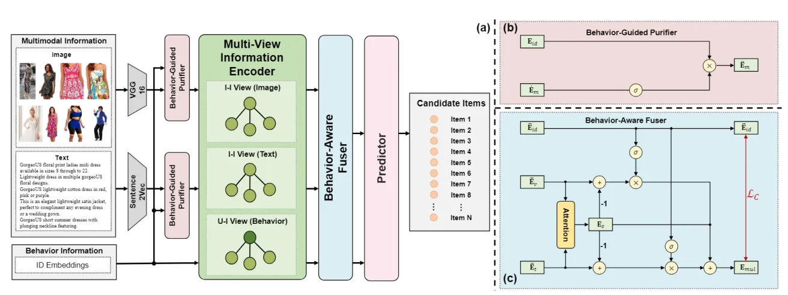

::: tip 提示
根据遗忘曲线：如果没有记录和回顾，6天后便会忘记75%的内容

阅读笔记正是帮助你记录和回顾的工具，不必拘泥于形式，其核心是：记录、翻看、思考
:::
::: info 信息
论文 [Multi-View Graph Convolutional Network for Multimedia Recommendation](http://124.222.48.233/wp-content/uploads/2023/11/1700442847-Multi-View-Graph-Convolutional-Network-for-Multimedia-Recommendation.pdf)     

代码 [https://github.com/demonph10/MGCN](https://github.com/demonph10/MGCN)

摘要: 本文主要提出了 MGCN 模型用于多模态推荐，为了避免模态噪声污染，首先在物品行为信息的帮助下纯化模态特征。然后，物品和行为特征的纯化模态特征在单独的视图中丰富，包括用户-物品视图和物品-物品视图。通过这种方式，增强了特征的可区分性。同时，设计了一种行为感知融合器，通过自适应学习不同模态特征的相对重要性来全面建模用户偏好。此外，为行为感知融合器配备了自我监督的辅助任务。该任务有望最大化融合多模态特征和行为特征之间的相互信息，从而同时捕获互补和补充的偏好信息。

:::

## 论文贡献
> 1）开发了一种行为引导的净化器，在行为信息的指导下有效地避免了噪声污染问题。

> 2）设计了一个多视图信息编码器，它通过分别捕获高阶协作信号和语义相关信号来丰富表示。

> 3）提出了一种行为感知融合器，并构建了一个新的自监督辅助任务，通过自适应融合行为信息和多模态信息对用户偏好进行建模。

## 模型架构

### Behavior-Guided Purifier（行为引导净化器）
本文的第一步就是利用 behavior 信息来对模态信息进行一个过滤：
- 首先对原始的模态特征$E_{i,m}$进行一个线性变换：
$$\dot{E}_{i,m}=W_{1}E_{i,m}+b_{1},$$
其中$W_{1}\in \mathbb{R}^{d\times d_{m}},b_{1}\in \mathbb{R}^{d}$。
-  通过 behavior 信息进行调整：
$$\ddot{E}_{i,m}=f^{m}_{gate}(E_{i,id},\dot{E}_{i,m})=E_{i,id}\odot \sigma(W_{2}\dot{E}_{i,m}+b_{2})$$
其中$W_{2}\in \mathbb{R}^{d\times d},b_{2}\in \mathbb{R}^{d}$，$\odot$表示 element-wise 乘积，$\sigma$表示 sigmoid 激活函数。

### Multi-View Information Encoder（多视图信息编码器）
- User-Item View：首先通过 LightGCN 在 User-Item 的图上将 id embedding $E_{id}$转换为$\bar{E}_{id}$.
- Item-Item View：首先使用 KNN 对稠密图进行稀疏化，得到标准化后的邻接矩阵$\ddot{S}_{m}$,然后通过下式得到平滑后的物品模态 embeddings：
$$\bar{E}_{i,m}=\ddot{E}_{i,m}\ddot{S}_{m}$$
接着，通过聚合用户交互过的物品的模态特征得到用户模态特征：
$$\ddot{e}_{u,m}=\sum_{i\in \mathcal{N}_{u}}\frac{1}{\sqrt{|\mathcal{N}_{u}||\mathcal{N}_{i}|}}\bar{e}_{i,m}.$$
- 将两者进行拼接得到模态表征：
$$\bar{E}_{m}=[\bar{E}_{u,m},\bar{E}_{i,m}]\in \mathbb{R}^{d\times (|U|+|I|)}.$$

### Behavior-Aware Fuser（行为感知融合器）
- 模态偏好首先从用户行为特征中提取：
$$P_{m}=\sigma(W_{3}\bar{E}_{id} + b_{3}),$$
其中$W_{3}\in\mathbb{R}^{d\times d}$和$b_{3}\in\mathbb{R}^{d}$是可学习的参数，$\sigma$是 sigmoid 非线性激活函数，它学习非线性门来模拟用户模态特征。
- 模态共享特征通过注意力机制计算：
$$\alpha_{m}=softmax(q_{1}^{T}tanh(W_{4}\bar{E}_{m}+b_{4})),$$
其中$q_{1}\in\mathbb{R}^{d}$表示注意力向量，$W_{4}\in\mathbb{R}^{d\times d}, b_{4}\in\mathbb{R}^{d}$分别表示权重矩阵和偏置向量，这些参数对所有模态共享，得到的共享特征$E_{s}$为：
$$E_{s}=\sum_{m\in\mathcal{M}}\alpha_{m}\bar{E}_{m}.$$
- 模态特异特征可以通过减去共享特征获得：
$$\tilde{E}_{m}=\bar{E}_{m}-E_{s}.$$
- 最后，自适应融合模态特异特征，并结合共享特征作为最终的特征表示：
$E_{mul}=E_{s}+\frac{1}{\mathcal{M}}\sum_{m\in\mathcal{M}}\tilde{E}_{m}\odot P_{m}.$
为了促进行为和多模态信息的探索，设计了一个自我监督的辅助任务。该任务数学表达式如下：
$$\mathcal{L}_{C}=\sum_{u\in \mathcal{U}}-log\frac{exp(e_{u,mul}\cdot \bar{e}_{u,id}/\tau)}{\sum_{v\in \mathcal{U}}exp(e_{v,mul}\cdot \bar{e}_{v,id}/\tau)}+\sum_{i\in \mathcal{I}}-log\frac{exp(e_{i,mul}\cdot \bar{e}_{i,id}/\tau)}{\sum_{j\in \mathcal{I}}exp(e_{j,mul}\cdot \bar{e}_{j,id}/\tau)}$$

### Predictor（预测）
基于增强的行为特征和多模态特征，形成了用户和物品的最终表示：
$$e_{u}=\bar{e}_{u,id}+e_{u,mul},\qquad e_{i}=\bar{e}_{i,id}+e_{i,mul}.$$
 然后采用内积形式来确定用户和物品之间交互的可能性：
$$f_{predict}(u,i)=\hat{y}_{ui}=e_{u}^{T}e_{i}.$$

### Optimization（优化）
在模型训练阶段，采用贝叶斯个性化排名 (BPR) 损失$\mathcal{L}_{BPR}$作为基本优化任务，假设用户更喜欢历史交互的物品而不是未点击的物品。并将其与辅助自我监督任务相结合，共同更新用户和物品的表示：
$$\mathcal{L}=\mathcal{L}_{BPR}+\lambda_{C}\mathcal{L}_{C}+\lambda_{E}\|E\|_{2},$$
其中$E$是模型参数的集合，$\lambda_{C},\lambda_{E}$分别是用于控制对比辅助任务和$L_{2}$正则化效果的超参数。

## 总结
在本文中，提出了一种用于多媒体推荐的多视图图卷积网络 (MGCN)。具体来说，首先开发了一个行为引导的净化器，以避免模态噪声污染。然后，通过多视图信息编码器分别丰富纯化的特征和行为特征。同时，为了全面建模用户偏好，设计了一个行为感知融合器，并提出了一种新的自监督辅助任务。